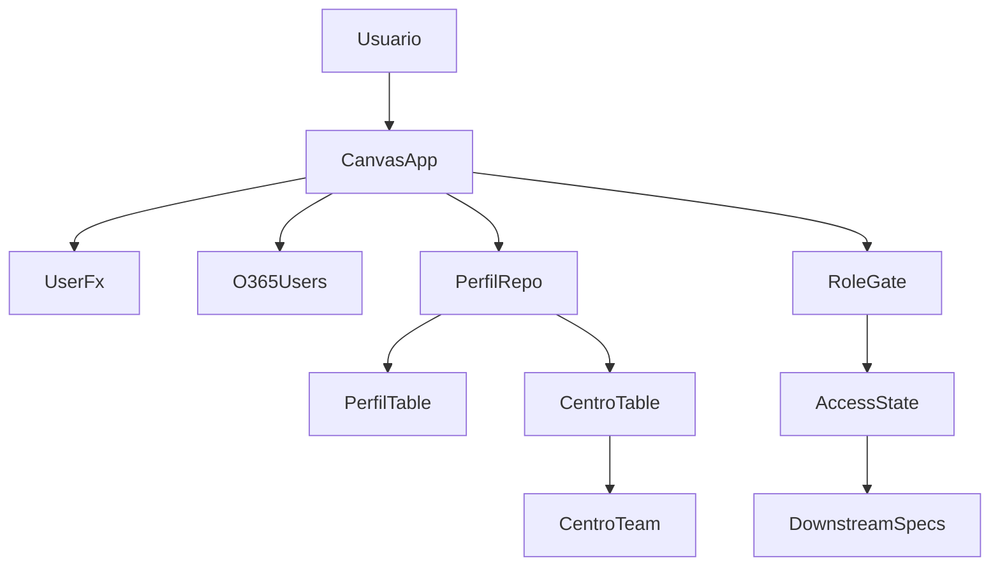
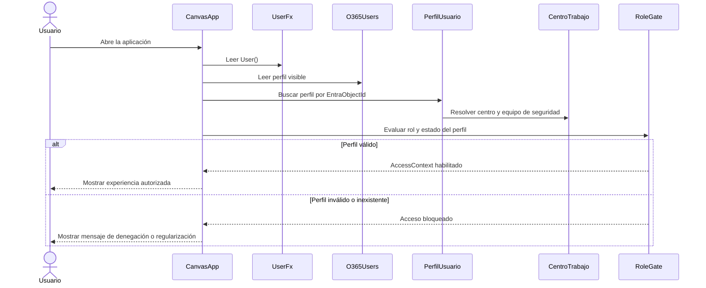
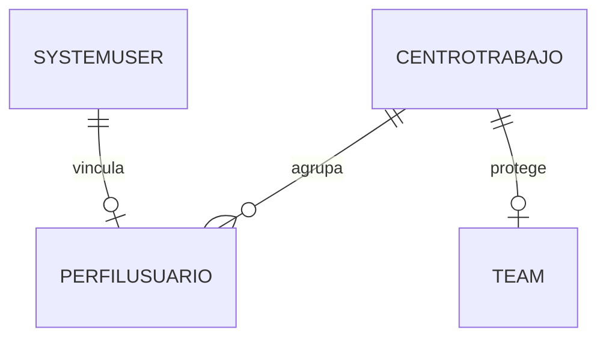
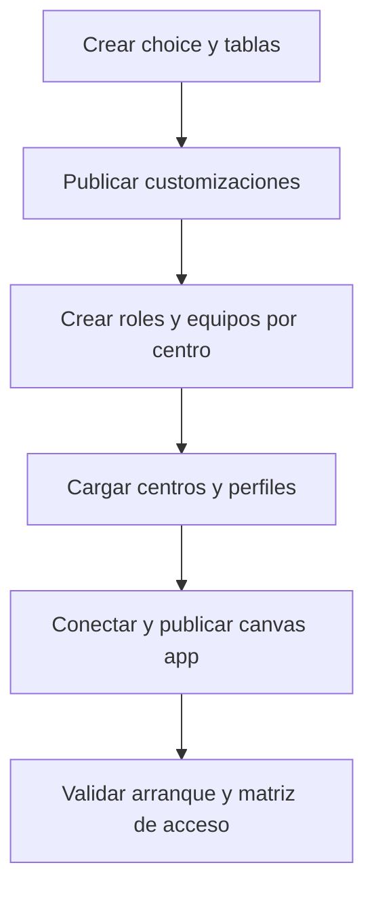

## Overview
Esta especificación define la base transversal de autenticación y autorización para la solución de incidencias de Logística Sur S.L. El objetivo es que cada empleado entre con su identidad corporativa, obtenga un único contexto operativo válido y solo pueda ver o ejecutar aquello que corresponde a su rol y centro de trabajo. La solución ya existe como paquete Dataverse con una canvas app vacía a nivel funcional, por lo que este diseño añade los primeros contratos autoritativos sobre identidad, perfil y seguridad de datos.

Los usuarios objetivo son Operarios, Supervisores y Administradores. Este diseño establece el contrato que downstream specs reutilizarán para permisos de pantalla, alcance de datos y ownership de registros. También fija la entidad autoritativa de perfil de usuario para evitar que cada spec redefina el modelo de acceso.

### Goals
- Resolver automáticamente el contexto de acceso del usuario corporativo al abrir la app.
- Definir un modelo Dataverse autoritativo para rol único y centro de trabajo.
- Establecer una base reutilizable de seguridad por centro que los specs posteriores puedan consumir sin redefinirla.
- Proteger la experiencia funcional y los datos frente a usuarios no válidos o perfiles incompletos.

### Non-Goals
- Administrar altas y bajas de cuentas corporativas fuera de la solución.
- Implementar CRUD de incidencias, comentarios, adjuntos, dashboard o notificaciones.
- Crear una interfaz administrativa completa para mantenimiento de usuarios y centros en esta fase.
- Resolver reglas específicas por creador, asignado o estado que pertenecen a specs consumidoras.

## Boundary Commitments

### This Spec Owns
- La resolución de identidad de entrada de la canvas app usando la sesión corporativa existente.
- El contrato autoritativo del perfil de usuario (`jlb_perfilusuario`) con rol de negocio único y centro de trabajo.
- El catálogo de centros de trabajo (`jlb_centrotrabajo`) y la referencia al equipo de seguridad del centro.
- Las reglas base de autorización funcional por rol y de bloqueo por perfil inválido.
- La seam de seguridad de datos que downstream specs usarán para ownership o compartición por centro.

### Out of Boundary
- El modelo y las reglas de negocio de incidencias, comentarios, adjuntos, dashboard y notificaciones.
- La gestión de usuarios en Entra ID o Microsoft 365 Admin Center.
- La automatización avanzada de aprovisionamiento de equipos o sincronización de RR. HH.
- Cualquier regla de visibilidad que dependa del contenido de una incidencia concreta más allá del contexto base rol + centro.

### Allowed Dependencies
- Identidad nativa de Power Apps y la sesión corporativa del entorno.
- Conector Office 365 Users para enriquecer datos visibles del usuario.
- Dataverse como almacén de perfiles, centros, roles técnicos y seguridad de registros.
- Configuración administrativa del entorno para security roles y equipos por centro.

### Revalidation Triggers
- Cambios en la forma de identificar al usuario autenticado o en la disponibilidad de `EntraObjectId`.
- Cambios en el esquema de `jlb_perfilusuario`, `jlb_centrotrabajo` o en sus claves únicas.
- Sustitución del modelo de equipos por centro o del ownership esperado para datos downstream.
- Nuevos roles de negocio, soporte multirol o múltiples centros por usuario.
- Nuevos prerrequisitos de arranque de la app o nuevas conexiones obligatorias.

## Architecture

### Existing Architecture Analysis
La solución actual es greenfield desde el punto de vista funcional. `src\Other\Customizations.xml` no contiene entidades, roles ni relaciones, y `src\Other\Solution.xml` solo registra una canvas app como componente raíz. `src\CanvasApps\jlb_logsticasur_95873.meta.xml` muestra una app sin referencias de conexión ni dependencias CDS declaradas. Esto permite introducir un modelo limpio, pero también obliga a explicitar todos los componentes, contratos y prerrequisitos del feature.

### Architecture Pattern & Boundary Map


**Architecture Integration**:
- **Selected pattern**: identidad nativa de plataforma + resolución autoritativa de perfil + seguridad de datos apoyada en equipos por centro.
- **Domain boundaries**: la app resuelve identidad y aplica gating funcional; Dataverse conserva el contrato de perfil y centro; la seguridad por centro queda definida como seam para ownership/sharing downstream.
- **Existing patterns preserved**: extensión del paquete de solución existente y reutilización de la canvas app actual.
- **New components rationale**: se introducen solo cuatro componentes lógicos nuevos para cubrir identidad, perfil, autorización UI y seam de seguridad de centro.
- **Steering compliance**: mantiene Power Apps + Dataverse + Entra ID como única pila y evita soluciones paralelas fuera del roadmap.
- **Dependency direction**: Identidad Power Apps → Resolución de Perfil → Estado de Acceso → Gating de UI → Funcionalidades consumidoras. Los datos downstream solo pueden depender del `AccessContext`, nunca redefinirlo ni renombrar sus campos públicos.

### Technology Stack

| Layer | Choice / Version | Role in Feature | Notes |
|-------|------------------|-----------------|-------|
| Frontend / CLI | Power Apps Canvas App 3.26074.x | Resolver identidad, cargar contexto de acceso y aplicar gating de experiencia | Reutiliza la app `jlb_logsticasur_95873` ya empaquetada |
| Backend / Services | Fórmulas Power Fx + runtime nativo de Power Apps | Lógica de arranque, bloqueo y evaluación de permisos | Sin servicio custom adicional |
| Data / Storage | Microsoft Dataverse | Perfiles de usuario, centros de trabajo, choice de rol y seguridad de registros | Fuente única para perfiles y seam de autorización |
| Messaging / Events | No aplica en este spec | Sin mensajería propia | Notificaciones quedan fuera de alcance |
| Infrastructure / Runtime | Microsoft 365 / Entra ID + Office 365 Users connector | Identidad corporativa y datos visibles del usuario | Requiere conexión válida en la app |

## File Structure Plan

### Directory Structure
```text
src\
├── CanvasApps\
│   ├── jlb_logsticasur_95873_DocumentUri.msapp             # Lógica Power Fx de arranque, variables globales y pantallas bloqueadas
│   ├── jlb_logsticasur_95873.meta.xml                      # Metadatos y referencias de conexión/datos de la app
│   └── jlb_logsticasur_95873_AdditionalUris0_identity.json # Identidad del recurso empaquetado de la canvas app
├── Entities\
│   ├── jlb_centrotrabajo\                                  # Tabla autoritativa de centros y vistas/formularios asociados
│   └── jlb_perfilusuario\                                  # Tabla autoritativa de perfil de usuario y relación con systemuser
├── OptionSets\
│   └── jlb_rolnegocio\                                     # Definición del rol único Operario/Supervisor/Administrador
└── Roles\                                                  # Definiciones exportadas de seguridad para Operario, Supervisor y Administrador
```

### Modified Files
- `src\Other\Solution.xml` — añadir los nuevos componentes Dataverse al paquete de solución existente.
- `src\Other\Customizations.xml` — reflejar tablas, relaciones, choice, vistas básicas y referencias de seguridad exportadas.
- `src\CanvasApps\jlb_logsticasur_95873.meta.xml` — registrar la conexión a Office 365 Users y las dependencias CDS necesarias.
- `src\CanvasApps\jlb_logsticasur_95873_DocumentUri.msapp` — implementar el arranque autenticado, el estado de acceso y los guards de navegación/acciones.

> Prerrequisitos operativos fuera de control de código: cada centro activo debe tener un equipo de seguridad de Dataverse o un Microsoft Entra group team asociado, y los usuarios deben existir en el entorno con acceso básico a la app.

## System Flows



**Flow decisions**
- El arranque no libera navegación funcional hasta tener `AccessContext` válido o un error bloqueante definitivo.
- El correo se usa como dato mostrado; la identidad operativa se resuelve por `EntraObjectId`.
- El guard de UI no sustituye a la seguridad Dataverse; solo evita navegación errónea y mejora la experiencia.

## Requirements Traceability

| Requirement | Summary | Components | Interfaces | Flows |
|-------------|---------|------------|------------|-------|
| 1.1 | Entrada con identidad corporativa sin credenciales locales | Canvas Bootstrap de Acceso | `PowerAppsIdentity`, `AccessContextResolver` | Arranque autenticado |
| 1.2 | Bloqueo de usuarios sin cuenta válida o sin permiso | Canvas Bootstrap de Acceso, Matriz de Autorización UI | `AccessResolutionResult` | Arranque autenticado |
| 1.3 | No exponer datos durante la resolución de identidad | Canvas Bootstrap de Acceso | `AccessState` | Arranque autenticado |
| 1.4 | Mostrar nombre y correo del usuario autenticado | Canvas Bootstrap de Acceso | `VisibleUserProfile` | Arranque autenticado |
| 2.1 | Resolver rol y centro antes de navegar | Repositorio de Perfil de Usuario, Canvas Bootstrap de Acceso | `AccessContext` | Arranque autenticado |
| 2.2 | Bloqueo por perfil incompleto o ambiguo | Repositorio de Perfil de Usuario, Matriz de Autorización UI | `AccessResolutionResult` | Arranque autenticado |
| 2.3 | Rol de negocio mutuamente excluyente | Modelo de Seguridad de Centro y Perfil | `BusinessRole` | Arranque autenticado |
| 2.4 | Mostrar rol y centro durante la sesión | Canvas Bootstrap de Acceso | `AccessContext` | Arranque autenticado |
| 3.1 | Mostrar solo pantallas y acciones del rol | Matriz de Autorización UI | `PermissionMatrix` | Arranque autenticado |
| 3.2 | Denegar acceso por navegación directa o indirecta | Matriz de Autorización UI | `PermissionCheck` | Arranque autenticado |
| 3.3 | Aplicar cambios de rol/centro en siguiente inicio | Repositorio de Perfil de Usuario, Canvas Bootstrap de Acceso | `AccessContextResolver` | Arranque autenticado |
| 3.4 | Mensaje explícito en capacidad restringida | Matriz de Autorización UI | `PermissionCheck` | Arranque autenticado |
| 4.1 | Limitar datos por rol y centro | Modelo de Seguridad de Centro y Perfil | `AccessScopeContract` | Arranque autenticado |
| 4.2 | Impedir ver o usar datos fuera del centro | Modelo de Seguridad de Centro y Perfil, Matriz de Autorización UI | `AccessScopeContract`, `PermissionCheck` | Arranque autenticado |
| 4.3 | Supervisor limitado a su centro | Modelo de Seguridad de Centro y Perfil | `AccessContext` | Arranque autenticado |
| 4.4 | Administrador con alcance global | Modelo de Seguridad de Centro y Perfil | `AccessContext` | Arranque autenticado |
| 4.5 | Reutilización del contexto base por specs posteriores | Repositorio de Perfil de Usuario, Modelo de Seguridad de Centro y Perfil | `AccessContext`, `AccessScopeContract` | Arranque autenticado |
| 5.1 | Comportamiento coherente en clientes soportados | Canvas Bootstrap de Acceso | `AccessState` | Arranque autenticado |
| 5.2 | Error bloqueante y accionable sin datos parciales | Canvas Bootstrap de Acceso | `AccessResolutionResult` | Arranque autenticado |
| 5.3 | Experiencia inicial lista en 3 segundos | Canvas Bootstrap de Acceso, Repositorio de Perfil de Usuario | `AccessContextResolver` | Arranque autenticado |
| 5.4 | Mensaje temporal ante caída de identidad/permisos | Canvas Bootstrap de Acceso | `AccessResolutionResult` | Arranque autenticado |

## Components and Interfaces

| Component | Domain/Layer | Intent | Req Coverage | Key Dependencies | Contracts |
|-----------|--------------|--------|--------------|------------------|-----------|
| Canvas Bootstrap de Acceso | UI | Resolver identidad, cargar estado y bloquear/desbloquear la app | 1.1, 1.2, 1.3, 1.4, 2.1, 2.4, 5.1, 5.2, 5.3, 5.4 | User Power Fx (P0), Office 365 Users (P1), Repositorio de Perfil (P0) | Service, State |
| Repositorio de Perfil de Usuario | Data access | Resolver el perfil autoritativo y materializar `AccessContext` | 2.1, 2.2, 2.3, 3.3, 4.5, 5.3 | `jlb_perfilusuario` (P0), `jlb_centrotrabajo` (P0) | Service |
| Matriz de Autorización UI | UI policy | Traducir rol y estado a navegación y acciones permitidas | 1.2, 2.2, 3.1, 3.2, 3.4, 4.2 | `AccessContext` (P0) | Service, State |
| Modelo de Seguridad de Centro y Perfil | Dataverse security | Mantener el contrato de rol único, centro y seam de ownership/sharing por centro | 2.3, 4.1, 4.2, 4.3, 4.4, 4.5 | Dataverse roles (P0), equipos por centro (P1) | State |

### UI

#### Canvas Bootstrap de Acceso

| Field | Detail |
|-------|--------|
| Intent | Resolver el acceso del usuario al abrir la app y gobernar el estado bloqueado o habilitado |
| Requirements | 1.1, 1.2, 1.3, 1.4, 2.1, 2.4, 5.1, 5.2, 5.3, 5.4 |

**Responsibilities & Constraints**
- Leer la identidad del usuario actual al inicio de la app.
- Mantener un estado explícito: `loading`, `ready`, `blocked`.
- No habilitar navegación funcional ni cargas downstream hasta que exista un `AccessContext` válido.
- Exponer nombre, correo, rol y centro en una zona estable de la experiencia.

**Dependencies**
- Inbound: `src\CanvasApps\jlb_logsticasur_95873_DocumentUri.msapp` — arranque y navegación (P0)
- Outbound: Repositorio de Perfil de Usuario — resolver perfil operativo (P0)
- External: `User()` — identidad actual (P0)
- External: Office 365 Users — nombre/correo enriquecidos del usuario (P1)

**Contracts**: Service [x] / API [ ] / Event [ ] / Batch [ ] / State [x]

##### Service Interface
```typescript
type AccessLoadState = "loading" | "ready" | "blocked";

interface PowerAppsIdentity {
  entraObjectId: string;
  userPrincipalName: string;
  fullName: string;
  imageUrl?: string;
}

interface VisibleUserProfile {
  displayName: string;
  corporateEmail: string;
}

interface CanvasAccessBootstrap {
  initialize(): Promise<AccessResolutionResult>;
  getState(): AccessLoadState;
  getVisibleProfile(): VisibleUserProfile | null;
}
```
- Preconditions: el usuario ya abrió la app con sesión corporativa del entorno.
- Postconditions: la app queda en `ready` con contexto completo o en `blocked` con mensaje accionable.
- Invariants: ningún dato operativo se consulta antes de terminar `initialize()`.

##### State Management
- State model: variable global `AccessState` y registro global `AccessContext`.
- Persistence & consistency: solo en memoria de sesión; se recalcula en cada inicio o recarga.
- Concurrency strategy: una única inicialización por arranque; recargas posteriores sustituyen el contexto completo.

**Implementation Notes**
- Integration: modifica el único artefacto de app existente y añade la conexión Office 365 Users.
- Validation: medir tiempo de resolución completa y comprobar que no hay navegación a pantallas funcionales antes de `ready`.
- Risks: dependencia de una única msapp empaquetada limita paralelismo de implementación.

#### Matriz de Autorización UI

| Field | Detail |
|-------|--------|
| Intent | Convertir `AccessContext` en permisos de pantalla, navegación y acciones |
| Requirements | 1.2, 2.2, 3.1, 3.2, 3.4, 4.2 |

**Responsibilities & Constraints**
- Definir permisos mínimos por rol para capacidades de la app.
- Bloquear navegación directa a capacidades no autorizadas.
- Mostrar feedback explícito cuando una capacidad exista pero no esté autorizada.
- No asumir reglas downstream fuera del contexto base rol + centro.

**Dependencies**
- Inbound: Canvas Bootstrap de Acceso — entrega `AccessContext` (P0)
- Outbound: Pantallas y controles de la canvas app — consumen permisos calculados (P0)

**Contracts**: Service [x] / API [ ] / Event [ ] / Batch [ ] / State [x]

##### Service Interface
```typescript
type BusinessRole = "Operario" | "Supervisor" | "Administrador";

type CapabilityKey =
  | "home"
  | "incident-create"
  | "incident-manage-center"
  | "catalog-admin"
  | "user-admin";

interface PermissionCheck {
  capability: CapabilityKey;
  allowed: boolean;
  denialMessage?: string;
}

interface PermissionMatrix {
  canAccess(role: BusinessRole, capability: CapabilityKey): PermissionCheck;
}
```
- Preconditions: `AccessContext.profileStatus == "active"`.
- Postconditions: cada capacidad evaluada devuelve un resultado determinista y mostrable.
- Invariants: ninguna pantalla confía únicamente en visibilidad visual sin guard de entrada.

##### State Management
- State model: mapa de capacidades derivado del rol dentro de `AccessContext`.
- Persistence & consistency: recalculado al resolver el perfil y al reiniciar sesión.
- Concurrency strategy: lectura inmutable durante cada sesión.

**Implementation Notes**
- Integration: los specs posteriores ampliarán `CapabilityKey` sin reescribir la lógica base de rol.
- Validation: probar deep links, navegación por menú y botones deshabilitados o redirigidos.
- Risks: si se omite un guard en una pantalla downstream, la UI puede quedar incoherente aunque Dataverse siga protegiendo datos.

### Data

#### Repositorio de Perfil de Usuario

| Field | Detail |
|-------|--------|
| Intent | Consultar el perfil autoritativo y construir `AccessContext` para la sesión |
| Requirements | 2.1, 2.2, 2.3, 3.3, 4.5, 5.3 |

**Responsibilities & Constraints**
- Resolver un único perfil activo por `EntraObjectId`.
- Incorporar rol único, centro, equipo del centro y referencias visibles del usuario.
- Traducir perfiles ausentes, duplicados o incompletos a errores bloqueantes deterministas.
- Entregar un contrato estable consumible por specs posteriores.

**Dependencies**
- Inbound: Canvas Bootstrap de Acceso — solicita contexto (P0)
- Outbound: `jlb_perfilusuario` — fuente autoritativa del rol (P0)
- Outbound: `jlb_centrotrabajo` — fuente autoritativa del centro y equipo (P0)

**Contracts**: Service [x] / API [ ] / Event [ ] / Batch [ ] / State [ ]

##### Contrato público (canónico)
El siguiente `AccessContext` es el contrato público estable y autoritativo para toda la solución. Los specs downstream deben consumirlo **verbatim**, sin alias locales ni renombrados alternativos. En particular, `perfilUsuarioId`, `centroTrabajoNombre` y `dataScope` son los nombres canónicos que sustituyen cualquier variante previa.

##### Service Interface
```typescript
type AccessFailureReason =
  | "identity-unavailable"
  | "profile-not-found"
  | "profile-duplicate"
  | "role-invalid"
  | "center-missing"
  | "access-denied"
  | "dependency-unavailable";

interface AccessContext {
  entraObjectId: string;
  dataverseUserId: string;
  perfilUsuarioId: string;
  userPrincipalName: string;
  displayName: string;
  corporateEmail: string;
  role: BusinessRole;
  centroTrabajoId: string;
  centroCodigo: string;
  centroTrabajoNombre: string;
  centroSecurityTeamId: string;
  dataScope: "self" | "center" | "global";
  profileStatus: "active" | "blocked";
}

type AccessResolutionResult =
  | { ok: true; context: AccessContext }
  | { ok: false; reason: AccessFailureReason; message: string };

interface AccessContextResolver {
  resolve(identity: PowerAppsIdentity): Promise<AccessResolutionResult>;
}
```
- Preconditions: identidad actual disponible y no vacía.
- Postconditions: devuelve exactamente un contexto válido o un fallo bloqueante categorizado.
- Invariants: nunca devuelve múltiples roles ni centro nulo en un resultado exitoso.
- Regla del contrato canónico: `perfilUsuarioId` identifica el perfil autoritativo en `jlb_perfilusuario`; `dataverseUserId` conserva la referencia al `systemuser`; `dataScope` expresa el alcance efectivo consumible por cualquier spec downstream.

**Implementation Notes**
- Integration: downstream specs deben consumir `AccessContext` exactamente con estos nombres de campo y no consultar el rol o el alcance desde lugares alternativos.
- Validation: forzar escenarios de perfil inexistente, duplicado, centro sin equipo y cambio de rol entre recargas.
- Risks: consultas por correo romperían unicidad en tenants con UPN y SMTP distintos.

#### Modelo de Seguridad de Centro y Perfil

| Field | Detail |
|-------|--------|
| Intent | Definir el modelo Dataverse autoritativo para roles, centros y seam de seguridad por centro |
| Requirements | 2.3, 4.1, 4.2, 4.3, 4.4, 4.5 |

**Responsibilities & Constraints**
- Mantener exactamente un rol de negocio por perfil.
- Mantener exactamente un centro de trabajo activo por perfil.
- Asociar cada centro activo a un equipo de seguridad válido para ownership/sharing downstream.
- Distinguir el alcance global de Administrador del alcance por centro de Supervisor.
- No otorgar acceso masivo a Operarios mediante membresía automática en equipos de centro.

**Dependencies**
- Inbound: Repositorio de Perfil de Usuario — consume el esquema y las claves (P0)
- External: Dataverse security roles — privilegios técnicos (P0)
- External: Dataverse o Entra teams — boundary real de datos por centro (P1)

**Contracts**: Service [ ] / API [ ] / Event [ ] / Batch [ ] / State [x]

##### State Contract
```typescript
interface AccessScopeContract {
  role: BusinessRole;
  centroTrabajoId: string;
  centroCodigo: string;
  centroSecurityTeamId: string;
  dataScope: "self" | "center" | "global";
}
```
- Preconditions: el perfil del usuario ya fue validado.
- Postconditions: downstream specs reciben un perímetro base consistente para ownership, sharing y filtros complementarios.
- Invariants: `dataScope` nunca amplía permisos por encima del rol y centro resueltos en `AccessContext`.
- Relación con el contrato público: `AccessScopeContract` es una proyección derivada del `AccessContext` canónico, no un contrato alternativo de sesión.

##### State Management
- State model: tablas `jlb_perfilusuario` y `jlb_centrotrabajo`, choice `jlb_rolnegocio`, security roles y equipos por centro.
- Persistence & consistency: el perfil es autoritativo para rol y centro; el centro es autoritativo para el equipo de seguridad de ese ámbito.
- Concurrency strategy: actualizaciones administrativas explícitas; el usuario final solo consume el resultado.

**Implementation Notes**
- Integration: `Incidencias` y demás tablas downstream deberán guardar referencia al centro de trabajo y aplicar ownership/sharing usando `centroSecurityTeamId`.
- Validation: comprobar que un supervisor con equipo de centro accede a registros del centro y que un operario no obtiene ese acceso por acumulación involuntaria.
- Risks: si un centro carece de equipo asociado, el feature debe bloquear usuarios de ese centro hasta regularización.

## Data Models

### Domain Model
- **CentroTrabajo**: entidad autoritativa del ámbito operativo. Aporta nombre, código y la referencia al equipo de seguridad del centro.
- **PerfilUsuario**: entidad autoritativa del contexto operativo de cada usuario. Aporta el vínculo con el usuario Dataverse, su `EntraObjectId`, el rol único y el centro activo.
- **AccessContext**: value object de sesión construido al iniciar la app. No se persiste como tabla; se deriva del perfil y del centro.
- **Invariants**:
  - Un `PerfilUsuario` activo referencia exactamente un `CentroTrabajo` activo.
  - Un `PerfilUsuario` activo representa exactamente un rol de negocio entre Operario, Supervisor y Administrador.
  - Un `CentroTrabajo` activo debe tener código único y un equipo de seguridad asociado antes de usarse en producción.



### Logical Data Model

**Structure Definition**
- `jlb_centrotrabajo`
  - `jlb_centrotrabajoid` (GUID, PK)
  - `jlb_nombre` (texto, obligatorio)
  - `jlb_codigo` (texto corto, obligatorio, único)
  - `jlb_teamid` (lookup a `team`, obligatorio para centros activos)
  - `statecode/statuscode` (activo/inactivo)
- `jlb_perfilusuario`
  - `jlb_perfilusuarioid` (GUID, PK)
  - `jlb_systemuserid` (lookup a `systemuser`, obligatorio, único)
  - `jlb_entraobjectid` (texto GUID, obligatorio, único/alternate key)
  - `jlb_rolnegocio` (choice single select, obligatorio)
  - `jlb_centrotrabajoid` (lookup a `jlb_centrotrabajo`, obligatorio)
  - `jlb_correocorporativo` (texto, obligatorio para presentación)
  - `statecode/statuscode` (activo/bloqueado/inactivo)

**Consistency & Integrity**
- `jlb_systemuserid` y `jlb_entraobjectid` deben identificar un único perfil activo.
- `jlb_codigo` debe ser estable porque downstream specs pueden usarlo en filtros y reporting.
- Un perfil en estado bloqueado no es resoluble a `AccessContext` exitoso.
- La inactivación de un centro exige revalidar todos los perfiles que lo referencian.

### Physical Data Model
- Tipo de propiedad recomendado:
  - texto corto para `jlb_codigo`
  - choice de selección única para `jlb_rolnegocio`
  - lookups nativos para `systemuser`, `team` y `jlb_centrotrabajo`
- Índices/claves:
  - alternate key en `jlb_perfilusuario.jlb_entraobjectid`
  - restricción única funcional sobre `jlb_perfilusuario.jlb_systemuserid`
  - alternate key en `jlb_centrotrabajo.jlb_codigo`
- Ownership:
  - `jlb_perfilusuario` puede mantenerse organization-owned o con un modelo mínimo de lectura controlada; el acceso masivo a datos operativos no debe depender de esta tabla.
  - Las tablas de negocio downstream deben usar `jlb_centrotrabajo.jlb_teamid` para ownership o compartición por centro.

### Data Contracts & Integration

**API Data Transfer**
- No se define API custom. El contrato compartido para la app y specs posteriores es `AccessContext`.

**Cross-Service Data Management**
- La identidad entra por Power Apps; la autorización de negocio se resuelve en Dataverse.
- El correo puede refrescarse desde Office 365 Users, pero el resultado no cambia la clave autoritativa del perfil.
- El contrato canónico downstream es:
  - `entraObjectId: string`
  - `dataverseUserId: string`
  - `perfilUsuarioId: string`
  - `userPrincipalName: string`
  - `displayName: string`
  - `corporateEmail: string`
  - `role: BusinessRole`
  - `centroTrabajoId: string`
  - `centroCodigo: string`
  - `centroTrabajoNombre: string`
  - `centroSecurityTeamId: string`
  - `dataScope: "self" | "center" | "global"`
  - `profileStatus: "active" | "blocked"`

## Error Handling

### Error Strategy
- Fallar en cerrado: sin identidad válida, perfil válido o centro válido no existe navegación funcional.
- Normalizar los fallos de arranque en categorías pequeñas y mostrables.
- Diferenciar entre error recuperable por recarga y error que exige intervención administrativa.

### Error Categories and Responses
- **Identity/Permission unavailable**: mensaje de indisponibilidad temporal; mantener la app en `blocked`.
- **Profile not found / duplicate / invalid**: mensaje de regularización con contacto a administración; sin acceso a datos.
- **Unauthorized capability**: mensaje corto de permisos insuficientes y regreso a pantalla permitida.
- **Center without team mapping**: bloqueo operativo para evitar datos sin perímetro real de seguridad.

### Monitoring
- Registrar en la solución o en telemetría disponible del entorno los fallos de resolución del perfil y sus categorías.
- Revisar periódicamente perfiles bloqueados, perfiles duplicados y centros sin equipo asociado como señal operativa.

## Testing Strategy

### Unit Tests
- Validar la función o fórmula de resolución de estado `loading -> ready/blocked` ante identidad válida, inválida y no disponible.
- Validar la conversión de `BusinessRole` en capacidades visibles para Operario, Supervisor y Administrador.
- Validar la categorización de errores de `AccessResolutionResult` para perfil inexistente, duplicado y centro faltante.

### Integration Tests
- Verificar que la app obtiene `EntraObjectId` del usuario y resuelve un único `jlb_perfilusuario` activo.
- Verificar que Office 365 Users enriquece nombre/correo cuando está disponible y que existe fallback visible cuando no lo está.
- Verificar que `jlb_centrotrabajo.jlb_teamid` queda disponible para specs consumidoras y que no hay centros activos sin este vínculo.
- Verificar que un Supervisor con el equipo correcto accede al ámbito de su centro y que un Operario no hereda acceso masivo por pertenecer al mismo centro.

### E2E/UI Tests
- Inicio satisfactorio desde navegador, Android, iPhone y tablet con perfil completo, mostrando nombre, correo, rol y centro.
- Usuario sin perfil, perfil ambiguo o centro inactivo recibe pantalla bloqueante sin datos parciales.
- Navegación directa a capacidad restringida devuelve al usuario a una experiencia permitida con mensaje de permisos.
- Cambio de rol o centro en Dataverse se refleja al cerrar y reabrir la app.

### Performance/Load
- Medir que la resolución inicial del `AccessContext` y de la experiencia autorizada ocurre en 3 segundos o menos en condiciones habituales.
- Validar el comportamiento con al menos la concurrencia objetivo del producto para confirmar que la consulta de perfil no introduce cuellos de botella evitables.

### Security Considerations
- La UI nunca es la única barrera: Dataverse debe seguir siendo la barrera real para datos.
- El identificador estable de autorización es `EntraObjectId`; el correo es solo presentación.
- Los Operarios no deben recibir membresía de equipo que les abra por accidente el perímetro completo del centro.
- Los Administradores reciben alcance global por rol técnico y funcional, pero el rol de negocio sigue siendo único en el perfil.

### Performance & Scalability
- Resolver el perfil en una única lectura lógica de perfil + centro por arranque y reutilizarlo en memoria de sesión.
- Mantener el modelo reducido a dos tablas nuevas y un choice para minimizar latencia y complejidad operativa.

### Migration Strategy


- **Phase breakdown**:
  - Crear `jlb_rolnegocio`, `jlb_centrotrabajo` y `jlb_perfilusuario`.
  - Publicar customizaciones para que las tablas estén disponibles en la app y en seguridad.
  - Aprovisionar equipos por centro y asignar roles técnicos mínimos.
  - Cargar perfiles de usuario con rol y centro válidos antes de abrir el acceso a usuarios finales.
  - Publicar la canvas app con la lógica de arranque y guards.
- **Rollback triggers**: perfiles duplicados, centros sin equipo o fallos generalizados de arranque bloquean la salida.
- **Validation checkpoints**: resolución de identidad, unicidad de perfil, visibilidad por rol y alcance por centro.
