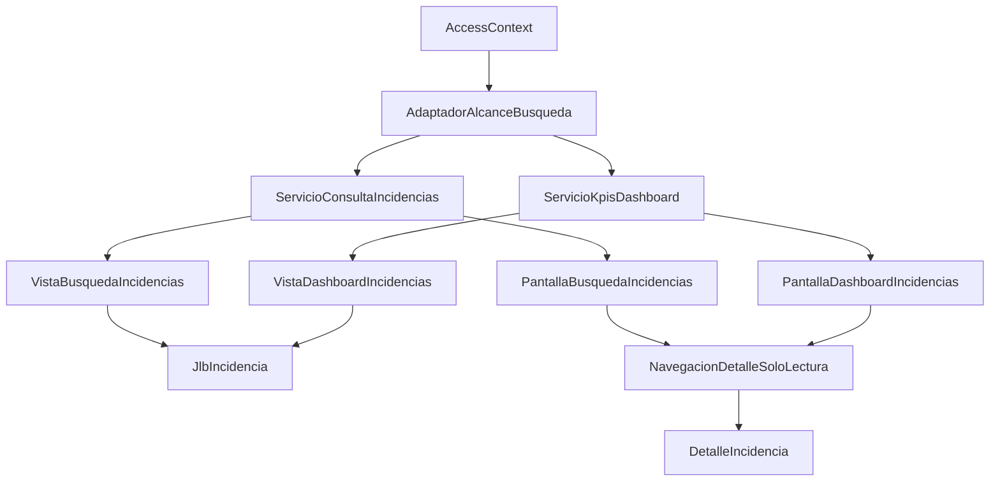
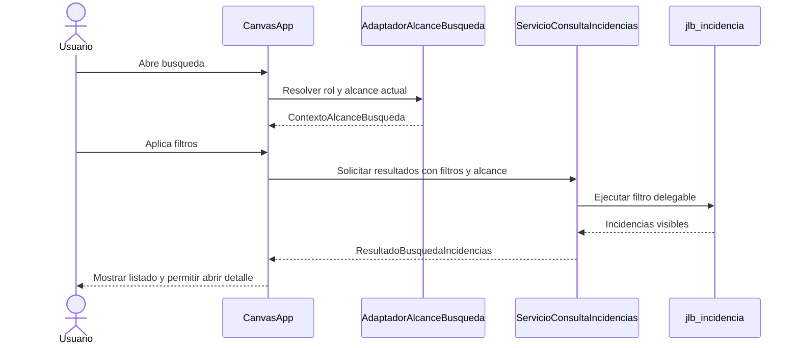
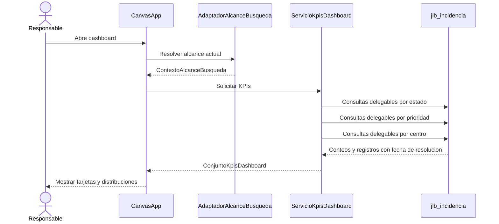
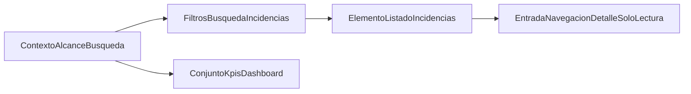

# Design Document

## Overview
Esta funcionalidad añade la capa de consulta terminal de incidencias dentro de la canvas app de Logística Sur S.L. Su propósito es permitir que Operarios, Supervisores y Administradores encuentren incidencias relevantes mediante filtros combinables y que Supervisores y Administradores visualicen KPIs operativos sin salir de la aplicación. La solución no crea ni altera incidencias: consume el modelo autoritativo ya definido por `incidencias-core` y el contexto de acceso ya resuelto por `autenticacion-roles`.

El impacto principal es incorporar dos superficies de lectura - busqueda/listado y dashboard - sobre la misma fuente `jlb_incidencia`, manteniendo exactitud funcional bajo restricciones de delegacion de Power Apps. El diseno prioriza filtrado server-side, reutilizacion del `AccessContext` canonico y navegacion al detalle consumiendo el contrato upstream de modo `manage`/`read-only` para no reabrir el boundary del lifecycle transaccional.

### Goals
- Permitir búsqueda multi-filtro combinable sobre incidencias dentro del alcance autorizado del usuario.
- Mostrar un dashboard con cinco KPIs operativos exactos y coherentes con el rol.
- Reutilizar nombres de rol, centro de trabajo y campos de `jlb_incidencia` ya aprobados upstream.
- Cumplir el objetivo de menos de 3 segundos para consultas habituales y apertura del dashboard.

### Non-Goals
- Crear, editar, asignar, resolver o cerrar incidencias desde esta capa.
- Cambiar el esquema autoritativo de `jlb_incidencia`, `jlb_tipoincidencia`, `jlb_perfilusuario` o `jlb_centrotrabajo`.
- Implementar comentarios, adjuntos, notificaciones o integración con Power BI.
- Introducir tablas agregadas nuevas o servicios externos para KPIs en v1.

## Boundary Commitments

### This Spec Owns
- La experiencia de búsqueda/listado de incidencias en modo solo consulta.
- La derivación del alcance de consulta a partir del contexto autorizado del usuario.
- Los contratos de filtro, listado y KPI consumidos por la canvas app.
- La experiencia de dashboard con los cinco KPIs requeridos.
- La navegación al detalle de incidencia en modo lectura y retorno con contexto preservado.

### Out of Boundary
- Mutaciones del dominio de incidencias: alta, edición, asignación, transiciones y cierre.
- Definición de la identidad del usuario, del rol de negocio o del centro de trabajo.
- Gestión del catálogo de tipos fuera de su uso como filtro de consulta.
- Comentarios, adjuntos, notificaciones y reporting externo.

### Allowed Dependencies
- `autenticacion-roles` como fuente autoritativa del `AccessContext` canonico (`entraObjectId`, `dataverseUserId`, `perfilUsuarioId`, `userPrincipalName`, `displayName`, `corporateEmail`, `role`, `centroTrabajoId`, `centroCodigo`, `centroTrabajoNombre`, `centroSecurityTeamId`, `dataScope`, `profileStatus`).
- `incidencias-core` como fuente autoritativa de `jlb_incidencia`, `jlb_tipoincidencia` y la semántica de estados e hitos.
- La canvas app `jlb_logsticasur_95873` como host de las nuevas pantallas de consulta.
- Vistas Dataverse exportadas sobre `jlb_incidencia` para reducir payload y estabilizar columnas consumidas.

### Revalidation Triggers
- Cambio de nombres o semántica en `Operario`, `Supervisor`, `Administrador`, `dataScope`, `jlb_perfilusuario` o `jlb_centrotrabajo`.
- Alta, baja o renombrado de columnas consumidas del contrato `jlb_incidencia`.
- Cambios en la secuencia de estados o en la semántica de `jlb_fechacreacion` o `jlb_fecharesolucion`.
- Sustitución del detalle de incidencias o de la estrategia de navegación de consulta.
- Cambios de rendimiento que obliguen a abandonar consultas delegables directas.

## Architecture

### Existing Architecture Analysis
La solución actual empaqueta una única canvas app en `src\CanvasApps` y mantiene los manifiestos de solución en `src\Other`. El metadato actual no declara aún referencias Dataverse ni fuentes de consulta, por lo que este feature debe registrar explícitamente sus dependencias de lectura. Los specs previos ya fijan los seams de acceso y de datos: `autenticacion-roles` entrega el contexto autorizado y `incidencias-core` publica la tabla `jlb_incidencia` con los campos necesarios para filtros y KPIs.

La principal restricción técnica proviene de Power Apps: las consultas deben ser delegables para no truncar resultados sobre conjuntos grandes. Por eso el diseño evita `ClearCollect()` masivo, evita agregación cliente de propósito general y concentra las lecturas sobre una única entidad o vista con columnas indexadas o ya previstas upstream.

### Architecture Pattern & Boundary Map


**Architecture Integration**:
- **Selected pattern**: canvas app como orquestador de lectura + adaptador de alcance + consultas delegables a Dataverse + navegación de consulta reutilizando el detalle existente.
- **Domain boundaries**: `AdaptadorAlcanceBusqueda` decide el perímetro; `ServicioConsultaIncidencias` resuelve filtros y listado; `ServicioKpisDashboard` calcula KPIs; las pantallas solo presentan estado y navegación.
- **Existing patterns preserved**: reutilizacion del `AccessContext` canonico, de la unica canvas app host y del contrato `jlb_incidencia` sin duplicacion de datos.
- **New components rationale**: cada componente aísla una responsabilidad visible y permite verificar filtros, KPIs y navegación sin mezclar el lifecycle upstream.
- **Steering compliance**: mantiene Power Apps + Dataverse como pila única y conserva Power BI fuera de alcance.
- **Dependency direction**: `AccessContext` -> `AdaptadorAlcanceBusqueda` -> `ServicioConsultaIncidencias` / `ServicioKpisDashboard` -> vistas Dataverse -> pantallas de consulta -> contrato de navegacion de detalle.

### Technology Stack

| Layer | Choice / Version | Role in Feature | Notes |
|-------|------------------|-----------------|-------|
| Frontend / CLI | Power Apps Canvas App 3.26074.x | Pantallas de búsqueda, dashboard y navegación de consulta | Reutiliza `jlb_logsticasur_95873` |
| Backend / Services | Power Fx delegable | Construcción de filtros, consultas y composición de KPIs | Sin servicio custom |
| Data / Storage | Microsoft Dataverse | Lectura de `jlb_incidencia`, `jlb_tipoincidencia`, `jlb_perfilusuario`, `jlb_centrotrabajo` y vistas exportadas | Sin cambios de ownership |
| Messaging / Events | No aplica | El feature es de solo consulta | No publica eventos |
| Infrastructure / Runtime | Entra ID + contexto de `autenticacion-roles` | Determina el alcance `self`, `center` o `global` | Dependencia P0 |

## File Structure Plan

### Directory Structure
```text
src\
├── CanvasApps\
│   ├── jlb_logsticasur_95873_DocumentUri.msapp                # Runtime de búsqueda, dashboard, estado de filtros y navegación de consulta
│   ├── jlb_logsticasur_95873.meta.xml                         # Referencias Dataverse y metadatos de la app host
│   └── jlb_logsticasur_95873_AdditionalUris0_identity.json    # Identidad del recurso ya empaquetado
├── Entities\
│   └── jlb_incidencia\
│       └── Views\
│           ├── jlb_incidencia_consulta.xml                    # Vista ligera para listado de búsqueda con columnas visibles
│           └── jlb_incidencia_dashboard.xml                   # Vista ligera para KPIs con columnas de estado, prioridad, centro y fechas
└── Other\
    ├── Customizations.xml                                     # Exportación de vistas, referencias y metadatos de app
    └── Solution.xml                                           # Registro de la app actualizada y de las vistas Dataverse del feature
```

### Modified Files
- `src\CanvasApps\jlb_logsticasur_95873_DocumentUri.msapp` — incorpora `AdaptadorAlcanceBusqueda`, `ServicioConsultaIncidencias`, `ServicioKpisDashboard`, `PantallaBusquedaIncidencias`, `PantallaDashboardIncidencias` y `NavegacionDetalleSoloLectura` dentro del runtime de la app.
- `src\CanvasApps\jlb_logsticasur_95873.meta.xml` — registra referencias Dataverse a `jlb_incidencia`, `jlb_tipoincidencia`, `jlb_perfilusuario` y `jlb_centrotrabajo`.
- `src\Other\Customizations.xml` — materializa vistas de consulta, ordenaciones por defecto y dependencias de la app.
- `src\Other\Solution.xml` — declara las vistas y el asset actualizado de la canvas app en la solución.

> No se añaden dependencias de terceros. Las vistas Dataverse no cambian el contrato físico de `jlb_incidencia`; solo fijan columnas, orden por defecto y superficies ligeras de lectura.

## System Flows





- El dashboard comparte el mismo `ContextoAlcanceBusqueda` que la búsqueda para impedir divergencias de perímetro.
- La navegacion al detalle desde busqueda o dashboard consume el contrato upstream de `incidencias-core` con `mode = "read-only"`, `origin` y un token explicito de retorno (`returnContextKey`).
- La distribución por centro, en alcance `center`, se representa solo con el centro vigente del supervisor; en alcance `global`, conserva la comparativa entre centros visibles.

## Requirements Traceability

| Requirement | Summary | Components | Interfaces | Flows |
|-------------|---------|------------|------------|-------|
| 1.1 | Carga inicial limitada por rol | AdaptadorAlcanceBusqueda, ServicioConsultaIncidencias, PantallaBusquedaIncidencias | `ContextoAlcanceBusqueda`, `ConsultaBusquedaIncidencias` | Búsqueda |
| 1.2 | Operario solo ve creadas o asignadas | AdaptadorAlcanceBusqueda, ServicioConsultaIncidencias | `ContextoAlcanceBusqueda` | Búsqueda |
| 1.3 | Supervisor ve solo su centro | AdaptadorAlcanceBusqueda, ServicioConsultaIncidencias | `ContextoAlcanceBusqueda` | Búsqueda |
| 1.4 | Administrador ve todos los centros | AdaptadorAlcanceBusqueda, ServicioConsultaIncidencias | `ContextoAlcanceBusqueda` | Búsqueda |
| 1.5 | Denegación fuera de alcance | AdaptadorAlcanceBusqueda, NavegacionDetalleSoloLectura | `DecisionAccesoIncidencia` | Búsqueda |
| 1.6 | Capa de solo consulta | PantallaBusquedaIncidencias, PantallaDashboardIncidencias, NavegacionDetalleSoloLectura | `EntradaNavegacionDetalleSoloLectura` | Búsqueda, Dashboard |
| 2.1 | Filtros visibles requeridos | PantallaBusquedaIncidencias, ServicioConsultaIncidencias | `FiltrosBusquedaIncidencias` | Búsqueda |
| 2.2 | Filtros combinables AND | ServicioConsultaIncidencias | `ConsultaBusquedaIncidencias` | Búsqueda |
| 2.3 | Rango de fechas visible | ServicioConsultaIncidencias | `FiltroRangoFechas` | Búsqueda |
| 2.4 | Centro fijo para supervisor | AdaptadorAlcanceBusqueda, PantallaBusquedaIncidencias | `PoliticaFiltroCentro` | Búsqueda |
| 2.5 | Tipos históricos siguen consultables | ServicioConsultaIncidencias, PantallaBusquedaIncidencias | `OpcionFiltroTipoIncidencia` | Búsqueda |
| 2.6 | Restablecer filtros al alcance base | PantallaBusquedaIncidencias | `FiltrosBusquedaIncidencias` | Búsqueda |
| 2.7 | Estado vacío explícito | PantallaBusquedaIncidencias | `ResultadoBusquedaIncidencias` | Búsqueda |
| 3.1 | Columnas visibles en resultados | ServicioConsultaIncidencias, PantallaBusquedaIncidencias | `ElementoListadoIncidencias` | Búsqueda |
| 3.2 | Detalle en modo consulta | NavegacionDetalleSoloLectura | `EntradaNavegacionDetalleSoloLectura` | Búsqueda, Dashboard |
| 3.3 | Preservación de filtros al volver | PantallaBusquedaIncidencias, NavegacionDetalleSoloLectura | `EstadoUiBusqueda` | Búsqueda |
| 3.4 | Error y reintento visibles | ServicioConsultaIncidencias, PantallaBusquedaIncidencias, PantallaDashboardIncidencias | `EstadoErrorConsulta` | Búsqueda |
| 4.1 | Cinco KPIs requeridos | ServicioKpisDashboard, PantallaDashboardIncidencias | `ConjuntoKpisDashboard` | Dashboard |
| 4.2 | KPI abiertas | ServicioKpisDashboard | `ConjuntoKpisDashboard` | Dashboard |
| 4.3 | KPI cerradas | ServicioKpisDashboard | `ConjuntoKpisDashboard` | Dashboard |
| 4.4 | Tiempo medio de resolución | ServicioKpisDashboard | `MetricaResolucion` | Dashboard |
| 4.5 | Distribución por prioridad | ServicioKpisDashboard, PantallaDashboardIncidencias | `FilaDistribucionPrioridad` | Dashboard |
| 4.6 | Distribución por centro | ServicioKpisDashboard, PantallaDashboardIncidencias | `FilaDistribucionCentro` | Dashboard |
| 4.7 | Ceros y vacíos claros | ServicioKpisDashboard, PantallaDashboardIncidencias | `EstadoVacioDashboard` | Dashboard |
| 5.1 | KPIs del supervisor limitados a su centro | AdaptadorAlcanceBusqueda, ServicioKpisDashboard | `ContextoAlcanceBusqueda` | Dashboard |
| 5.2 | KPIs globales para administrador con acotación reversible | AdaptadorAlcanceBusqueda, ServicioKpisDashboard, PantallaDashboardIncidencias | `SeleccionAlcanceDashboard` | Dashboard |
| 5.3 | Operario sin acceso al dashboard | AdaptadorAlcanceBusqueda, PantallaDashboardIncidencias | `PoliticaAccesoDashboard` | Dashboard |
| 5.4 | Alcance refrescado entre sesiones | AdaptadorAlcanceBusqueda | `ContextoAlcanceBusqueda` | Dashboard |
| 6.1 | Respuesta menor de 3 segundos | ServicioConsultaIncidencias, ServicioKpisDashboard | `ResultadoBusquedaIncidencias`, `ConjuntoKpisDashboard` | Búsqueda, Dashboard |
| 6.2 | Resultados completos sin truncado funcional | ServicioConsultaIncidencias, ServicioKpisDashboard | `PoliticaConsultaDelegable` | Búsqueda, Dashboard |
| 6.3 | Misma experiencia en web y móvil | PantallaBusquedaIncidencias, PantallaDashboardIncidencias, NavegacionDetalleSoloLectura | `EstadoUiBusqueda` | Búsqueda, Dashboard |
| 6.4 | KPIs dentro de la app | PantallaDashboardIncidencias | `ConjuntoKpisDashboard` | Dashboard |

## Components and Interfaces

| Component | Domain/Layer | Intent | Req Coverage | Key Dependencies (P0/P1) | Contracts |
|-----------|--------------|--------|--------------|--------------------------|-----------|
| AdaptadorAlcanceBusqueda | Estado de acceso | Traducir `AccessContext` a alcance utilizable por consulta | 1.1, 1.2, 1.3, 1.4, 1.5, 2.4, 5.1, 5.2, 5.3, 5.4 | `AccessContext` (P0) | Service, State |
| ServicioConsultaIncidencias | Consulta | Resolver filtros delegables y construir el listado visible | 1.1, 2.1, 2.2, 2.3, 2.5, 2.6, 2.7, 3.1, 3.4, 6.1, 6.2 | `jlb_incidencia` (P0), `jlb_tipoincidencia` (P1) | Service |
| ServicioKpisDashboard | Agregación | Calcular KPIs y distribuciones sin ampliar el alcance | 4.1, 4.2, 4.3, 4.4, 4.5, 4.6, 4.7, 5.1, 5.2, 6.1, 6.2, 6.4 | `jlb_incidencia` (P0), AdaptadorAlcanceBusqueda (P0) | Service |
| PantallaBusquedaIncidencias | UI | Presentar filtros, resultados, vacíos y reintento | 1.6, 2.1, 2.6, 2.7, 3.1, 3.3, 3.4, 6.3 | ServicioConsultaIncidencias (P0) | State |
| PantallaDashboardIncidencias | UI | Presentar KPIs, restricciones de rol y drill-in | 1.6, 4.1, 4.7, 5.2, 5.3, 6.3, 6.4 | ServicioKpisDashboard (P0) | State |
| NavegacionDetalleSoloLectura | Navegación | Abrir el detalle existente en modo consulta y volver con contexto | 1.5, 1.6, 3.2, 3.3, 6.3 | PantallaBusquedaIncidencias (P0), PantallaDashboardIncidencias (P0), detalle de incidencias-core (P1) | Service, State |

### Estado de acceso

#### AdaptadorAlcanceBusqueda

| Field | Detail |
|-------|--------|
| Intent | Derivar un contrato único de alcance de lectura para búsqueda y dashboard |
| Requirements | 1.1, 1.2, 1.3, 1.4, 1.5, 2.4, 5.1, 5.2, 5.3, 5.4 |

**Responsibilities & Constraints**
- Resolver un único alcance visible a partir del rol y centro del usuario autenticado.
- Impedir que un filtro de la UI amplíe el perímetro base del usuario.
- Exponer si el dashboard está permitido y cómo se comporta el filtro de centro.
- Mantener el mismo contrato para búsqueda y dashboard durante una sesión.

**Dependencies**
- Inbound: `AccessContext` - `role`, `dataScope`, `perfilUsuarioId`, `dataverseUserId`, `centroTrabajoId`, `centroCodigo`, `centroTrabajoNombre` y `centroSecurityTeamId` ya resueltos (P0)
- Outbound: `ServicioConsultaIncidencias` — consume restricciones de consulta (P0)
- Outbound: `ServicioKpisDashboard` — consume restricciones de agregación (P0)
- External: canvas app session state — almacenamiento local del estado de consulta (P1)

**Contracts**: Service [x] / API [ ] / Event [ ] / Batch [ ] / State [x]

##### Service Interface
```typescript
type BusinessRole = "Operario" | "Supervisor" | "Administrador";
type DataScope = "self" | "center" | "global";
type ModoFiltroCentro = "hidden" | "fixed" | "selectable";

interface AccessContext {
  entraObjectId: string;
  dataverseUserId: string;
  perfilUsuarioId: string;
  userPrincipalName: string;
  displayName: string;
  corporateEmail: string;
  role: BusinessRole;
  centroTrabajoId: string;
  centroCodigo: string;
  centroTrabajoNombre: string;
  centroSecurityTeamId: string;
  dataScope: DataScope;
  profileStatus: "active" | "blocked";
}

interface ContextoAlcanceBusqueda {
  role: BusinessRole;
  dataScope: DataScope;
  dataverseUserId: string;
  perfilUsuarioId: string;
  centroTrabajoId: string;
  centroCodigo: string;
  centroTrabajoNombre: string;
  centroSecurityTeamId: string;
  dashboardHabilitado: boolean;
  modoFiltroCentro: ModoFiltroCentro;
}

interface ServicioAdaptadorAlcanceBusqueda {
  resolver(acceso: AccessContext): ContextoAlcanceBusqueda;
}
```
- Preconditions: `AccessContext` proviene de `autenticacion-roles`, mantiene exactamente los nombres canonicos upstream y llega con `profileStatus = "active"`.
- Postconditions: el alcance resultante es determinista para búsqueda y dashboard.
- Invariants: nunca genera un alcance mas amplio que `dataScope`; en alcance `self` filtra por `createdby == dataverseUserId` o `jlb_responsableid == perfilUsuarioId`.

**Implementation Notes**
- Integration: se inicializa al entrar en las pantallas de consulta y al reabrir la app.
- Validation: cubrir operario, supervisor, administrador y rol inválido bloqueado upstream.
- Risks: cualquier cambio upstream en `dataScope` obliga a revalidar filtros y dashboard.

### Consulta

#### ServicioConsultaIncidencias

| Field | Detail |
|-------|--------|
| Intent | Traducir filtros de usuario y alcance autorizado a consultas delegables de listado |
| Requirements | 1.1, 2.1, 2.2, 2.3, 2.5, 2.6, 2.7, 3.1, 3.4, 6.1, 6.2 |

**Responsibilities & Constraints**
- Combinar filtros visibles con el alcance base usando semántica AND.
- Consultar solo columnas necesarias para el listado.
- Mantener consultables incidencias históricas con tipos hoy inactivos.
- Devolver estados explícitos de vacío, error y éxito sin resultados parciales ambiguos.

**Dependencies**
- Inbound: `AdaptadorAlcanceBusqueda` - aporta limites de consulta y la traduccion canonica de `dataverseUserId`/`perfilUsuarioId` a filtros efectivos (P0)
- Outbound: vista `jlb_incidencia_consulta` — proyección ligera de columnas visibles (P0)
- External: `jlb_incidencia` — tabla autoritativa de incidencias (P0)
- External: `jlb_tipoincidencia` — nombres visibles de clasificación (P1)

**Contracts**: Service [x] / API [ ] / Event [ ] / Batch [ ] / State [ ]

##### Service Interface
```typescript
interface FiltroRangoFechas {
  desde?: string;
  hasta?: string;
}

interface FiltrosBusquedaIncidencias {
  estado?: string;
  prioridad?: string;
  fecha?: FiltroRangoFechas;
  tipoIncidenciaId?: string;
  responsablePerfilUsuarioId?: string;
  centroTrabajoId?: string;
}

interface ElementoListadoIncidencias {
  // incidenciaId: GUID interno usado solo para navegar al detalle (IncidentDetailNavigationInput.incidenciaId).
  // idIncidencia: identificador de negocio visible al usuario; nunca se usa para navegación.
  incidenciaId: string;
  idIncidencia: string;
  titulo: string;
  estado: string;
  prioridad: string;
  tipoIncidenciaNombre: string;
  responsableNombre?: string;
  centroTrabajoNombre: string;
  fechaCreacion: string;
  fechaResolucion?: string;
}

interface ResultadoBusquedaIncidencias {
  filtros: FiltrosBusquedaIncidencias;
  elementos: ElementoListadoIncidencias[];
  sinResultados: boolean;
}

interface ServicioConsultaIncidencias {
  buscar(contexto: ContextoAlcanceBusqueda, filtros: FiltrosBusquedaIncidencias): ResultadoBusquedaIncidencias;
}
```
- Preconditions: los filtros ya fueron normalizados por la UI y el rango de fechas es válido.
- Postconditions: cada elemento pertenece al alcance autorizado y cumple todos los filtros activos.
- Invariants: no se usa una colección local masiva como fuente de verdad del listado.

**Implementation Notes**
- Integration: utiliza filtros delegables sobre `jlb_incidencia` y orden por fecha de creación descendente por defecto.
- Validation: probar combinación de filtros, reset y tipo histórico inactivo.
- Risks: fórmulas no delegables introducidas durante implementación pueden romper exactitud en producción.

#### ServicioKpisDashboard

| Field | Detail |
|-------|--------|
| Intent | Calcular los cinco KPIs requeridos sin romper el perímetro de consulta ni la exactitud de datos |
| Requirements | 4.1, 4.2, 4.3, 4.4, 4.5, 4.6, 4.7, 5.1, 5.2, 6.1, 6.2, 6.4 |

**Responsibilities & Constraints**
- Calcular abiertas y cerradas a partir del estado actual de la incidencia.
- Calcular tiempo medio de resolución usando solo incidencias con `jlb_fecharesolucion` disponible.
- Exponer distribuciones por prioridad y por centro sin ampliar el alcance visible.
- Devolver ceros o vacíos explícitos cuando no haya datos.

**Dependencies**
- Inbound: `AdaptadorAlcanceBusqueda` — aporta límites de agregación (P0)
- Outbound: vista `jlb_incidencia_dashboard` — columnas mínimas para KPIs (P0)
- External: `jlb_incidencia` — fechas, estado, prioridad y centro (P0)

**Contracts**: Service [x] / API [ ] / Event [ ] / Batch [ ] / State [ ]

##### Service Interface
```typescript
interface MetricaResolucion {
  horasResolucionMedia: number;
  tamanoMuestra: number;
}

interface FilaDistribucionPrioridad {
  prioridad: string;
  total: number;
}

interface FilaDistribucionCentro {
  centroTrabajoId: string;
  centroTrabajoNombre: string;
  total: number;
}

interface ConjuntoKpisDashboard {
  abiertas: number;
  cerradas: number;
  tiempoMedioResolucion: MetricaResolucion;
  porPrioridad: FilaDistribucionPrioridad[];
  porCentro: FilaDistribucionCentro[];
}

interface ServicioKpisDashboard {
  obtenerKpis(contexto: ContextoAlcanceBusqueda, centroTrabajoSeleccionadoId?: string): ConjuntoKpisDashboard;
}
```
- Preconditions: el usuario tiene permiso de dashboard segun `ContextoAlcanceBusqueda` y el `AccessContext.profileStatus` canonico permanece activo.
- Postconditions: los cinco KPIs se calculan sobre el mismo alcance lógico.
- Invariants: `centroTrabajoSeleccionadoId` solo puede estrechar alcance cuando `dataScope == "global"`.

**Implementation Notes**
- Integration: las distribuciones usan consultas delegables separadas por dominio pequeño, no `GroupBy()` cliente sobre todo el dataset.
- Validation: medir respuesta en supervisor y administrador con datos de varios centros.
- Risks: si la cardinalidad de centros crece, la distribución global por centro necesitará revisión de rendimiento.

### UI y navegación

#### PantallaBusquedaIncidencias

| Field | Detail |
|-------|--------|
| Intent | Presentar filtros, listado, estado vacío, error y conservación del contexto |
| Requirements | 1.6, 2.1, 2.6, 2.7, 3.1, 3.3, 3.4, 6.3 |

**Responsibilities & Constraints**
- Presentar los filtros requeridos y sus políticas visibles por rol.
- Mostrar la lista resultante con columnas mínimas estables.
- Conservar el estado de búsqueda al navegar al detalle y volver.
- No exponer acciones de mutación dentro de esta superficie.

**Dependencies**
- Inbound: `ServicioConsultaIncidencias` — fuente del listado (P0)
- Inbound: `AdaptadorAlcanceBusqueda` - define politicas visibles de centro y dashboard a partir del contrato canonico de sesion (P0)
- Outbound: `NavegacionDetalleSoloLectura` — apertura de detalle (P1)

**Contracts**: Service [ ] / API [ ] / Event [ ] / Batch [ ] / State [x]

##### State Management
- State model: `EstadoUiBusqueda` con filtros activos, estado de carga, resultados y origen de retorno.
- Persistence & consistency: persiste solo durante la sesión visible del usuario.
- Concurrency strategy: la última búsqueda confirmada sustituye a la anterior y limpia errores obsoletos.

**Implementation Notes**
- Integration: la UX debe adaptarse a pantalla web y tablet, así como a móvil, sin cambiar comportamiento.
- Validation: comprobar reset, vacío, reintento y retorno desde detalle.
- Risks: una maquetación no responsiva puede ocultar filtros críticos en móvil.

#### PantallaDashboardIncidencias

| Field | Detail |
|-------|--------|
| Intent | Presentar KPIs y restricciones visibles por rol |
| Requirements | 1.6, 4.1, 4.7, 5.2, 5.3, 6.3, 6.4 |

**Responsibilities & Constraints**
- Mostrar solo el dashboard a usuarios autorizados.
- Renderizar tarjetas y distribuciones con estados de carga, vacío y error claros.
- Permitir al administrador acotar por centro sin perder la posibilidad de volver a global.
- Mantener la experiencia dentro de la app sin depender de reporting externo.

**Dependencies**
- Inbound: `ServicioKpisDashboard` — datos agregados (P0)
- Inbound: `AdaptadorAlcanceBusqueda` — política de acceso y selección de centro (P0)
- Outbound: `NavegacionDetalleSoloLectura` — drill-in opcional a incidencias concretas (P1)

**Contracts**: Service [ ] / API [ ] / Event [ ] / Batch [ ] / State [x]

##### State Management
- State model: alcance actual, centro seleccionado cuando aplique, KPIs y estado de error.
- Persistence & consistency: recalcula al abrir la pantalla y al cambiar el centro seleccionado por un administrador.
- Concurrency strategy: invalida resultados anteriores cuando cambia el alcance.

**Implementation Notes**
- Integration: las distribuciones pueden enlazar con la búsqueda reutilizando el mismo centro o prioridad como filtro inicial.
- Validation: cubrir supervisor, administrador, operario denegado y vacío sin incidencias.
- Risks: si el drill-in no preserva contexto, el usuario pierde continuidad analítica.

#### NavegacionDetalleSoloLectura

| Field | Detail |
|-------|--------|
| Intent | Navegar al detalle existente sin abrir el boundary de mutaciones |
| Requirements | 1.5, 1.6, 3.2, 3.3, 6.3 |

**Responsibilities & Constraints**
- Pasar `incidenciaId`, `origin`, `returnContextKey` y `mode = "read-only"` conforme al seam de detalle publicado por `incidencias-core` (`IncidentDetailNavigationInput` / `IncidentDetailNavigationResult`, sin alias locales).
- Aplicar guard previo de acceso antes de abrir el detalle, reutilizando la semantica upstream de creador (`creadorSystemUserId` frente a `AccessContext.dataverseUserId`) y responsable (`jlb_responsableid` frente a `AccessContext.perfilUsuarioId`).
- Restaurar el contexto de busqueda o dashboard al volver mediante el contrato de salida del detalle.
- Bloquear acciones transaccionales cuando el origen sea esta capa de consulta, aunque el detalle soporte `mode = "manage"` para otros flujos.

**Dependencies**
- Inbound: `PantallaBusquedaIncidencias` — origen de consulta (P0)
- Inbound: `PantallaDashboardIncidencias` — origen analítico (P0)
- External: detalle reutilizable de `incidencias-core` - consume campos visibles `idIncidencia` (identificador de negocio, no forma parte del contrato de navegación), `estado`, `prioridad`, `tipoIncidencia`, `responsable`, `centroTrabajo`, `fechaCreacion`, `fechaAsignacion`, `fechaResolucion` y el contrato de navegación público `IncidentDetailNavigationInput` / `IncidentDetailNavigationResult` (`mode`: `manage` | `read-only`), que usa exclusivamente `incidenciaId` (GUID) para abrir/cerrar el detalle (P1)

**Contracts**: Service [x] / API [ ] / Event [ ] / Batch [ ] / State [x]

##### Service Interface
```typescript
type OrigenNavegacionDetalleSoloLectura = "search" | "dashboard";

interface EntradaNavegacionDetalleSoloLectura {
  incidenciaId: string;
  mode: "read-only";
  origin: OrigenNavegacionDetalleSoloLectura;
  returnContextKey?: string | null;
}

interface SalidaNavegacionDetalleSoloLectura {
  origin: OrigenNavegacionDetalleSoloLectura;
  mode: "read-only";
  returnContextKey?: string | null;
  didMutate: boolean;
}

interface ServicioNavegacionDetalleSoloLectura {
  open(input: EntradaNavegacionDetalleSoloLectura): void;
  restore(output: SalidaNavegacionDetalleSoloLectura): void;
}
```
- Nota de compatibilidad: `EntradaNavegacionDetalleSoloLectura` y `SalidaNavegacionDetalleSoloLectura` son alias 1:1 (mismos campos y tipos) de `IncidentDetailNavigationInput` / `IncidentDetailNavigationResult` publicados por `incidencias-core`; `origin` se restringe aquí a `"search" | "dashboard"` como subconjunto válido de `IncidentDetailOrigin`. No se renombran ni transforman campos al cruzar el seam.
- Preconditions: la incidencia ya fue validada dentro del alcance autorizado.
- Postconditions: el usuario ve el detalle sin acciones de mutación y puede volver con contexto restaurado.
- Invariants: `mode` es siempre `"read-only"` cuando el origen es este spec y nunca se promueve localmente a `"manage"`.

**Implementation Notes**
- Integration: depende de que `incidencias-core` publique y mantenga estable el seam de detalle con `mode`, parametros de entrada/salida y restauracion de contexto; mientras esa publicacion siga implicita, este spec lo consume como dependencia explicita a revalidar.
- Validation: probar navegación desde búsqueda y dashboard, incluida denegación previa.
- Risks: si el detalle upstream ignora el modo lectura, se rompe la frontera funcional de este spec.

## Data Models

### Domain Model
- **ContextoAlcanceBusqueda**: valor derivado del acceso autorizado que delimita qué datos se pueden consultar.
- **FiltrosBusquedaIncidencias**: estado visible de filtros combinables aplicado con semántica AND.
- **ElementoListadoIncidencias**: proyección ligera de `jlb_incidencia` para la galería o listado.
- **ConjuntoKpisDashboard**: agregado efímero de métricas calculadas a partir del alcance visible.
- **Invariants**:
  - Ningún resultado o KPI puede incluir incidencias fuera del `ContextoAlcanceBusqueda`.
  - Los filtros solo estrechan resultados; nunca amplían el alcance base.
  - El dashboard no está disponible para `Operario`.
  - El detalle abierto desde esta capa permanece en modo solo consulta.



### Logical Data Model

**Structure Definition**:
- Fuente principal: `jlb_incidencia`
  - `jlb_incidenciaid`
  - `jlb_idincidencia`
  - `jlb_titulo`
  - `jlb_estado`
  - `jlb_prioridad`
  - `jlb_tipoincidenciaid`
  - `jlb_fechacreacion`
  - `jlb_fecharesolucion`
  - `jlb_responsableid`
  - `jlb_centrotrabajoid`
- Catálogos de apoyo:
  - `jlb_tipoincidencia.jlb_nombre`, `statecode/statuscode`
  - `jlb_perfilusuario` para nombres visibles de responsable y alcance individual
  - `jlb_centrotrabajo.jlb_nombre`, `jlb_codigo`
- Proyecciones de lectura:
  - `jlb_incidencia_consulta` — columnas visibles del listado y orden por fecha de creación.
  - `jlb_incidencia_dashboard` — columnas mínimas para conteos y métricas de dashboard.

**Consistency & Integrity**:
- No se añade ninguna columna ni tabla de negocio nueva; el feature es consumidor puro.
- Los filtros por tipo deben seguir devolviendo incidencias históricas aunque el tipo esté inactivo.
- `jlb_centrotrabajoid` y `jlb_responsableid` se interpretan con las reglas autorizadas upstream, no con reglas locales nuevas.

### Physical Data Model
- No hay migración de esquema ni nuevas tablas.
- Se reutilizan los índices ya recomendados por `incidencias-core` para `jlb_estado`, `jlb_centrotrabajoid`, `jlb_responsableid`, `jlb_tipoincidenciaid`, junto con filtros por `jlb_fechacreacion` y `jlb_fecharesolucion`.
- Las vistas exportadas deben fijar selección explícita de columnas para minimizar payload de la app.
- La ordenación por defecto del listado debe priorizar `jlb_fechacreacion` descendente y no requerir colección masiva local.

### Data Contracts & Integration
- **Consulta de busqueda (entrada)**: alcance derivado y filtros visibles.
- **Resultado de busqueda (salida)**: lista de filas con identificador, clasificacion, prioridad, responsable, centro y fechas visibles.
- **Salida de KPIs del dashboard**: cinco metricas y distribuciones basadas en el mismo alcance logico.
- **Cross-Spec Integration**:
  - `autenticacion-roles` aporta el contexto de rol, centro y `dataScope`.
  - `incidencias-core` aporta el contrato estable de `jlb_incidencia` y el detalle reutilizable.
  - No hay consumidores downstream adicionales desde este spec.

## Error Handling

### Error Strategy
La experiencia de consulta falla pronto y de forma visible. Los errores de acceso se resuelven antes de mostrar datos. Los errores de consulta muestran mensaje y reintento explícito. Los vacíos funcionales se representan como vacíos válidos, no como errores. El dashboard nunca debe mezclar datos de un alcance anterior con el actual.

### Error Categories and Responses
- **User Errors**: rango de fechas inválido o filtro incompatible → mensaje visible y sin ejecutar consulta ambigua.
- **Authorization Errors**: acceso a incidencia fuera de alcance o dashboard desde `Operario` → denegación o redirección segura sin datos.
- **System Errors**: timeout o fallo temporal de Dataverse → estado de error con reintento manual.
- **Consistency Errors**: contexto de acceso ausente o cambiado entre sesiones → recalcular alcance y bloquear hasta tener contexto válido.

### Monitoring
- Medir tiempos de carga y número de consultas con Monitor de Power Apps durante validación.
- Revisar warnings de delegación en todas las fórmulas del buscador y dashboard.
- Confirmar que las pantallas no disparan consultas redundantes al volver del detalle.

## Testing Strategy

### Unit Tests
- Validar que `AdaptadorAlcanceBusqueda` traduce correctamente `Operario`, `Supervisor` y `Administrador` a `self`, `center` y `global` según el contrato upstream.
- Validar que la política del filtro de centro devuelve `hidden`, `fixed` o `selectable` según el rol.
- Validar que la normalización del rango de fechas rechaza intervalos inválidos antes de consultar.

### Integration Tests
- Verificar que el buscador combina estado, prioridad, fecha, tipo, responsable y centro con semántica AND sin ampliar alcance (1.1, 2.1, 2.2, 2.3, 2.4).
- Verificar que las incidencias con tipos inactivos siguen apareciendo y pueden filtrarse por su tipo histórico (2.5).
- Verificar que un deep link o intento de apertura fuera de alcance devuelve denegación sin datos (1.5, 3.2).
- Verificar que el dashboard calcula abiertas, cerradas y tiempo medio de resolución sobre el mismo conjunto lógico (4.1, 4.2, 4.3, 4.4).
- Verificar que el administrador puede acotar a un centro y volver a global, y que el supervisor nunca amplía su alcance (5.1, 5.2, 5.4).

### E2E/UI Tests
- Operario entra en búsqueda, ve solo sus incidencias, abre una y vuelve manteniendo filtros (1.2, 3.2, 3.3).
- Supervisor filtra por prioridad y fecha, obtiene resultados de su centro y ve dashboard limitado a ese centro (1.3, 2.3, 5.1).
- Administrador consulta global, restringe temporalmente a un centro y restablece la vista global (1.4, 5.2).
- Operario intenta abrir dashboard y recibe denegación o redirección segura (5.3).
- Ante fallo temporal de consulta, la pantalla muestra error y permite reintento (3.4, 4.7).

### Performance/Load
- Medir apertura inicial del buscador y del dashboard en menos de 3 segundos con consultas habituales (6.1).
- Verificar ausencia de truncado funcional sobre datasets superiores a los límites locales de cliente revisando fórmulas delegables (6.2).
- Validar comportamiento consistente en navegador, Android, iPhone y tablet (6.3).

### Security Considerations
- Toda la seguridad funcional depende del contexto autorizado upstream; esta capa no redefine permisos.
- El dashboard se considera información sensible agregada y queda restringido a `Supervisor` y `Administrador`.
- La navegación en modo solo consulta debe impedir que un origen analítico habilite acciones transaccionales por error.

### Performance & Scalability
- Patrón primario: una única entidad o vista por pantalla con filtros delegables y columnas explícitas.
- Evitar `ClearCollect()` masivo y lookups por fila en galerías.
- Calcular distribuciones mediante consultas pequeñas y repetibles sobre dominios acotados, no mediante agregación cliente general.
- Validar con Monitor que el número de llamadas y el payload siguen siendo aceptables bajo uso concurrente esperado.
