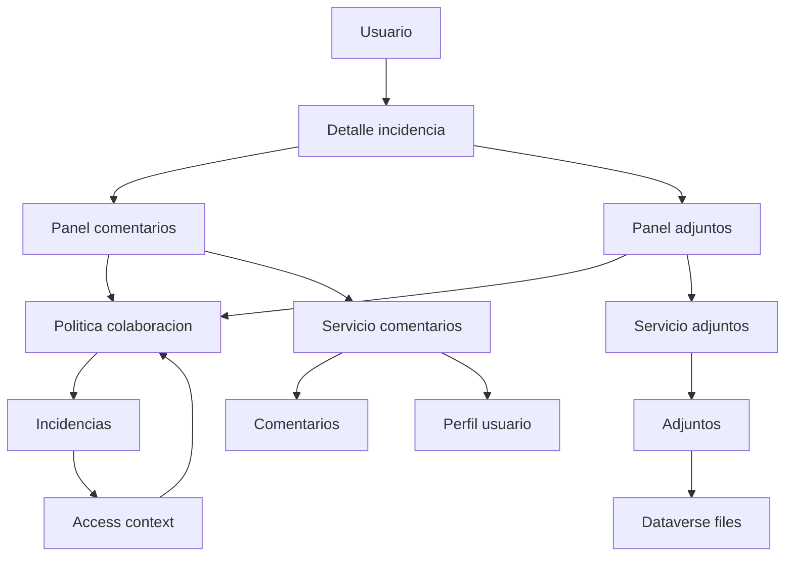
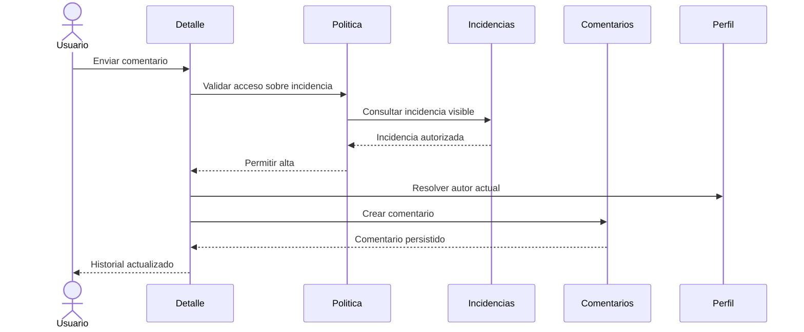
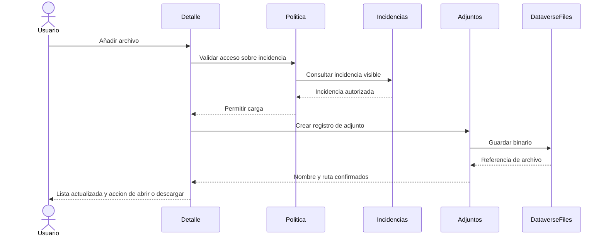
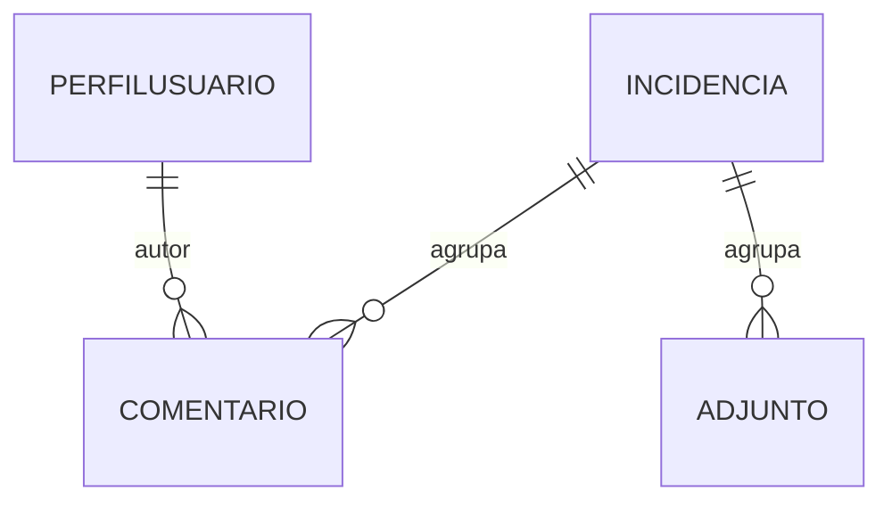

## Overview
Este feature amplía la gestión de incidencias de Logística Sur S.L. con dos capacidades colaborativas ligadas a incidencias ya existentes: comentarios inmutables y adjuntos de imágenes/PDF. El objetivo es consolidar en la misma canvas app el contexto operativo que hoy queda disperso entre llamadas, correos y archivos compartidos, sin tocar el ciclo de vida de la incidencia ni la política de acceso ya resuelta upstream.

Los usuarios finales siguen siendo Operarios, Supervisores y Administradores, pero la colaboración no define nuevos roles ni nuevos criterios de visibilidad. Su responsabilidad se limita a persistir y presentar información complementaria de una incidencia visible, reutilizando la pantalla de detalle y los contratos autoritativos de `autenticacion-roles` e `incidencias-core`.

### Goals
- Añadir un historial de comentarios append-only ligado a cada incidencia visible.
- Permitir adjuntar imágenes y documentos PDF almacenados en Dataverse, con previsualización de imágenes y descarga de ambos tipos.
- Mantener el mismo alcance de acceso que la incidencia padre sin duplicar lógica derivada de `role`, `centroTrabajoId`, `centroCodigo`, `centroTrabajoNombre` o `dataScope`.

### Non-Goals
- Redefinir la tabla `Incidencias`, su alta, asignación o transiciones de estado.
- Implementar búsqueda, filtrado, dashboard o notificaciones sobre comentarios o adjuntos.
- Permitir edición, sustitución o borrado funcional de comentarios o adjuntos ya creados.
- Introducir almacenamiento externo fuera de Dataverse.

## Boundary Commitments

### This Spec Owns
- Las tablas Dataverse `Comentarios` y `Adjuntos` como subentidades 1-N de `Incidencias`.
- La experiencia de detalle para alta y lectura de comentarios inmutables.
- La experiencia de detalle para alta de adjuntos válidos, previsualización de imágenes y descarga de imágenes/PDF.
- El contrato funcional que liga cada comentario o adjunto a una incidencia existente mediante `IdIncidencia` o su GUID técnico.

### Out of Boundary
- La definición del esquema de `Incidencias` y sus campos de negocio ya fijados por `incidencias-core`.
- La autenticación, la resolución del perfil y los campos canónicos `role`, `perfilUsuarioId`, `centroTrabajoId`, `centroCodigo`, `centroTrabajoNombre`, `centroSecurityTeamId`, `dataScope` y `profileStatus` definidos por `autenticacion-roles`.
- Notificaciones, reporting, conteos agregados, búsqueda o filtros avanzados sobre colaboración.
- Cualquier flujo de edición o borrado de comentarios y adjuntos desde la aplicación.

### Allowed Dependencies
- `incidencias-core` como fuente autoritativa de `jlb_incidencia`, `IdIncidencia`, `Responsable`, `CentroTrabajo` y el seam de detalle de incidencia.
- `autenticacion-roles` como fuente autoritativa de `AccessContext` (`entraObjectId`, `dataverseUserId`, `perfilUsuarioId`, `userPrincipalName`, `displayName`, `corporateEmail`, `role`, `centroTrabajoId`, `centroCodigo`, `centroTrabajoNombre`, `centroSecurityTeamId`, `dataScope`, `profileStatus`), `jlb_perfilusuario`, `jlb_rolnegocio` y `jlb_centrotrabajo`.
- Capacidades nativas de Dataverse para tablas, relaciones, auditoría y almacenamiento de archivos.
- La canvas app `jlb_logsticasur_95873` como host único de la experiencia de usuario.

### Revalidation Triggers
- Cambios en el identificador estable de `Incidencias` o en la semántica de su política de alcance.
- Cambios en el esquema o la semántica de `jlb_perfilusuario` o en cualquier campo canónico de `AccessContext` (`entraObjectId`, `dataverseUserId`, `perfilUsuarioId`, `userPrincipalName`, `displayName`, `corporateEmail`, `role`, `centroTrabajoId`, `centroCodigo`, `centroTrabajoNombre`, `centroSecurityTeamId`, `dataScope`, `profileStatus`).
- Cambios en la forma de almacenar o resolver archivos en Dataverse que afecten a `RutaArchivo`.
- Nuevos requisitos que exijan edición/borrado, conteos agregados, preview de PDF o almacenamiento externo.

## Architecture

### Existing Architecture Analysis
La solución fuente sigue siendo una app canvas empaquetada con metadatos mínimos (`Solution.xml`, `Customizations.xml` y `jlb_logsticasur_95873.meta.xml`). El spec `incidencias-core` ya reservó la pantalla de detalle como punto de entrada para colaboración, y el spec `autenticacion-roles` consolidó el patrón `AccessContext` canónico (`entraObjectId`, `dataverseUserId`, `perfilUsuarioId`, `userPrincipalName`, `displayName`, `corporateEmail`, `role`, `centroTrabajoId`, `centroCodigo`, `centroTrabajoNombre`, `centroSecurityTeamId`, `dataScope`, `profileStatus`) + `jlb_perfilusuario` + `jlb_centrotrabajo` como frontera obligatoria para permisos. Este feature es, por tanto, una extensión de integración ligera: añade dos nuevas tablas y amplía el detalle sin reestructurar la arquitectura host.

### Architecture Pattern & Boundary Map


**Architecture Integration**:
- **Selected pattern**: extensión vertical sobre el detalle de incidencia, con reglas de acceso heredadas y persistencia específica por subentidad.
- **Dependency direction**: contratos upstream (`AccessContext`, `Incidencias`) → política de colaboración → servicios de comentario/adjunto → persistencia Dataverse → paneles del detalle.
- **Existing patterns preserved**: identificador de negocio estable, lookups a `jlb_perfilusuario` y consumo verbatim de `role`, `perfilUsuarioId`, `centroTrabajoId`, `centroCodigo`, `centroTrabajoNombre`, `centroSecurityTeamId`, `dataScope` y `profileStatus` desde `AccessContext`.
- **New components rationale**: se separan comentario, adjunto y política para que comentarios y adjuntos puedan evolucionar sin volver a tocar el lifecycle base.
- **Steering compliance**: se mantiene Dataverse como fuente única de datos/archivos y la app canvas como único punto de interacción.

### Technology Stack

| Layer | Choice / Version | Role in Feature | Notes |
|-------|------------------|-----------------|-------|
| Frontend / CLI | Power Apps Canvas App `jlb_logsticasur_95873` (cliente 3.26074.8.0) | Formularios y secciones de detalle para comentarios y adjuntos | Sin nueva app host |
| Backend / Services | Fórmulas Power Fx + operaciones nativas Dataverse | Orquestar alta, lectura, validación visible y refresco | Sin API custom |
| Data / Storage | Microsoft Dataverse | Tablas `jlb_comentario`, `jlb_adjunto`, relaciones a `jlb_incidencia`, columna técnica de archivo | Fuente única de verdad |
| Messaging / Events | Superficies de cambio Dataverse | Exponer altas de colaboración para usos posteriores si un spec futuro lo requiere | No se implementan notificaciones |
| Infrastructure / Runtime | Solución Power Platform `LogsticaSurSL` | Empaquetado, metadatos y dependencias de la app | Mantiene prefijo `jlb` |

## File Structure Plan

### Directory Structure
```text
src\
├── CanvasApps\
│   ├── jlb_logsticasur_95873_DocumentUri.msapp                           # Pantalla de detalle con paneles de comentarios y adjuntos
│   ├── jlb_logsticasur_95873.meta.xml                                    # Dependencias Dataverse de colaboración
│   └── jlb_logsticasur_95873_AdditionalUris0_identity.json               # Identidad del recurso de app ya empaquetado
├── Entities\
│   ├── jlb_comentario\
│   │   ├── Entity.xml                                                    # Definición principal de la tabla de comentarios
│   │   ├── Attributes\jlb_idcomentario.xml                               # Identificador de negocio estable del comentario
│   │   ├── Attributes\jlb_comentario.xml                                 # Texto del comentario
│   │   ├── Attributes\jlb_fecha.xml                                      # Fecha y hora del comentario
│   │   ├── Relationships\jlb_comentario_jlb_incidencia.xml              # Relación 1-N con incidencias
│   │   └── Relationships\jlb_comentario_jlb_perfilusuario.xml           # Autor del comentario
│   └── jlb_adjunto\
│       ├── Entity.xml                                                    # Definición principal de la tabla de adjuntos
│       ├── Attributes\jlb_idadjunto.xml                                  # Identificador de negocio estable del adjunto
│       ├── Attributes\jlb_nombrearchivo.xml                              # Nombre visible del archivo
│       ├── Attributes\jlb_rutaarchivo.xml                                # Ruta o referencia resoluble de descarga
│       ├── Attributes\jlb_archivo.xml                                    # Columna técnica de archivo en Dataverse
│       └── Relationships\jlb_adjunto_jlb_incidencia.xml                 # Relación 1-N con incidencias
└── Other\
    ├── Solution.xml                                                      # Registro de tablas y recursos de la solución
    └── Customizations.xml                                                # Metadatos exportados de entidades, relaciones y app
```

### Modified Files
- `src\Other\Solution.xml` — registrar `jlb_comentario`, `jlb_adjunto`, sus relaciones y dependencias de app.
- `src\Other\Customizations.xml` — añadir metadatos de tablas, columnas, relaciones y configuración de auditoría/archivo.
- `src\CanvasApps\jlb_logsticasur_95873_DocumentUri.msapp` — contener `Política de Acceso Heredado a Colaboración`, `Servicio de Publicación de Comentarios`, `Servicio de Gestión de Adjuntos`, `Panel de Historial de Comentarios` y `Panel de Adjuntos de Incidencia`.
- `src\CanvasApps\jlb_logsticasur_95873.meta.xml` — declarar referencias Dataverse para `jlb_incidencia`, `jlb_comentario`, `jlb_adjunto` y `jlb_perfilusuario`.
- `src\Entities\jlb_comentario\Relationships\jlb_comentario_jlb_incidencia.xml` y `src\Entities\jlb_adjunto\Relationships\jlb_adjunto_jlb_incidencia.xml` — materializar el `Contrato de Integración de Colaboración` sobre la incidencia padre.

> No existen `product.md`, `tech.md` ni `structure.md` en `.kiro\steering\`; este diseño se alinea con `roadmap.md` y con los specs upstream ya aprobados.

## System Flows





**Flow decisions**:
- Los comentarios se agregan al historial solo tras confirmación persistida; no se muestran como definitivos antes.
- La ruta descargable del adjunto se persiste únicamente cuando el almacenamiento del binario termina correctamente.
- La vista previa de PDF no forma parte del flujo: los PDF se resuelven mediante descarga/apertura externa.

## Requirements Traceability

| Requirement | Summary | Components | Interfaces | Flows |
|-------------|---------|------------|------------|-------|
| 1.1 | Área para redactar comentario | Panel de Historial de Comentarios | `CreateCommentCommand` | Comentario |
| 1.2 | Alta con id, autor y fecha | Servicio de Publicación de Comentarios, Esquema Dataverse de Comentarios | `CreateCommentCommand`, `CommentHistoryEntry` | Comentario |
| 1.3 | Rechazo de comentario vacío | Panel de Historial de Comentarios, Servicio de Publicación de Comentarios | `CreateCommentError` | Comentario |
| 1.4 | Historial append-only visible | Panel de Historial de Comentarios, Esquema Dataverse de Comentarios | `CommentHistoryEntry` | Comentario |
| 1.5 | Sin editar ni eliminar comentarios | Panel de Historial de Comentarios, Esquema Dataverse de Comentarios | `CommentHistoryEntry` | Detalle |
| 2.1 | Mostrar comentarios y adjuntos en detalle | Panel de Historial de Comentarios, Panel de Adjuntos de Incidencia | `IncidentCollaborationReference` | Detalle |
| 2.2 | Heredar alcance del padre | Política de Acceso Heredado a Colaboración | `CollaborationAccessPolicy` | Comentario, Adjunto |
| 2.3 | Denegar acceso fuera de alcance | Política de Acceso Heredado a Colaboración, Paneles de detalle | `CollaborationAccessDecision` | Detalle |
| 2.4 | Mostrar autor y fecha del comentario | Panel de Historial de Comentarios | `CommentHistoryEntry` | Comentario |
| 2.5 | Estados vacíos claros | Panel de Historial de Comentarios, Panel de Adjuntos de Incidencia | `CommentHistoryEntry`, `AttachmentEntry` | Detalle |
| 3.1 | Aceptar solo imagen o PDF | Servicio de Gestión de Adjuntos, Panel de Adjuntos de Incidencia | `AttachmentUploadCommand` | Adjunto |
| 3.2 | Registrar id, nombre e incidencia | Servicio de Gestión de Adjuntos, Esquema Dataverse de Adjuntos | `AttachmentEntry` | Adjunto |
| 3.3 | Rechazar formato no permitido | Servicio de Gestión de Adjuntos | `AttachmentUploadError` | Adjunto |
| 3.4 | Error visible en carga fallida | Panel de Adjuntos de Incidencia, Servicio de Gestión de Adjuntos | `AttachmentUploadResult` | Adjunto |
| 3.5 | Elegir fuente compatible | Panel de Adjuntos de Incidencia | `AttachmentSourceCapability` | Adjunto |
| 4.1 | Mostrar nombres de archivos | Panel de Adjuntos de Incidencia | `AttachmentEntry` | Detalle |
| 4.2 | Previsualizar imágenes | Panel de Adjuntos de Incidencia, Servicio de Gestión de Adjuntos | `AttachmentPreviewModel` | Adjunto |
| 4.3 | Descargar imagen o PDF | Panel de Adjuntos de Incidencia, Servicio de Gestión de Adjuntos | `AttachmentDownloadCommand` | Adjunto |
| 4.4 | Fallback a descarga si no hay preview | Panel de Adjuntos de Incidencia | `AttachmentPreviewModel` | Adjunto |
| 4.5 | Sin sustituir ni eliminar adjuntos | Panel de Adjuntos de Incidencia, Esquema Dataverse de Adjuntos | `AttachmentEntry` | Detalle |
| 5.1 | Persistir colaboración aunque cambie el lifecycle | Contrato de Integración de Colaboración, Esquemas Dataverse | `IncidentCollaborationReference` | Detalle |
| 5.2 | Mantener fuera el scope no propio | Contrato de Integración de Colaboración | `IncidentCollaborationReference` | Detalle |
| 5.3 | Reflejar resultado en 3 segundos | Paneles de detalle, Servicios de comentario y adjunto | `CommentPublishResult`, `AttachmentUploadResult` | Comentario, Adjunto |
| 5.4 | Cancelar si la incidencia ya no está disponible | Política de Acceso Heredado a Colaboración, Servicios de comentario y adjunto | `CreateCommentError`, `AttachmentUploadError` | Comentario, Adjunto |
| 5.5 | Soporte homogéneo en clientes soportados | Paneles de detalle, Servicio de Gestión de Adjuntos | `AttachmentSourceCapability` | Detalle, Adjunto |

## Components and Interfaces

| Component | Domain/Layer | Intent | Req Coverage | Key Dependencies (P0/P1) | Contracts |
|-----------|--------------|--------|--------------|--------------------------|-----------|
| Esquema Dataverse de Comentarios | Data | Persistir historial inmutable por incidencia | 1.2, 1.4, 1.5, 2.4, 5.1 | `jlb_incidencia` (P0), `jlb_perfilusuario` (P0) | Event, State |
| Esquema Dataverse de Adjuntos | Data | Persistir metadatos y binarios de imagen/PDF | 3.2, 4.1, 4.5, 5.1 | `jlb_incidencia` (P0), Dataverse files (P0) | Event, State |
| Política de Acceso Heredado a Colaboración | Policy | Reusar la visibilidad de la incidencia padre para leer y crear colaboración | 2.2, 2.3, 5.4 | `AccessContext` (P0), `jlb_incidencia` (P0) | Service, State |
| Servicio de Publicación de Comentarios | Domain | Validar y registrar comentarios append-only | 1.2, 1.3, 1.4, 5.3 | Política de acceso (P0), comentarios (P0) | Service |
| Servicio de Gestión de Adjuntos | Domain | Validar tipos, persistir archivo y resolver preview/descarga | 3.1, 3.2, 3.3, 3.4, 4.2, 4.3, 4.4, 5.3 | Política de acceso (P0), adjuntos (P0), Dataverse files (P0) | Service |
| Panel de Historial de Comentarios | UI | Mostrar historial y formulario de alta | 1.1, 1.4, 1.5, 2.1, 2.4, 2.5 | Servicio de comentarios (P0) | State |
| Panel de Adjuntos de Incidencia | UI | Mostrar lista, carga, preview y descarga | 2.1, 2.5, 3.5, 4.1, 4.2, 4.3, 4.4, 4.5, 5.5 | Servicio de adjuntos (P0) | State |
| Contrato de Integración de Colaboración | Integration | Fijar la unión estable con `Incidencias` sin ampliar el boundary | 5.1, 5.2 | `incidencias-core` (P0) | State |

### Data

#### Esquema Dataverse de Comentarios

| Field | Detail |
|-------|--------|
| Intent | Definir la tabla `jlb_comentario` como historial autoritativo e inmutable de comentarios por incidencia |
| Requirements | 1.2, 1.4, 1.5, 2.4, 5.1 |

**Responsibilities & Constraints**
- Mantener exactamente los campos de negocio autorizados: `IdComentario`, `IdIncidencia`, `Comentario`, `Usuario`, `Fecha`.
- Conservar `IdComentario` como identificador visible, único e inmutable.
- Persistir `IdIncidencia` como lookup obligatorio a `jlb_incidencia`.
- Persistir `Usuario` como lookup obligatorio a `jlb_perfilusuario` y `Fecha` como marca temporal del alta.
- No admitir edición ni borrado funcional desde la app una vez creada la fila.

**Dependencies**
- Inbound: Servicio de Publicación de Comentarios — crea registros válidos (P0)
- Outbound: `jlb_incidencia` — incidencia padre existente (P0)
- Outbound: `jlb_perfilusuario` — autor del comentario (P0)
- External: auditoría Dataverse — verificación de inmutabilidad operativa (P1)

**Contracts**: Service [ ] / API [ ] / Event [x] / Batch [ ] / State [x]

##### Event Contract
- Published change surfaces:
  - Alta de fila en `jlb_comentario` con `IdComentario`, `IdIncidencia`, `Usuario` y `Fecha`.
- Ordering / delivery guarantees:
  - La UI consume comentarios ordenados por `Fecha` persistida.
- Idempotency considerations:
  - El servicio de publicación evita duplicados funcionales reintentando solo si no existe ya el `IdComentario` emitido.

##### State Management
- State model: historial append-only asociado a una incidencia.
- Persistence & consistency: la confirmación visible al usuario solo ocurre después de persistencia Dataverse satisfactoria.
- Concurrency strategy: múltiples usuarios pueden añadir comentarios sobre la misma incidencia sin sobrescribir registros previos.

#### Esquema Dataverse de Adjuntos

| Field | Detail |
|-------|--------|
| Intent | Definir la tabla `jlb_adjunto` como registro autoritativo de evidencias ligadas a una incidencia |
| Requirements | 3.2, 4.1, 4.5, 5.1 |

**Responsibilities & Constraints**
- Mantener los campos de negocio autorizados: `IdAdjunto`, `IdIncidencia`, `NombreArchivo`, `RutaArchivo`.
- Añadir una única columna técnica de archivo para almacenar el binario dentro de Dataverse sin convertirla en nuevo contrato funcional de negocio.
- Conservar `IdAdjunto` como identificador visible, único e inmutable.
- Persistir `RutaArchivo` solo cuando la carga del binario haya quedado confirmada.
- No admitir sustitución ni borrado funcional desde la app una vez creado el adjunto.

**Dependencies**
- Inbound: Servicio de Gestión de Adjuntos — crea registros y carga binarios (P0)
- Outbound: `jlb_incidencia` — incidencia padre existente (P0)
- External: Dataverse files — almacenamiento y resolución del archivo binario (P0)
- External: auditoría Dataverse — comprobación de ausencia de cambios posteriores (P1)

**Contracts**: Service [ ] / API [ ] / Event [x] / Batch [ ] / State [x]

##### Event Contract
- Published change surfaces:
  - Alta de fila en `jlb_adjunto` con `IdAdjunto`, `IdIncidencia`, `NombreArchivo` y `RutaArchivo`.
- Ordering / delivery guarantees:
  - La lista de adjuntos refleja solo archivos con binario y ruta ya confirmados.
- Idempotency considerations:
  - Un intento fallido de carga no debe dejar un adjunto visible si la ruta final no existe.

##### State Management
- State model: adjunto creado, adjunto disponible para descarga, preview disponible solo para imagen.
- Persistence & consistency: el registro solo se muestra como listo cuando metadatos y binario son coherentes.
- Concurrency strategy: la creación de adjuntos distintos sobre la misma incidencia es independiente; no hay edición concurrente del mismo registro.

### Policy

#### Política de Acceso Heredado a Colaboración

| Field | Detail |
|-------|--------|
| Intent | Resolver si el usuario puede leer o crear colaboración reutilizando el alcance de la incidencia padre |
| Requirements | 2.2, 2.3, 5.4 |

**Responsibilities & Constraints**
- Resolver lectura y alta de comentarios/adjuntos a partir del mismo perímetro de `incidencias-core`.
- Comprobar la existencia y visibilidad de la incidencia antes de mostrar o mutar colaboración.
- Denegar acceso antes de exponer contenido o metadatos colaborativos.
- No ampliar permisos por pertenecer a un centro ni por conocer un identificador de incidencia.

**Dependencies**
- Inbound: `AccessContext` de `autenticacion-roles` — `role`, `perfilUsuarioId`, `centroTrabajoId`, `centroCodigo`, `centroTrabajoNombre`, `centroSecurityTeamId`, `dataScope` y `profileStatus` vigentes (P0)
- Inbound: `jlb_incidencia` de `incidencias-core` — incidencia visible y su contexto operativo (P0)
- Outbound: Servicio de Publicación de Comentarios — guardia de alta (P0)
- Outbound: Servicio de Gestión de Adjuntos — guardia de alta y descarga (P0)

**Contracts**: Service [x] / API [ ] / Event [ ] / Batch [ ] / State [x]

##### Service Interface
```typescript
type CollaborationPermission = "allowed" | "forbidden" | "missing-incident";

interface IncidentCollaborationReference {
  incidenciaGuid: string;
  incidenciaBusinessId: string;
}

interface CollaborationAccessRequest {
  accessContext: AccessContext;
  incidencia: IncidentCollaborationReference;
}

interface CollaborationAccessDecision {
  permission: CollaborationPermission;
  canRead: boolean;
  canCreateComment: boolean;
  canAddAttachment: boolean;
  canDownloadAttachment: boolean;
}

interface CollaborationAccessPolicy {
  evaluate(input: CollaborationAccessRequest): CollaborationAccessDecision;
}
```
- Preconditions: `AccessContext` ya resuelto y referencia válida de incidencia recibida desde el detalle.
- Postconditions: toda acción colaborativa conoce si puede ejecutarse o debe bloquearse.
- Invariants: una decisión `forbidden` o `missing-incident` nunca devuelve permisos parciales de lectura de contenido.
- Regla de consumo canónico: la política lee `accessContext.role`, `accessContext.perfilUsuarioId`, `accessContext.centroTrabajoId`, `accessContext.centroCodigo`, `accessContext.centroTrabajoNombre`, `accessContext.centroSecurityTeamId`, `accessContext.dataScope` y `accessContext.profileStatus` sin alias locales.

##### State Management
- State model: `loading`, `allowed`, `forbidden`, `missingIncident`.
- Persistence & consistency: la decisión se recalcula al abrir el detalle y antes de cada mutación.
- Concurrency strategy: si la incidencia cambia de alcance durante la sesión, la siguiente operación vuelve a evaluar el permiso.

### Domain

#### Servicio de Publicación de Comentarios

| Field | Detail |
|-------|--------|
| Intent | Validar comentario visible y registrar una nueva entrada inmutable en el historial |
| Requirements | 1.2, 1.3, 1.4, 5.3, 5.4 |

**Responsibilities & Constraints**
- Rechazar comentarios vacíos o solo con espacios.
- Enriquecer el alta con autor y fecha del servidor/plataforma.
- Añadir el comentario al historial de la incidencia sin tocar filas previas.
- Devolver un resultado observable por la UI en tiempo compatible con el objetivo de 3 segundos.

**Dependencies**
- Inbound: Política de Acceso Heredado a Colaboración — autorización previa (P0)
- Outbound: Esquema Dataverse de Comentarios — persistencia append-only (P0)
- Outbound: `jlb_perfilusuario` — respaldo autoritativo de `perfilUsuarioId` y `displayName` si la UI necesita refrescarlos (P1)

**Contracts**: Service [x] / API [ ] / Event [ ] / Batch [ ] / State [ ]

##### Service Interface
```typescript
interface CreateCommentCommand {
  incidenciaGuid: string;
  incidenciaBusinessId: string;
  comentario: string;
  perfilUsuarioId: string;
  displayName: string;
}

type CreateCommentError =
  | { kind: "empty-comment" }
  | { kind: "forbidden" }
  | { kind: "missing-incident" }
  | { kind: "persistence-failed" };

interface CommentHistoryEntry {
  comentarioId: string;
  incidenciaGuid: string;
  incidenciaBusinessId: string;
  comentario: string;
  perfilUsuarioId: string;
  displayName: string;
  fechaIso: string;
}

interface CommentPublishResult {
  entry: CommentHistoryEntry;
}

interface CommentPublishingService {
  publish(input: CreateCommentCommand): CommentPublishResult | CreateCommentError;
  listByIncident(incidenciaGuid: string): CommentHistoryEntry[];
}
```
- Preconditions: acceso permitido y detalle de incidencia ya resuelto.
- Postconditions: en éxito existe una nueva fila visible en el historial; en error no se crea ninguna fila parcial.
- Invariants: nunca se actualiza ni se elimina un comentario existente mediante este servicio.

#### Servicio de Gestión de Adjuntos

| Field | Detail |
|-------|--------|
| Intent | Validar tipo de archivo, persistir el adjunto y resolver preview/descarga según el tipo |
| Requirements | 3.1, 3.2, 3.3, 3.4, 4.2, 4.3, 4.4, 5.3, 5.5 |

**Responsibilities & Constraints**
- Aceptar solo imágenes y PDF como formatos funcionales.
- Crear el registro de adjunto únicamente junto con una referencia de archivo confirmada.
- Determinar si un archivo admite previsualización embebida o solo descarga.
- Exponer mensajes claros cuando el tipo no sea válido o la carga falle.

**Dependencies**
- Inbound: Política de Acceso Heredado a Colaboración — autorización previa (P0)
- Outbound: Esquema Dataverse de Adjuntos — metadatos de negocio (P0)
- External: Dataverse files — carga y resolución del binario (P0)
- External: capacidades del cliente de Power Apps — origen del archivo y apertura/descarga (P1)

**Contracts**: Service [x] / API [ ] / Event [ ] / Batch [ ] / State [ ]

##### Service Interface
```typescript
type AttachmentKind = "image" | "pdf";
type AttachmentSourceCapability = "camera" | "gallery" | "filePicker";

interface AttachmentUploadCommand {
  incidenciaGuid: string;
  incidenciaBusinessId: string;
  fileName: string;
  contentType: string;
  source: AttachmentSourceCapability;
}

type AttachmentUploadError =
  | { kind: "unsupported-type" }
  | { kind: "forbidden" }
  | { kind: "missing-incident" }
  | { kind: "upload-failed" };

interface AttachmentEntry {
  adjuntoId: string;
  incidenciaGuid: string;
  incidenciaBusinessId: string;
  nombreArchivo: string;
  rutaArchivo: string;
  kind: AttachmentKind;
}

interface AttachmentPreviewModel {
  adjuntoId: string;
  kind: AttachmentKind;
  previewMode: "embedded-image" | "download-only";
  resource: string;
}

interface AttachmentUploadResult {
  entry: AttachmentEntry;
}

interface AttachmentDownloadCommand {
  adjuntoId: string;
  incidenciaGuid: string;
}

interface AttachmentManagementService {
  upload(input: AttachmentUploadCommand): AttachmentUploadResult | AttachmentUploadError;
  listByIncident(incidenciaGuid: string): AttachmentEntry[];
  resolvePreview(entry: AttachmentEntry): AttachmentPreviewModel;
  resolveDownload(input: AttachmentDownloadCommand): AttachmentPreviewModel | AttachmentUploadError;
}
```
- Preconditions: acceso permitido, incidencia visible y archivo seleccionado desde una fuente compatible del cliente.
- Postconditions: en éxito queda un adjunto visible con nombre y ruta resoluble; en error no queda confirmación funcional ambigua.
- Invariants: `previewMode` solo puede ser `embedded-image` para imágenes; los PDF siempre usan `download-only`.

### UI

#### Panel de Historial de Comentarios

| Field | Detail |
|-------|--------|
| Intent | Añadir y consultar comentarios dentro del detalle de la incidencia |
| Requirements | 1.1, 1.4, 1.5, 2.1, 2.4, 2.5 |

**Responsibilities & Constraints**
- Mostrar un formulario simple de comentario y el historial asociado a la incidencia actual.
- Renderizar autor y fecha de cada entrada.
- Mostrar estado vacío cuando no haya comentarios.
- No mostrar acciones de edición ni borrado.

**Dependencies**
- Inbound: Servicio de Publicación de Comentarios — carga y alta de comentarios (P0)
- Inbound: Política de Acceso Heredado a Colaboración — permisos de lectura/alta (P0)
- Outbound: Detalle de incidencia host — refresh tras alta confirmada (P1)

**Contracts**: Service [ ] / API [ ] / Event [ ] / Batch [ ] / State [x]

##### State Management
- State model: `loading`, `ready`, `empty`, `saving`, `error`, `forbidden`.
- Persistence & consistency: la lista se refresca tras cada alta confirmada y no inserta entradas optimistas permanentes.
- Concurrency strategy: el envío se bloquea mientras una publicación esté en curso desde esa sesión.

**Implementation Notes**
- Integration: vive en la misma pantalla de detalle que `incidencias-core` ya usa para contexto operativo.
- Validation: comprobar orden estable por `Fecha` y ausencia total de acciones de edición/borrado.
- Risks: si se mezcla con acciones de lifecycle se difumina el boundary del feature.

#### Panel de Adjuntos de Incidencia

| Field | Detail |
|-------|--------|
| Intent | Cargar, listar, previsualizar imágenes y descargar adjuntos de la incidencia |
| Requirements | 2.1, 2.5, 3.5, 4.1, 4.2, 4.3, 4.4, 4.5, 5.5 |

**Responsibilities & Constraints**
- Mostrar la lista de adjuntos existentes con su nombre visible.
- Permitir seleccionar archivos desde las fuentes compatibles del cliente.
- Ofrecer vista previa embebida solo para imágenes y descarga para imágenes/PDF.
- No mostrar acciones de sustitución ni borrado.

**Dependencies**
- Inbound: Servicio de Gestión de Adjuntos — carga, preview y descarga (P0)
- Inbound: Política de Acceso Heredado a Colaboración — permisos de lectura/alta/descarga (P0)
- External: controles nativos de Power Apps para selección/captura y apertura de archivos (P1)

**Contracts**: Service [ ] / API [ ] / Event [ ] / Batch [ ] / State [x]

##### State Management
- State model: `loading`, `ready`, `empty`, `uploading`, `previewing`, `downloading`, `error`, `forbidden`.
- Persistence & consistency: el panel solo presenta adjuntos completamente confirmados; los fallidos no quedan en la lista final.
- Concurrency strategy: una misma sesión serializa sus cargas, pero puede refrescar la lista para ver adjuntos creados por otros usuarios.

**Implementation Notes**
- Integration: comparte contenedor con el detalle de incidencia y reutiliza la recarga del registro padre tras cambios confirmados.
- Validation: verificar preview de imagen, descarga de imagen/PDF y fallback de descarga si la preview falla.
- Risks: el PDF Viewer no se usa por la restricción de URLs HTTPS anónimas y por no ser requisito del alcance.

### Integration

#### Contrato de Integración de Colaboración

| Field | Detail |
|-------|--------|
| Intent | Publicar la unión estable entre colaboración e incidencia sin apropiarse del lifecycle ni de la seguridad upstream |
| Requirements | 5.1, 5.2 |

**Responsibilities & Constraints**
- Declarar `IdIncidencia` y el GUID técnico de la incidencia como referencias válidas de navegación e integridad.
- Mantener comentarios y adjuntos como información complementaria que sobrevive a cambios de estado o responsable.
- Hacer explícito que colaboración no añade filtros, KPI ni notificaciones en esta fase.

**Dependencies**
- Inbound: `incidencias-core` — detalle de incidencia y contrato de identidad (P0)
- Inbound: `autenticacion-roles` — contexto de acceso (P0)
- Outbound: specs futuros solo pueden consumir conteos o eventos mediante nuevos cambios de alcance (P1)

**Contracts**: Service [ ] / API [ ] / Event [ ] / Batch [ ] / State [x]

##### State Management
- State model: referencia estable `incidenciaGuid` + `incidenciaBusinessId` compartida entre tablas y UI.
- Persistence & consistency: los registros de colaboración no alteran el estado de la incidencia ni dependen del estado actual para mantenerse visibles si sigue autorizada.
- Concurrency strategy: el refresh del detalle toma la incidencia como anchor y vuelve a consultar comentarios/adjuntos a partir de esa referencia.

## Data Models

### Domain Model
- **Incidencia**: raíz de agregación upstream sobre la que se anclan comentarios y adjuntos.
- **Comentario**: entidad append-only que representa una observación operativa con autor y fecha.
- **Adjunto**: entidad append-only que representa una evidencia archivo asociada a la incidencia.
- **AccessContext**: objeto upstream con `entraObjectId`, `dataverseUserId`, `perfilUsuarioId`, `userPrincipalName`, `displayName`, `corporateEmail`, `role`, `centroTrabajoId`, `centroCodigo`, `centroTrabajoNombre`, `centroSecurityTeamId`, `dataScope` y `profileStatus` que condiciona la visibilidad de la colaboración, pero no se persiste en este spec.
- **Invariants**:
  - No existe comentario ni adjunto sin incidencia visible y persistida.
  - Un comentario nunca cambia después de crearse.
  - Un adjunto nunca se sustituye ni se elimina desde la app después de crearse.
  - La colaboración no modifica el lifecycle de la incidencia ni amplía su perímetro de acceso.



### Logical Data Model

**Structure Definition**:
- `jlb_comentario`
  - `jlb_comentarioid` (GUID, PK técnico)
  - `jlb_idcomentario` (texto/autonumérico, obligatorio, único, inmutable)
  - `jlb_incidenciaid` (lookup a `jlb_incidencia`, obligatorio)
  - `jlb_comentario` (texto largo, obligatorio)
  - `jlb_usuarioid` (lookup a `jlb_perfilusuario`, obligatorio)
  - `jlb_fecha` (datetime, obligatorio)
  - `createdby` (campo estándar Dataverse, informativo)
- `jlb_adjunto`
  - `jlb_adjuntoid` (GUID, PK técnico)
  - `jlb_idadjunto` (texto/autonumérico, obligatorio, único, inmutable)
  - `jlb_incidenciaid` (lookup a `jlb_incidencia`, obligatorio)
  - `jlb_nombrearchivo` (texto, obligatorio)
  - `jlb_rutaarchivo` (texto, obligatorio, referencia resoluble tras la carga)
  - `jlb_archivo` (file column Dataverse, obligatoria a nivel funcional de alta, soporte físico del binario)
  - `createdby` (campo estándar Dataverse, informativo)

**Consistency & Integrity**:
- Las relaciones con `jlb_incidencia` y `jlb_perfilusuario` no habilitan borrados funcionales en cascada desde esta app.
- `jlb_idcomentario` y `jlb_idadjunto` son estables para trazabilidad y soporte operativo.
- `jlb_rutaarchivo` debe referenciar el mismo binario confirmado en `jlb_archivo`.
- Dos adjuntos distintos pueden compartir `NombreArchivo`; la unicidad recae en `IdAdjunto`.

### Physical Data Model
- Tipos de propiedad recomendados:
  - texto/autonumérico para `jlb_idcomentario` y `jlb_idadjunto`
  - texto largo para `jlb_comentario`
  - datetime para `jlb_fecha`
  - texto corto para `jlb_nombrearchivo`
  - texto/URL para `jlb_rutaarchivo`
  - columna de archivo Dataverse para `jlb_archivo`
- Índices / claves:
  - PK en `jlb_comentarioid` y `jlb_adjuntoid`
  - Claves alternativas en `jlb_idcomentario` y `jlb_idadjunto`
  - Índices recomendados en `jlb_incidenciaid`, `jlb_fecha` y `jlb_nombrearchivo`
- Auditoría habilitada en:
  - tablas `jlb_comentario` y `jlb_adjunto`
  - columnas `jlb_incidenciaid`, `jlb_usuarioid`, `jlb_fecha`, `jlb_nombrearchivo`, `jlb_rutaarchivo`
- Estrategia de escala:
  - cargas y lecturas acotadas al detalle de una sola incidencia
  - no se precargan historiales masivos al iniciar la app

### Data Contracts & Integration

**API Data Transfer**
- No hay API custom; los contratos se materializan como operaciones Dataverse y view models de la canvas app.

**Event Schemas**
- `CommentHistoryEntry` y `AttachmentEntry` son las superficies mínimas de lectura del detalle.
- Compatibilidad:
  - `IdComentario` e `IdAdjunto` no cambian una vez emitidos.
  - `RutaArchivo` solo apunta a un adjunto confirmado y no se reutiliza para otro archivo.

**Cross-Service Data Management**
- `incidencias-core`: aporta `incidenciaGuid`, `IdIncidencia`, detalle visible y reglas de alcance.
- `autenticacion-roles`: aporta `entraObjectId`, `dataverseUserId`, `perfilUsuarioId`, `userPrincipalName`, `displayName`, `corporateEmail`, `role`, `centroTrabajoId`, `centroCodigo`, `centroTrabajoNombre`, `centroSecurityTeamId`, `dataScope` y `profileStatus` del usuario activo.
- `busqueda-dashboard` y `notificaciones` permanecen fuera de este spec; cualquier consumo futuro de conteos o eventos requiere revalidación de boundary.

## Error Handling

### Error Strategy
La estrategia es fallar pronto en validaciones visibles, bloquear acceso antes de mostrar contenido y no confirmar colaboración hasta tener persistencia coherente. Los errores de comentario y adjunto deben traducirse a mensajes accionables en el mismo detalle de incidencia.

### Error Categories and Responses
- **User Errors**:
  - Comentario vacío → bloquear guardado y señalar corrección requerida.
  - Tipo de archivo no admitido → rechazar carga e indicar que solo se aceptan imágenes o PDF.
  - Acción fuera de alcance → denegar lectura/alta/descarga sin mostrar datos colaborativos.
- **System Errors**:
  - Falla al guardar comentario → mantener el formulario visible y mostrar error sin añadir entrada fantasma.
  - Falla al cargar archivo → no dejar adjunto confirmado ni `RutaArchivo` visible.
  - Fallo de preview de imagen → mantener acceso a descarga y al resto de archivos.
- **Business Logic Errors**:
  - Incidencia inexistente o ya no visible → cancelar operación y avisar que la incidencia no está disponible.
  - Inconsistencia entre metadatos y binario → ocultar el adjunto como listo y tratarlo como error de carga.

### Monitoring
- Revisar auditoría Dataverse de altas en `jlb_comentario` y `jlb_adjunto`.
- Registrar errores visibles de validación/carga en la telemetría disponible de la app o en el monitor de Power Apps durante pruebas.
- Vigilar tiempos de refresco del detalle tras publicar comentario o adjunto.

## Testing Strategy

### Unit Tests
- Validar que la política de acceso hereda exactamente la decisión de visibilidad de la incidencia padre para lectura y alta (2.2, 2.3, 5.4).
- Validar que el servicio de comentarios rechaza texto vacío y produce una nueva entrada con autor/fecha al publicar (1.2, 1.3, 1.4).
- Validar que el servicio de adjuntos clasifica correctamente imágenes y PDF y rechaza formatos no permitidos (3.1, 3.3, 4.2, 4.3).

### Integration Tests
- Crear comentarios sobre una incidencia visible y comprobar persistencia de `IdComentario`, `IdIncidencia`, `Usuario` y `Fecha` sin modificación posterior (1.2, 1.4, 1.5, 2.4).
- Crear adjuntos válidos y comprobar coherencia entre `NombreArchivo`, `RutaArchivo`, la referencia a incidencia y el binario almacenado (3.2, 3.4, 4.1).
- Cambiar responsable o estado de una incidencia desde `incidencias-core` y verificar que comentarios/adjuntos siguen accesibles con la misma referencia (5.1).

### E2E/UI Tests
- Abrir una incidencia sin comentarios ni adjuntos y comprobar estados vacíos, formulario de comentario y lista de adjuntos (1.1, 2.1, 2.5).
- Añadir comentario válido, verlo en el historial y confirmar que no existen acciones de edición/borrado (1.2, 1.5).
- Cargar una imagen, previsualizarla y descargarla desde el detalle (3.1, 4.2, 4.3).
- Cargar un PDF y comprobar que la experiencia ofrece descarga sin pretender preview embebida (3.1, 4.3, 5.5).
- Intentar acceder a colaboración de una incidencia fuera de alcance y comprobar denegación sin fuga de metadatos (2.3, 5.4).

### Performance/Load
- Medir apertura del detalle con comentarios/adjuntos habituales dentro del objetivo de 3 segundos (5.3).
- Medir alta de comentario y refresco del historial dentro del objetivo de 3 segundos (5.3).
- Medir carga de adjunto de tamaño operativo habitual y actualización de la lista sin bloqueo prolongado de la sesión (3.4, 5.3).

### Security Considerations
- La colaboración no introduce un modelo de permisos propio; toda lectura o alta depende del `AccessContext` y de la incidencia visible.
- La app no expone acciones de modificación destructiva sobre comentarios o adjuntos.
- La descarga de PDF se realiza fuera del visor experimental para no debilitar el control de acceso con URLs anónimas.

### Performance & Scalability
- El detalle carga colaboración bajo demanda por incidencia, evitando colecciones globales masivas.
- Las listas de comentarios y adjuntos deben paginarse o limitarse visualmente solo si el volumen operativo lo exige, sin cambiar la semántica del historial.
- La persistencia de binarios se apoya en la capacidad nativa de Dataverse para evitar duplicar almacenamiento.

### Migration Strategy
- Fase 1: crear `jlb_comentario` y `jlb_adjunto` con sus relaciones y soporte de archivo.
- Fase 2: registrar tablas y dependencias en la solución y en la canvas app.
- Fase 3: añadir paneles de detalle, guards heredados y flujos de alta/descarga.
- Fase 4: validar inmutabilidad visible, acceso heredado y tiempos de respuesta antes de abrir specs posteriores.
