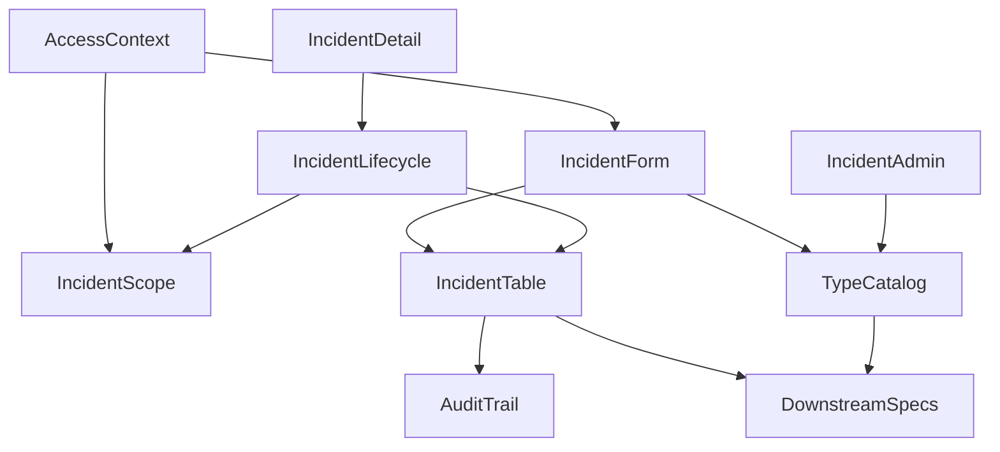
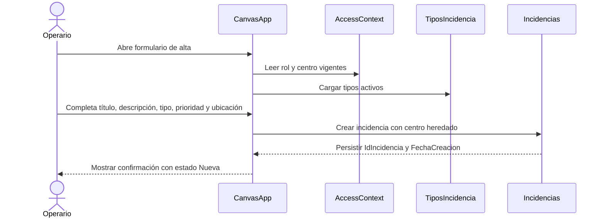
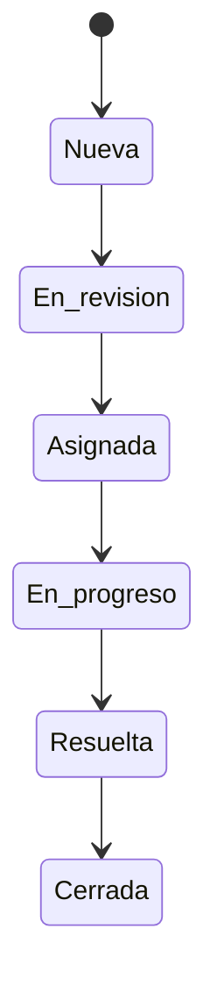
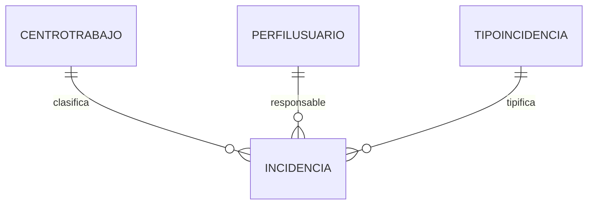

## Overview
Esta especificación define el núcleo transaccional de incidencias operativas para Logística Sur S.L. Su propósito es convertir el registro informal actual en un flujo único y trazable dentro de la canvas app, con un modelo Dataverse autoritativo para incidencias, un catálogo configurable de tipos y un ciclo de vida secuencial con asignación de responsable. El feature toma como dependencia resuelta la autenticación y autorización base de `autenticacion-roles`, por lo que no vuelve a definir identidad, rol ni centro de trabajo.

Los usuarios objetivo son Operarios, Supervisores y Administradores. Los operarios registran incidencias y consultan las suyas o las que tienen asignadas; los supervisores gestionan el ciclo de vida y las incidencias de su centro; los administradores disponen además del mantenimiento del catálogo de tipos y alcance global. El impacto principal es introducir los primeros contratos duraderos del dominio de incidencias para que colaboración, dashboard y notificaciones se integren después sin mover esta frontera.

### Goals
- Definir la tabla autoritativa `Incidencias` con los campos y relaciones necesarias para alta, asignación y ciclo de vida.
- Definir la tabla autoritativa `TiposIncidencia` con activación y desactivación administrativa.
- Establecer un flujo secuencial obligatorio de estados sin saltos.
- Reutilizar `jlb_perfilusuario` y `jlb_centrotrabajo` para permisos, responsable y centro sin duplicar el modelo de acceso.
- Publicar seams estables para specs downstream mediante `IdIncidencia`, `creadorSystemUserId`, el contrato de navegación al detalle y las marcas temporales clave.

### Non-Goals
- Implementar comentarios, adjuntos, búsqueda avanzada, dashboard o envío de notificaciones.
- Redefinir autenticación, roles o centros de trabajo.
- Introducir una columna dedicada de ubicación fuera del esquema de datos autorizado para este spec.
- Diseñar automatizaciones Power Automate dentro de este boundary.

## Boundary Commitments

### This Spec Owns
- La definición autoritativa de la tabla Dataverse `Incidencias` y sus restricciones de negocio.
- La definición autoritativa de la tabla Dataverse `TiposIncidencia`, su estado activo/inactivo y su carga por defecto.
- El formulario de alta de incidencias y sus validaciones funcionales visibles.
- La política de asignación de responsable y el ciclo de vida secuencial `Nueva → En revisión → Asignada → En progreso → Resuelta → Cerrada`.
- Las marcas temporales visibles del dominio: `FechaCreacion`, `FechaAsignacion`, `FechaResolucion`.
- El contrato estable de integración que downstream specs consumirán a partir del registro de incidencia y su auditoría básica, incluyendo `creadorSystemUserId` derivado de `createdby` y el seam de navegación del detalle en modos `manage` y `read-only`.

### Out of Boundary
- La captura y persistencia de comentarios y adjuntos como entidades o experiencias completas.
- Los filtros multi-criterio, búsquedas agregadas y KPIs.
- Los flujos de envío de email, push o cualquier automatización de notificación.
- El aprovisionamiento y mantenimiento de perfiles de usuario, roles y centros.
- La expansión del esquema de `Incidencias` con nuevos atributos no listados en este spec sin revalidación explícita.

### Allowed Dependencies
- `autenticacion-roles` como fuente autoritativa de `AccessContext`, `jlb_perfilusuario`, `jlb_centrotrabajo`, `jlb_rolnegocio` y `centroSecurityTeamId`.
- Microsoft Dataverse como fuente única de datos, claves, relaciones y auditoría.
- Canvas app `jlb_logsticasur_95873` como host de UI y lógica Power Fx.
- Campos estándar de Dataverse (`createdby`, auditoría de cambios) cuando ayuden a cumplir trazabilidad sin redefinir ownership.

### Revalidation Triggers
- Cualquier cambio en el esquema o semántica de `jlb_perfilusuario`, `jlb_centrotrabajo`, `jlb_rolnegocio` o `AccessContext`.
- Añadir, quitar o renombrar columnas de `Incidencias` o `TiposIncidencia`.
- Cambiar el ciclo de vida secuencial o permitir reaperturas/saltos de estado.
- Necesidad de tratar ubicación como columna consultable o indexable.
- Cambios en cómo downstream specs consumen `IdIncidencia`, `creadorSystemUserId`, el contrato de navegación al detalle, la auditoría o las marcas temporales.

## Architecture

### Existing Architecture Analysis
La solución fuente contiene una única canvas app empaquetada y los artefactos base de la solución en `src\Other`. No hay aún tablas funcionales exportadas para incidencias. El upstream `autenticacion-roles` ya fijó el patrón de `AccessContext`, la relación entre `jlb_perfilusuario` y `jlb_centrotrabajo`, y el seam `centroSecurityTeamId` para visibilidad por centro; este feature debe acoplarse a esos contratos y no reemplazarlos. En particular, cuando este spec consume contexto de sesión debe usar el contrato canónico completo `entraObjectId`, `dataverseUserId`, `perfilUsuarioId`, `userPrincipalName`, `displayName`, `corporateEmail`, `role`, `centroTrabajoId`, `centroCodigo`, `centroTrabajoNombre`, `centroSecurityTeamId`, `dataScope` y `profileStatus` sin alias locales.

### Architecture Pattern & Boundary Map


**Architecture Integration**:
- **Selected pattern**: canvas app como orquestador ligero + Dataverse como contrato autoritativo de dominio + auditoría nativa como superficie de cambio.
- **Domain boundaries**: el formulario de alta captura y valida; la política de alcance decide qué incidencia y qué responsable puede usar cada rol; el orquestador de ciclo de vida gobierna estados y fechas; Dataverse conserva las relaciones y la trazabilidad.
- **Existing patterns preserved**: uso de `AccessContext` y relaciones con `jlb_perfilusuario` / `jlb_centrotrabajo`; ampliación de la misma canvas app empaquetada.
- **New components rationale**: cada nuevo componente corresponde a una frontera funcional observable del dominio de incidencias y evita mezclar catálogo, alta, permisos y lifecycle.
- **Steering compliance**: mantiene Power Apps + Dataverse como única pila y deja Power Automate para el spec `notificaciones`.
- **Dependency direction**: `AccessContext` → política de alcance → formularios / lifecycle → tablas Dataverse → consumidores downstream. Ninguna capacidad downstream puede escribir nuevas reglas dentro del lifecycle base.

### Technology Stack

| Layer | Choice / Version | Role in Feature | Notes |
|-------|------------------|-----------------|-------|
| Frontend / CLI | Power Apps Canvas App 3.26074.x | Pantallas de alta, detalle, administración de tipos y acciones por rol | Reutiliza `jlb_logsticasur_95873` |
| Backend / Services | Power Fx + operaciones Dataverse nativas | Validación, persistencia, cambios de estado y filtros por alcance | Sin servicio custom |
| Data / Storage | Microsoft Dataverse | Tablas `jlb_incidencia` y `jlb_tipoincidencia`, lookups a `jlb_perfilusuario` y `jlb_centrotrabajo` | Fuente única de verdad |
| Messaging / Events | Superficie de cambios Dataverse + auditoría nativa | Base de integración para `notificaciones` y reporting futuro | Sin bus propio en este spec |
| Infrastructure / Runtime | Entra ID + contexto resuelto por `autenticacion-roles` | Autorización funcional y perímetro de datos | Dependencia upstream obligatoria |

## File Structure Plan

### Directory Structure
```text
src\
├── CanvasApps\
│   ├── jlb_logsticasur_95873_DocumentUri.msapp                            # Pantallas de alta, detalle, transición de estado y catálogo
│   ├── jlb_logsticasur_95873.meta.xml                                     # Referencias Dataverse y metadatos de pantallas/datos
│   └── jlb_logsticasur_95873_AdditionalUris0_identity.json                # Identidad del recurso de app ya empaquetado
├── Entities\
│   ├── jlb_incidencia\
│   │   ├── Entity.xml                                                     # Definición principal de la tabla de incidencias
│   │   ├── Attributes\jlb_idincidencia.xml                                # Identificador de negocio estable
│   │   ├── Attributes\jlb_titulo.xml                                      # Título obligatorio
│   │   ├── Attributes\jlb_descripcion.xml                                 # Descripción operativa persistida
│   │   ├── Attributes\jlb_estado.xml                                      # Estado secuencial obligatorio
│   │   ├── Attributes\jlb_prioridad.xml                                   # Prioridad visible
│   │   ├── Attributes\jlb_fechacreacion.xml                               # Hito de creación
│   │   ├── Attributes\jlb_fechaasignacion.xml                             # Hito de asignación
│   │   ├── Attributes\jlb_fecharesolucion.xml                             # Hito de resolución
│   │   ├── Relationships\jlb_incidencia_jlb_tipoincidencia.xml            # Relación con catálogo de tipos
│   │   ├── Relationships\jlb_incidencia_jlb_centrotrabajo.xml             # Centro heredado del creador
│   │   └── Relationships\jlb_incidencia_jlb_perfilusuario_responsable.xml # Responsable operativo
│   └── jlb_tipoincidencia\
│       ├── Entity.xml                                                     # Definición principal del catálogo
│       ├── Attributes\jlb_nombre.xml                                      # Nombre visible único
│       ├── Attributes\jlb_codigo.xml                                      # Código estable de integración
│       ├── Attributes\jlb_ordenvisual.xml                                 # Orden de presentación opcional
│       └── Views\ActiveTiposIncidencia.xml                                # Vista de tipos activos para formularios
└── OptionSets\
    └── jlb_estadoincidencia.xml                                           # Definición del ciclo de vida secuencial
```

### Modified Files
- `src\Other\Solution.xml` — registrar nuevas tablas, relaciones, option set y assets de app.
- `src\Other\Customizations.xml` — reflejar metadatos exportados de entidades, formularios, vistas, reglas y auditoría.
- `src\CanvasApps\jlb_logsticasur_95873_DocumentUri.msapp` — incorporar pantallas, fórmulas y acciones del dominio de incidencias.
- `src\CanvasApps\jlb_logsticasur_95873.meta.xml` — añadir dependencias Dataverse para `jlb_incidencia`, `jlb_tipoincidencia`, `jlb_perfilusuario` y `jlb_centrotrabajo`.

> No se prevén dependencias nuevas de terceros. La ausencia actual de `product.md`, `tech.md` y `structure.md` se sustituye por el contexto operativo de `roadmap.md` y los specs previos.

## System Flows





- La transición `En revisión → Asignada` exige responsable válido.
- `FechaAsignacion` se actualiza en la asignación inicial y en cada reasignación permitida.
- `FechaResolucion` se fija al entrar en `Resuelta` y se conserva en `Cerrada`.

## Requirements Traceability

| Requirement | Summary | Components | Interfaces | Flows |
|-------------|---------|------------|------------|-------|
| 1.1 | Alta con campos obligatorios visibles | Formulario de Alta de Incidencias | `IncidentDraftInput`, `IncidentCreationService` | Alta |
| 1.2 | Crear incidencia con id, estado inicial y fecha | Esquema Dataverse de Incidencias, Formulario de Alta de Incidencias | `IncidentRecord`, `IncidentCreationResult` | Alta |
| 1.3 | Heredar creador y centro vigentes | Formulario de Alta de Incidencias, Política de Alcance de Incidencias | `IncidentCreationInput` | Alta |
| 1.4 | Bloqueo y mensaje ante validación fallida | Formulario de Alta de Incidencias | `ValidationIssue` | Alta |
| 1.5 | Solo tipos activos en el formulario | Catálogo de Tipos de Incidencia, Formulario de Alta de Incidencias | `IncidentTypeAvailability` | Alta |
| 2.1 | Operario solo ve creadas o asignadas | Política de Alcance de Incidencias | `IncidentScopeDecision` | Detalle |
| 2.2 | Supervisor ve y gestiona incidencias de su centro | Política de Alcance de Incidencias, Orquestador de Ciclo de Vida y Asignación | `IncidentScopeDecision`, `LifecyclePermission` | Detalle |
| 2.3 | Administrador tiene alcance global | Política de Alcance de Incidencias | `IncidentScopeDecision` | Detalle |
| 2.4 | Denegación fuera de alcance | Política de Alcance de Incidencias, Detalle y Ciclo de Vida de Incidencias | `IncidentAccessResult` | Detalle |
| 2.5 | Detalle muestra datos básicos de la incidencia | Detalle y Ciclo de Vida de Incidencias, Esquema Dataverse de Incidencias | `IncidentDetailViewModel` | Detalle |
| 3.1 | Administrador ve listado de tipos | Catálogo de Tipos de Incidencia | `IncidentTypeAdminService` | Catálogo |
| 3.2 | Tipos por defecto disponibles | Catálogo de Tipos de Incidencia | `IncidentTypeSeedContract` | Catálogo |
| 3.3 | Alta de nuevos tipos | Catálogo de Tipos de Incidencia | `IncidentTypeMutation` | Catálogo |
| 3.4 | Edición sin romper historial | Catálogo de Tipos de Incidencia, Esquema Dataverse de Incidencias | `IncidentTypeMutation` | Catálogo |
| 3.5 | Desactivación sin uso futuro | Catálogo de Tipos de Incidencia | `IncidentTypeAvailability` | Catálogo |
| 3.6 | Bloqueo a no administradores | Catálogo de Tipos de Incidencia | `IncidentTypeAdminPermission` | Catálogo |
| 4.1 | Registrar responsable y fecha de asignación | Orquestador de Ciclo de Vida y Asignación, Esquema Dataverse de Incidencias | `AssignmentCommand`, `IncidentMutationResult` | Lifecycle |
| 4.2 | `Asignada` exige responsable | Orquestador de Ciclo de Vida y Asignación | `TransitionCommand`, `LifecycleRuleViolation` | Lifecycle |
| 4.3 | Bloqueo de asignación a roles no autorizados | Orquestador de Ciclo de Vida y Asignación | `LifecyclePermission` | Lifecycle |
| 4.4 | Responsable debe estar dentro del alcance permitido | Política de Alcance de Incidencias, Orquestador de Ciclo de Vida y Asignación | `AssignableProfile`, `AssignmentCommand` | Lifecycle |
| 4.5 | Mostrar responsable y fecha asignada | Detalle y Ciclo de Vida de Incidencias | `IncidentDetailViewModel` | Detalle |
| 5.1 | Secuencia única de estados | Esquema Dataverse de Incidencias, Orquestador de Ciclo de Vida y Asignación | `IncidentState`, `TransitionRule` | Lifecycle |
| 5.2 | Solo siguiente estado inmediato | Orquestador de Ciclo de Vida y Asignación | `TransitionCommand`, `TransitionOption` | Lifecycle |
| 5.3 | Rechazo de saltos o retrocesos | Orquestador de Ciclo de Vida y Asignación | `LifecycleRuleViolation` | Lifecycle |
| 5.4 | Registrar fecha de resolución | Orquestador de Ciclo de Vida y Asignación, Esquema Dataverse de Incidencias | `IncidentMutationResult` | Lifecycle |
| 5.5 | Conservar hitos al cerrar | Detalle y Ciclo de Vida de Incidencias, Esquema Dataverse de Incidencias | `IncidentDetailViewModel` | Lifecycle |
| 5.6 | Solo supervisor o administrador cambia estado/cierra | Orquestador de Ciclo de Vida y Asignación | `LifecyclePermission` | Lifecycle |
| 6.1 | Persistir hitos básicos del dominio | Esquema Dataverse de Incidencias | `IncidentRecord` | Alta, Lifecycle |
| 6.2 | Reflejar creación, asignación, resolución y cierre | Esquema Dataverse de Incidencias, Contrato de Integración Downstream | `IncidentChangeSurface` | Alta, Lifecycle |
| 6.3 | Mostrar hitos disponibles en incidencias abiertas | Detalle y Ciclo de Vida de Incidencias | `IncidentDetailViewModel` | Detalle |
| 6.4 | Mantener id e hitos como base de integración | Contrato de Integración Downstream | `IncidentIntegrationSnapshot` | Alta, Lifecycle |
| 7.1 | Flujo homogéneo en dispositivos soportados | Formulario de Alta de Incidencias, Detalle y Ciclo de Vida de Incidencias, Catálogo de Tipos de Incidencia | `IncidentViewState` | Alta, Detalle, Catálogo |
| 7.2 | Reflejar apertura o transición en 3 segundos | Formulario de Alta de Incidencias, Orquestador de Ciclo de Vida y Asignación | `IncidentMutationResult` | Alta, Lifecycle |
| 7.3 | Informar fallos sin confirmación ambigua | Formulario de Alta de Incidencias, Orquestador de Ciclo de Vida y Asignación | `ValidationIssue`, `LifecycleRuleViolation` | Alta, Lifecycle |
| 7.4 | No mostrar capacidades fuera de alcance | Formulario de Alta de Incidencias, Detalle y Ciclo de Vida de Incidencias | `IncidentFeatureFlags` | Detalle |

## Components and Interfaces

| Component | Domain/Layer | Intent | Req Coverage | Key Dependencies (P0/P1) | Contracts |
|-----------|--------------|--------|--------------|--------------------------|-----------|
| Esquema Dataverse de Incidencias | Data | Persistir incidencias, relaciones e hitos autoritativos | 1.2, 2.5, 4.1, 5.1, 5.4, 5.5, 6.1, 6.2 | `jlb_centrotrabajo` (P0), `jlb_perfilusuario` (P0), `jlb_tipoincidencia` (P0) | State, Event |
| Catálogo de Tipos de Incidencia | Data/UI | Mantener tipos activos/inactivos y defaults | 1.5, 3.1, 3.2, 3.3, 3.4, 3.5, 3.6 | Canvas app (P0), `jlb_tipoincidencia` (P0) | Service, State |
| Formulario de Alta de Incidencias | UI | Capturar una incidencia válida dentro del alcance del usuario | 1.1, 1.2, 1.3, 1.4, 1.5, 7.1, 7.2, 7.3, 7.4 | AccessContext (P0), Tipos activos (P0), tabla Incidencias (P0) | Service, State |
| Política de Alcance de Incidencias | Policy | Traducir rol, centro, creador y responsable en visibilidad y selección válida | 2.1, 2.2, 2.3, 2.4, 4.4 | AccessContext (P0), `createdby` (P1), `jlb_responsableid` (P0), `centroSecurityTeamId` (P1) | Service, State |
| Detalle y Ciclo de Vida de Incidencias | UI | Mostrar la incidencia y sus acciones disponibles según estado y permisos | 2.4, 2.5, 4.5, 5.5, 6.3, 7.1, 7.4 | Política de alcance (P0), orquestador lifecycle (P0) | State |
| Orquestador de Ciclo de Vida y Asignación | Domain | Validar transiciones, asignación, fechas y permisos | 2.2, 4.1, 4.2, 4.3, 4.4, 5.1, 5.2, 5.3, 5.4, 5.6, 6.2, 7.2, 7.3 | AccessContext (P0), Política de alcance (P0), tabla Incidencias (P0) | Service, State |
| Contrato de Integración Downstream | Integration | Exponer datos y superficies de cambio consumibles por specs posteriores | 6.1, 6.2, 6.4, 7.4 | Esquema Incidencias (P0), auditoría Dataverse (P1) | Event, State |

### Data

#### Esquema Dataverse de Incidencias

| Field | Detail |
|-------|--------|
| Intent | Definir la tabla `jlb_incidencia` y sus relaciones como contrato autoritativo del dominio |
| Requirements | 1.2, 2.5, 4.1, 5.1, 5.4, 5.5, 6.1, 6.2 |

**Responsibilities & Constraints**
- Mantener los campos de negocio autorizados: `IdIncidencia`, `Titulo`, `Descripcion`, `Estado`, `Prioridad`, `TipoIncidencia`, `FechaCreacion`, `FechaAsignacion`, `FechaResolucion`, `Responsable`, `CentroTrabajo` y la proyección pública `creadorSystemUserId` derivada de `createdby`.
- Conservar `IdIncidencia` como identificador visible, único e inmutable.
- Mantener `Estado` dentro del conjunto secuencial aprobado y bloquear valores fuera de la secuencia.
- Persistir `CentroTrabajo` como lookup obligatorio a `jlb_centrotrabajo`.
- Persistir `Responsable` como lookup opcional a `jlb_perfilusuario`, obligatorio para entrar en `Asignada`.
- Habilitar auditoría nativa en tabla y columnas críticas sin añadir una tabla paralela de historial.

**Dependencies**
- Inbound: Formulario de Alta de Incidencias — crea registros válidos (P0)
- Inbound: Orquestador de Ciclo de Vida y Asignación — actualiza estado, responsable y fechas (P0)
- Outbound: `jlb_centrotrabajo` — lookup obligatorio de alcance (P0)
- Outbound: `jlb_perfilusuario` — lookup opcional de responsable operativo (P0)
- Outbound: `jlb_tipoincidencia` — clasificación normalizada (P0)
- External: auditoría Dataverse — historial de cambios (P1)

**Contracts**: Service [ ] / API [ ] / Event [x] / Batch [ ] / State [x]

##### Event Contract
- Published change surfaces:
  - Alta de fila en `jlb_incidencia` con `IdIncidencia`, `Estado = Nueva`, `FechaCreacion`, `CentroTrabajo` y `createdby` proyectable como `creadorSystemUserId`.
  - Actualización de `Responsable` y `FechaAsignacion`.
  - Actualización de `Estado` y, cuando aplique, `FechaResolucion`.
- Ordering / delivery guarantees:
  - La persistencia del registro es la fuente de verdad.
  - Los consumidores downstream deben asumir consistencia basada en los cambios confirmados en Dataverse, no en eventos efímeros de UI.

##### State Management
- State model: fila `jlb_incidencia` + columnas auditadas.
- Persistence & consistency: una única fila concentra el estado vigente y los hitos visibles; el historial fino se delega a auditoría nativa.
- Concurrency strategy: actualizaciones optimistas de una única incidencia por operación; la UI debe recargar el registro tras cada mutación para mostrar el estado confirmado.

**Implementation Notes**
- Integration: la fila sirve como raíz agregada para colaboración, dashboard y notificaciones, y publica `creadorSystemUserId` como proyección estable del campo estándar `createdby`.
- Validation: comprobar unicidad de `IdIncidencia`, obligatoriedad de `CentroTrabajo` y persistencia de fechas en cada transición.
- Risks: un cambio futuro para filtrar por ubicación exigiría reabrir el modelo físico.

#### Catálogo de Tipos de Incidencia

| Field | Detail |
|-------|--------|
| Intent | Proveer clasificación configurable y administrable sin romper el historial existente |
| Requirements | 1.5, 3.1, 3.2, 3.3, 3.4, 3.5, 3.6 |

**Responsibilities & Constraints**
- Mantener una fila por tipo con nombre visible, código estable y estado activo/inactivo.
- Cargar los tipos iniciales `Seguridad`, `Equipamiento`, `Infraestructura`, `Calidad`, `Transporte` y `Otros`.
- Permitir edición del texto visible y desactivación, pero no eliminación destructiva de tipos ya usados.
- Exponer solo tipos activos al formulario de alta.
- Restringir la gestión del catálogo a rol `Administrador`.

**Dependencies**
- Inbound: Canvas app — pantalla de administración y selección en formularios (P0)
- Outbound: Esquema Dataverse de Incidencias — referencia por lookup (P0)
- External: `AccessContext.role` — gate de administración (P0)

**Contracts**: Service [x] / API [ ] / Event [ ] / Batch [ ] / State [x]

##### Service Interface
```typescript
type IncidentTypeStatus = "active" | "inactive";

interface IncidentTypeRecord {
  tipoIncidenciaId: string;
  codigo: string;
  nombre: string;
  estado: IncidentTypeStatus;
  ordenVisual: number | null;
}

interface IncidentTypeMutation {
  codigo?: string;
  nombre: string;
  estado: IncidentTypeStatus;
  ordenVisual?: number | null;
}

interface IncidentTypeAdminService {
  listAll(): Promise<IncidentTypeRecord[]>;
  listActive(): Promise<IncidentTypeRecord[]>;
  create(input: IncidentTypeMutation): Promise<IncidentTypeRecord>;
  update(tipoIncidenciaId: string, input: IncidentTypeMutation): Promise<IncidentTypeRecord>;
  deactivate(tipoIncidenciaId: string): Promise<IncidentTypeRecord>;
}
```
- Preconditions: el usuario actual tiene rol `Administrador` para mutaciones.
- Postconditions: el catálogo conserva consistencia entre tipos activos y tipos históricos.
- Invariants: un tipo inactivo no desaparece de incidencias existentes.

##### State Management
- State model: tabla `jlb_tipoincidencia` con estado activo/inactivo.
- Persistence & consistency: edición y desactivación explícitas; los formularios consumen la vista de activos.
- Concurrency strategy: administración de bajo volumen, última escritura gana con recarga de vista.

**Implementation Notes**
- Integration: `busqueda-dashboard` reutilizará `codigo`, `nombre` y estado activo para filtros.
- Validation: comprobar seed inicial y bloqueo a no administradores.
- Risks: borrar tipos en lugar de desactivarlos rompería referencias históricas.

### UI

#### Formulario de Alta de Incidencias

| Field | Detail |
|-------|--------|
| Intent | Capturar la incidencia inicial con validaciones visibles y persistirla dentro del alcance del creador |
| Requirements | 1.1, 1.2, 1.3, 1.4, 1.5, 7.1, 7.2, 7.3, 7.4 |

**Responsibilities & Constraints**
- Solicitar `Título`, `Descripción`, `TipoIncidencia`, `Prioridad` y `Ubicación` como datos visibles obligatorios.
- Mostrar la fecha de registro asociada al alta y usarla como `FechaCreacion`.
- Normalizar la ubicación dentro del contenido operativo persistido de la incidencia sin ampliar el esquema base.
- Crear la incidencia en `Nueva` y con `CentroTrabajo` heredado del `AccessContext`.
- No exponer controles de comentarios, adjuntos, notificaciones ni dashboard dentro de este flujo.

**Dependencies**
- Inbound: Canvas app host — navegación y contexto de sesión (P0)
- Outbound: Catálogo de Tipos de Incidencia — opciones activas (P0)
- Outbound: Esquema Dataverse de Incidencias — persistencia del alta (P0)
- External: `AccessContext` — `perfilUsuarioId`, `dataverseUserId`, `role`, `centroTrabajoId` y `profileStatus` resueltos con nombres canónicos (P0)

**Contracts**: Service [x] / API [ ] / Event [ ] / Batch [ ] / State [x]

##### Service Interface
```typescript
type IncidentPriorityCode = string;

interface IncidentDraftInput {
  titulo: string;
  descripcion: string;
  ubicacion: string;
  tipoIncidenciaId: string;
  prioridad: IncidentPriorityCode;
}

interface ValidationIssue {
  field: "titulo" | "descripcion" | "ubicacion" | "tipoIncidenciaId" | "prioridad" | "general";
  message: string;
}

interface IncidentCreationInput extends IncidentDraftInput {
  perfilUsuarioId: string;
  dataverseUserId: string;
  centroTrabajoId: string;
}

interface IncidentCreationResult {
  ok: boolean;
  incidenciaId?: string;
  idIncidencia?: string;
  issues?: ValidationIssue[];
}

interface IncidentCreationService {
  validate(input: IncidentDraftInput): ValidationIssue[];
  create(input: IncidentCreationInput): Promise<IncidentCreationResult>;
}
```
- Preconditions: el usuario tiene `AccessContext` válido y un tipo activo seleccionado.
- Postconditions: la incidencia queda creada en `Nueva` o el usuario ve errores concretos sin confirmación ambigua.
- Invariants: el alta nunca permite seleccionar un tipo inactivo ni un centro distinto del resuelto en sesión, y consume `perfilUsuarioId`, `dataverseUserId` y `centroTrabajoId` exactamente como llegan en `AccessContext`.

##### State Management
- State model: `draft`, `submitting`, `submitted`, `failed`.
- Persistence & consistency: solo se persiste al confirmar; tras éxito se recarga el detalle desde Dataverse.
- Concurrency strategy: una única creación activa por formulario.

**Implementation Notes**
- Integration: el formulario solo crea el registro raíz; adjuntos y comentarios quedan ocultos o señalados como no disponibles. `createdby` lo materializa Dataverse y el spec conserva `AccessContext.dataverseUserId` como referencia canónica de la sesión que originó el alta.
- Validation: cubrir obligatoriedad visible y formato no vacío de ubicación.
- Risks: si la normalización de ubicación cambia, el contrato visible del formulario debe mantenerse.

#### Detalle y Ciclo de Vida de Incidencias

| Field | Detail |
|-------|--------|
| Intent | Presentar la incidencia, su historial visible de hitos y las acciones permitidas según rol y estado |
| Requirements | 2.4, 2.5, 4.5, 5.5, 6.3, 7.1, 7.4 |

**Responsibilities & Constraints**
- Mostrar `IdIncidencia`, `Estado`, `Prioridad`, `TipoIncidencia`, `Responsable`, `CentroTrabajo`, `FechaCreacion`, `FechaAsignacion` y `FechaResolucion` cuando existan.
- Aceptar navegación con contrato explícito de entrada/salida en modos `manage` y `read-only`.
- Ocultar o deshabilitar acciones fuera de permiso, mostrando feedback explícito.
- Mantener visible que comentarios, adjuntos, filtros avanzados y notificaciones no pertenecen a este alcance.
- Refrescar la incidencia tras cada mutación para reflejar el estado confirmado en Dataverse.
- Restaurar el retorno al origen con un token opaco de contexto cuando la apertura provenga de otra superficie.

**Dependencies**
- Inbound: Política de Alcance de Incidencias — autorización de lectura/gestión (P0)
- Inbound: Orquestador de Ciclo de Vida y Asignación — acciones de mutación (P0)
- Inbound: navegación interna o downstream — apertura del detalle con contrato público (P1)
- Outbound: Esquema Dataverse de Incidencias — lectura del detalle actual (P0)

**Contracts**: Service [x] / API [ ] / Event [ ] / Batch [ ] / State [x]

##### Service Interface
```typescript
type IncidentDetailMode = "manage" | "read-only";
type IncidentDetailOrigin = "incidencias-core" | "search" | "dashboard";

interface IncidentDetailNavigationInput {
  incidenciaId: string;
  origin: IncidentDetailOrigin;
  mode: IncidentDetailMode;
  returnContextKey?: string | null;
}

interface IncidentDetailNavigationResult {
  origin: IncidentDetailOrigin;
  mode: IncidentDetailMode;
  returnContextKey?: string | null;
  didMutate: boolean;
}

interface IncidentDetailScreenContract {
  open(input: IncidentDetailNavigationInput): void;
  close(result: IncidentDetailNavigationResult): void;
}
```
- Preconditions: la incidencia ya fue resuelta por `incidenciaId` y el usuario llega con `AccessContext.profileStatus == "active"`.
- Postconditions: el detalle se abre en el modo solicitado y devuelve el `origin` junto al `returnContextKey` para que el llamador restaure su contexto.
- Invariants: `mode = "read-only"` oculta cualquier mutación y `returnContextKey` se trata como dato opaco, sin reinterpretarlo dentro de este spec.

##### State Management
- State model: `loading`, `ready`, `forbidden`, `mutating`, `error` + `navigationInput` / `lastNavigationResult`.
- Persistence & consistency: la UI nunca cachea un estado mutado sin recargar la fila confirmada.
- Concurrency strategy: bloqueo visual de acciones concurrentes sobre la misma incidencia en una sesión.

**Implementation Notes**
- Integration: será el punto de entrada natural para `incidencias-colaboracion` en una fase posterior mediante `IdIncidencia`. `busqueda-dashboard` debe consumir este seam con `incidenciaId`, `origin` y `mode: "read-only"`, y usar `returnContextKey` para restauración de contexto sin ampliar el boundary transaccional.
- Validation: comprobar consistencia del detalle tras reasignar, resolver y cerrar.
- Risks: mezclar capacidades downstream en esta pantalla rompería el boundary del spec.

### Policy

#### Política de Alcance de Incidencias

| Field | Detail |
|-------|--------|
| Intent | Resolver qué incidencias puede ver o gestionar cada usuario y qué responsables puede seleccionar |
| Requirements | 2.1, 2.2, 2.3, 2.4, 4.4 |

**Responsibilities & Constraints**
- Aplicar estas reglas base:
  - `Operario`: solo incidencias creadas por su usuario Dataverse o asignadas a su `jlb_perfilusuario`.
  - `Supervisor`: incidencias cuyo `CentroTrabajo` coincide con su `jlb_centrotrabajo`.
  - `Administrador`: todas las incidencias.
- Determinar la lista válida de responsables en función del alcance de centro o global.
- Reutilizar `centroSecurityTeamId` como seam de compartición para supervisión por centro sin ampliar permisos de operarios.
- Denegar acceso a incidencias fuera del alcance antes de mostrar su detalle.

**Dependencies**
- Inbound: `AccessContext` de `autenticacion-roles` — rol, centro y equipo del centro (P0)
- Outbound: Esquema Dataverse de Incidencias — filtros por centro, creador y responsable (P0)
- Outbound: `jlb_perfilusuario` — candidatos de responsable dentro del alcance (P0)
- External: `AccessContext.dataverseUserId`, `AccessContext.perfilUsuarioId`, `AccessContext.centroTrabajoId`, `AccessContext.centroSecurityTeamId`, `AccessContext.dataScope` y campos estándar `createdby` / sharing Dataverse — seam autoritativo de acceso y visibilidad real (P1)

**Contracts**: Service [x] / API [ ] / Event [ ] / Batch [ ] / State [x]

##### Service Interface
```typescript
interface IncidentScopeDecision {
  canRead: boolean;
  canManage: boolean;
  allowedReason: "creator" | "responsible" | "center" | "global" | null;
  denialMessage?: string;
}

interface AssignableProfile {
  perfilUsuarioId: string;
  displayName: string;
  centroTrabajoId: string;
  role: "Operario" | "Supervisor" | "Administrador";
}

interface IncidentScopePolicy {
  evaluateIncident(incident: IncidentRecord, mode: IncidentDetailMode, accessContext: AccessContext): IncidentScopeDecision;
  listAssignableProfiles(accessContext: AccessContext): Promise<AssignableProfile[]>;
}
```
- Preconditions: `AccessContext.profileStatus == "active"` y fila de incidencia recuperada.
- Postconditions: la decisión de alcance es determinista para lectura, gestión y asignación.
- Invariants: un operario nunca recibe acceso por el mero hecho de compartir centro con la incidencia.

##### State Management
- State model: decisión efímera calculada por registro y por sesión.
- Persistence & consistency: las reglas dependen siempre del `AccessContext` y del registro actual en Dataverse.
- Concurrency strategy: recalcular tras cada mutación de responsable o estado.

**Implementation Notes**
- Integration: downstream specs deberán reutilizar esta política o su seam de filtros, no reinventar reglas por rol. La correlación de creador usa `AccessContext.dataverseUserId` frente a `createdby`, la de responsable usa `AccessContext.perfilUsuarioId`, y la de centro usa `AccessContext.centroTrabajoId` / `AccessContext.centroSecurityTeamId`; no se permiten alias locales.
- Validation: probar casos creador/no creador, asignado/no asignado y cruce de centros.
- Risks: si el entorno no soporta sharing esperado por responsable, la experiencia podría depender más de filtros de app de lo deseable.

### Domain

#### Orquestador de Ciclo de Vida y Asignación

| Field | Detail |
|-------|--------|
| Intent | Gobernar transiciones válidas, permisos de mutación, responsable y hitos temporales |
| Requirements | 2.2, 4.1, 4.2, 4.3, 4.4, 5.1, 5.2, 5.3, 5.4, 5.6, 6.2, 7.2, 7.3 |

**Responsibilities & Constraints**
- Permitir únicamente estas transiciones: `Nueva → En revisión → Asignada → En progreso → Resuelta → Cerrada`.
- Exigir `Supervisor` o `Administrador` para asignar, reasignar, cambiar estado y cerrar.
- Exigir responsable válido para entrar en `Asignada` y conservarlo al avanzar a `En progreso`, `Resuelta` y `Cerrada`.
- Registrar `FechaAsignacion` en cada asignación o reasignación permitida.
- Registrar `FechaResolucion` al entrar por primera vez en `Resuelta` y preservarla al cerrar.
- Rechazar retrocesos, saltos y cierres anticipados.

**Dependencies**
- Inbound: Detalle y Ciclo de Vida de Incidencias — invoca acciones del usuario (P0)
- Inbound: Política de Alcance de Incidencias — valida permiso y responsable elegible (P0)
- Outbound: Esquema Dataverse de Incidencias — persistencia de cambios (P0)
- External: `AccessContext.role` — gate de mutación (P0)

**Contracts**: Service [x] / API [ ] / Event [ ] / Batch [ ] / State [x]

##### Service Interface
```typescript
type IncidentState =
  | "Nueva"
  | "En revisión"
  | "Asignada"
  | "En progreso"
  | "Resuelta"
  | "Cerrada";

interface IncidentRecord {
  incidenciaRowId: string;
  idIncidencia: string;
  titulo: string;
  descripcion: string;
  estado: IncidentState;
  prioridad: IncidentPriorityCode;
  tipoIncidenciaId: string;
  fechaCreacion: string;
  fechaAsignacion: string | null;
  fechaResolucion: string | null;
  responsablePerfilUsuarioId: string | null;
  centroTrabajoId: string;
  creadorSystemUserId: string;
}

interface TransitionCommand {
  incidenciaRowId: string;
  targetState: IncidentState;
  actingRole: "Supervisor" | "Administrador";
}

interface AssignmentCommand {
  incidenciaRowId: string;
  responsablePerfilUsuarioId: string;
  actingRole: "Supervisor" | "Administrador";
}

interface LifecycleRuleViolation {
  code:
    | "forbidden"
    | "invalid-transition"
    | "responsible-required"
    | "responsible-out-of-scope"
    | "already-closed"
    | "stale-record";
  message: string;
}

interface IncidentMutationResult {
  ok: boolean;
  incident?: IncidentRecord;
  error?: LifecycleRuleViolation;
}

interface IncidentLifecycleService {
  listAllowedTransitions(incident: IncidentRecord, actingRole: "Operario" | "Supervisor" | "Administrador"): IncidentState[];
  assign(command: AssignmentCommand): Promise<IncidentMutationResult>;
  transition(command: TransitionCommand): Promise<IncidentMutationResult>;
}
```
- Preconditions: incidencia cargada y decisión de alcance `canManage = true`.
- Postconditions: cada mutación devuelve la incidencia actualizada o un error categorizado y mostrable.
- Invariants: una incidencia cerrada no admite nuevas transiciones; `Asignada`, `En progreso`, `Resuelta` y `Cerrada` requieren responsable no nulo.

##### State Management
- State model: máquina de estados lineal sin bifurcaciones ni reaperturas.
- Persistence & consistency: el estado vigente siempre vive en la fila de incidencia; las fechas son derivadas de hitos ya confirmados.
- Concurrency strategy: recarga obligatoria tras cada actualización y rechazo de operaciones sobre versión visual desfasada.

**Implementation Notes**
- Integration: `notificaciones` consumirá cambios persistidos en estado, responsable y fechas, sin insertar lógica aquí.
- Validation: verificar todas las transiciones válidas e inválidas y la preservación de fechas al cerrar.
- Risks: permitir reasignación en estados tardíos debe mantenerse simple para no introducir ciclos no aprobados.

### Integration

#### Contrato de Integración Downstream

| Field | Detail |
|-------|--------|
| Intent | Exponer una superficie estable para specs consumidores sin ceder ownership del dominio base |
| Requirements | 6.1, 6.2, 6.4, 7.4 |

**Responsibilities & Constraints**
- Declarar `IdIncidencia` como referencia de negocio estable para claves foráneas lógicas y navegación.
- Declarar como mínimos consumibles downstream: `Estado`, `Prioridad`, `TipoIncidencia`, `FechaCreacion`, `FechaAsignacion`, `FechaResolucion`, `Responsable`, `CentroTrabajo` y `creadorSystemUserId`.
- Publicar `creadorSystemUserId` como proyección estable de `createdby` para `notificaciones` y cualquier consumidor autorizado del seam de identidad del creador.
- Publicar el punto de entrada del detalle mediante `IncidentDetailNavigationInput` / `IncidentDetailNavigationResult`, con `mode: "manage" | "read-only"`, `origin` y `returnContextKey` opaco.
- Reservar la auditoría de `Estado`, `Responsable`, `TipoIncidencia` y `Prioridad` como superficie oficial para trazabilidad ampliada.
- No asumir aquí qué hará cada consumidor con esos datos.

**Dependencies**
- Inbound: Esquema Dataverse de Incidencias — datos de base (P0)
- Inbound: Catálogo de Tipos de Incidencia — dimensión clasificatoria (P0)
- Inbound: Detalle y Ciclo de Vida de Incidencias — seam de navegación reutilizable (P1)
- External: auditoría Dataverse / triggers de cambios de fila — integración futura (P1)

**Contracts**: Service [x] / API [ ] / Event [x] / Batch [ ] / State [x]

##### Service Interface
```typescript
interface IncidentDetailNavigationContract {
  open(input: IncidentDetailNavigationInput): void;
  close(result: IncidentDetailNavigationResult): void;
}
```
- Published seam: `incidencias-core` acepta `IncidentDetailNavigationInput` con `mode = "manage"` para navegación propia y `mode = "read-only"` para consumidores de solo consulta.
- Compatibility rule: `busqueda-dashboard` y cualquier otro consumidor de solo lectura deben invocar `IncidentDetailNavigationInput` / `IncidentDetailNavigationResult` verbatim (mismos nombres de campo), fijando `mode: "read-only"` y `origin` en `"search"` o `"dashboard"`; no se publican alias ni tipos alternativos para este seam.

##### Event Contract
```typescript
interface IncidentIntegrationSnapshot {
  idIncidencia: string;
  incidenciaRowId: string;
  estado: IncidentState;
  prioridad: IncidentPriorityCode;
  tipoIncidenciaId: string;
  responsablePerfilUsuarioId: string | null;
  centroTrabajoId: string;
  fechaCreacion: string;
  fechaAsignacion: string | null;
  fechaResolucion: string | null;
  creadorSystemUserId: string;
}

interface IncidentChangeSurface {
  entityName: "jlb_incidencia";
  changedColumns: string[];
  snapshot: IncidentIntegrationSnapshot;
}
```
- Published events:
  - creación de incidencia
  - asignación o reasignación
  - cambio de estado
  - cierre
- Subscribed events: no aplica en este spec.
- Ordering / delivery guarantees: los consumidores leen siempre el snapshot persistido tras la confirmación en Dataverse.

##### State Management
- State model: snapshot derivado de la fila vigente y de sus columnas auditadas + estado efímero de navegación de detalle.
- Persistence & consistency: el contrato no añade nuevas tablas; se apoya en la incidencia autoritativa.
- Concurrency strategy: los consumidores deben resolver por `idIncidencia` o GUID y aceptar el último estado confirmado.

**Implementation Notes**
- Integration: `incidencias-colaboracion` usará `IdIncidencia` como referencia estable; `busqueda-dashboard` consumirá tipo, estado y centro; `notificaciones` reaccionará a superficies de cambio.
- Validation: comprobar que ninguna de estas capacidades necesita modificar la tabla base para sus primeras iteraciones.
- Risks: si un consumidor exige timestamps por cada transición intermedia, el boundary deberá revisarse.

## Data Models

### Domain Model
- **Incidencia**: agregado raíz del dominio. Conserva el estado vigente, los hitos visibles y las referencias mínimas de clasificación, responsable y centro.
- **TipoIncidencia**: entidad de catálogo administrable e independiente del ciclo de vida.
- **UbicaciónOperativa**: valor visible obligatorio del alta, persistido como parte del contenido operativo de la incidencia en esta fase.
- **ResponsibleAssignment**: decisión de negocio que enlaza una incidencia con un `jlb_perfilusuario` válido dentro del alcance permitido.
- **Invariants**:
  - Toda incidencia nace en `Nueva`.
  - Una incidencia no puede saltar ni retroceder estados.
  - `CentroTrabajo` se fija con el centro vigente del creador al crear la incidencia.
  - `FechaAsignacion` es nula hasta la primera asignación válida.
  - `FechaResolucion` es nula hasta entrar en `Resuelta`.
  - Un tipo inactivo no puede seleccionarse en altas nuevas, pero sigue visible en incidencias históricas.



### Logical Data Model

**Structure Definition**:
- `jlb_incidencia`
  - `jlb_incidenciaid` (GUID, PK técnico)
  - `jlb_idincidencia` (texto/autonumérico, obligatorio, único, inmutable, clave alternativa)
  - `jlb_titulo` (texto, obligatorio)
  - `jlb_descripcion` (texto largo, obligatorio; incluye contenido operativo y ubicación normalizada)
  - `jlb_estado` (choice single select, obligatorio; `Nueva`, `En revisión`, `Asignada`, `En progreso`, `Resuelta`, `Cerrada`)
  - `jlb_prioridad` (choice o valor de catálogo visible, obligatorio)
  - `jlb_tipoincidenciaid` (lookup a `jlb_tipoincidencia`, obligatorio)
  - `jlb_fechacreacion` (datetime, obligatorio)
  - `jlb_fechaasignacion` (datetime, nulo hasta asignación)
  - `jlb_fecharesolucion` (datetime, nulo hasta resolución)
  - `jlb_responsableid` (lookup a `jlb_perfilusuario`, nulo hasta asignación)
  - `jlb_centrotrabajoid` (lookup a `jlb_centrotrabajo`, obligatorio)
  - `createdby` (campo estándar Dataverse, usado por política de alcance y proyectado downstream como `creadorSystemUserId`)
- `jlb_tipoincidencia`
  - `jlb_tipoincidenciaid` (GUID, PK)
  - `jlb_codigo` (texto corto, obligatorio, único)
  - `jlb_nombre` (texto, obligatorio)
  - `jlb_ordenvisual` (número entero, opcional)
  - `statecode/statuscode` (activo/inactivo)

**Consistency & Integrity**:
- Relaciones sin borrado en cascada destructivo desde `jlb_tipoincidencia`, `jlb_centrotrabajo` o `jlb_perfilusuario` hacia `jlb_incidencia`.
- `jlb_centrotrabajoid` no cambia automáticamente si el creador cambia de centro después del alta.
- `jlb_responsableid` puede cambiar por reasignación válida; `jlb_fechaasignacion` refleja la última asignación efectiva.
- Los tipos con incidencias históricas se desactivan, no se eliminan.

### Physical Data Model

**For Relational Databases**:
- Índices / claves:
  - PK en `jlb_incidenciaid` y `jlb_tipoincidenciaid`
  - Clave alternativa en `jlb_idincidencia`
  - Índices recomendados en `jlb_estado`, `jlb_centrotrabajoid`, `jlb_responsableid`, `jlb_tipoincidenciaid`
- Auditoría habilitada en:
  - Tabla `jlb_incidencia`
  - Columnas `jlb_estado`, `jlb_responsableid`, `jlb_tipoincidenciaid`, `jlb_prioridad`, `jlb_centrotrabajoid`
- Estrategia de escala:
  - Consultas de detalle por `jlb_idincidencia` o GUID
  - Cargas de formulario basadas en vistas activas, no en colecciones masivas

### Data Contracts & Integration

**API Data Transfer**
- No hay API custom en este spec; los contratos se materializan en operaciones Dataverse y view models de la canvas app.

**Event Schemas**
- `IncidentChangeSurface` actúa como contrato conceptual para consumidores de cambios persistidos.
- Compatibilidad:
  - `IdIncidencia` no cambia una vez emitido.
  - Las columnas de hitos temporales solo añaden información; no se reutilizan con otra semántica.

**Cross-Service Data Management**
- `incidencias-colaboracion`: usa `IdIncidencia` o GUID como referencia a incidencia existente.
- `busqueda-dashboard`: consume `Estado`, `Prioridad`, `TipoIncidencia`, `CentroTrabajo`, `FechaCreacion`, `FechaResolucion` y el seam `IncidentDetailNavigationInput` / `IncidentDetailNavigationResult` con `mode: "read-only"`.
- `notificaciones`: consume cambios confirmados en `Estado`, `Responsable`, `FechaAsignacion`, `FechaResolucion` y `creadorSystemUserId`.

## Error Handling

### Error Strategy
La UI debe fallar pronto y con mensajes accionables. Las validaciones de alta ocurren antes de persistir. Las mutaciones de estado o responsable validan permiso, alcance y secuencia antes de escribir. Tras cualquier fallo, la app debe seguir mostrando el último estado confirmado de la incidencia, nunca una mutación optimista sin confirmar.

### Error Categories and Responses
- **User Errors**:
  - Datos obligatorios ausentes en alta → marcar campo y explicar qué falta.
  - Tipo inactivo o no disponible → impedir guardado y pedir una selección válida.
  - Responsable fuera del alcance → rechazar asignación e indicar que debe elegirse un responsable válido.
- **Business Logic Errors**:
  - Salto o retroceso de estado → mantener estado anterior y mostrar la secuencia permitida.
  - Cierre anticipado o sin rol permitido → denegar acción sin cambios.
  - Intento de operar incidencia fuera de alcance → mostrar estado `forbidden`.
- **System Errors**:
  - Error Dataverse al crear o actualizar → mostrar fallo sin confirmación ambigua y permitir reintentar.
  - Lectura desfasada tras mutación concurrente → recargar la incidencia y advertir del cambio reciente.

### Monitoring
- Activar auditoría Dataverse en la tabla y columnas críticas.
- Revisar métricas operativas de tiempo de carga del formulario, apertura de detalle y confirmación de transición.
- Mantener trazabilidad mínima mediante registros persistidos y auditoría, sin telemetría custom en este spec.

## Testing Strategy

### Unit Tests
- Validar que el formulario marca como obligatorios `Título`, `Descripción`, `TipoIncidencia`, `Prioridad` y `Ubicación` antes del alta (1.1, 1.4).
- Validar que `IncidentLifecycleService` solo devuelve el siguiente estado inmediato permitido para cada estado actual (5.1, 5.2, 5.3).
- Validar que `IncidentScopePolicy` distingue correctamente acceso por creador, responsable, centro y global (2.1, 2.2, 2.3, 2.4).

### Integration Tests
- Crear una incidencia y verificar persistencia de `IdIncidencia`, `Estado = Nueva`, `FechaCreacion`, `CentroTrabajo` y tipo activo (1.2, 1.3, 1.5, 6.1).
- Asignar y reasignar responsable válido comprobando actualización de `Responsable`, `FechaAsignacion` y conservación del resto de hitos (4.1, 4.4, 4.5, 6.2).
- Resolver y cerrar una incidencia verificando `FechaResolucion`, bloqueo de saltos y preservación de datos al cerrar (5.3, 5.4, 5.5, 5.6).
- Desactivar un tipo ya usado y comprobar que deja de aparecer en altas nuevas pero sigue visible en incidencias existentes (3.4, 3.5).

### E2E/UI Tests
- Flujo de operario: alta válida desde móvil y escritorio con confirmación en menos de 3 segundos y detalle visible de la incidencia creada (1.1, 1.2, 2.5, 7.1, 7.2).
- Flujo de supervisor: abrir incidencia de su centro, pasarla por `En revisión → Asignada → En progreso → Resuelta → Cerrada` sin saltos (2.2, 4.2, 5.1, 5.2, 5.4).
- Flujo de administrador: listar, crear, editar y desactivar tipos de incidencia (3.1, 3.2, 3.3, 3.4, 3.5).
- Flujos negativos: operario intentando gestionar catálogo, cerrar incidencia o abrir una ajena (2.4, 3.6, 5.6, 7.4).

### Performance/Load
- Medir apertura del formulario de alta con carga solo de tipos activos y contexto ya resuelto (1.5, 7.2).
- Medir apertura de detalle y confirmación de transición de estado bajo consultas habituales por centro (2.5, 7.2).
- Verificar que la estrategia no depende de precargar todas las incidencias al iniciar la app (7.1, 7.2).

### Security Considerations
- Todas las reglas de rol y centro dependen del `AccessContext` upstream; este spec no introduce credenciales ni perfiles alternativos.
- El catálogo de tipos y las mutaciones de lifecycle se protegen por rol `Supervisor` / `Administrador` según corresponda.
- La política de alcance evita que la membresía de centro otorgue por sí sola acceso masivo a operarios.
- La auditoría habilitada debe cubrir cambios de estado, responsable y clasificación.

### Performance & Scalability
- Objetivo visible: alta, apertura de detalle y transición válida reflejadas en 3 segundos o menos en condiciones habituales.
- Estrategia: cargar solo tipos activos y la incidencia en foco; evitar colecciones globales masivas.
- Escala objetivo heredada del roadmap: hasta 500 usuarios activos concurrentes con Dataverse como fuente única.

### Migration Strategy
- Fase 1: crear `jlb_tipoincidencia` y sembrar tipos por defecto.
- Fase 2: crear `jlb_incidencia`, relaciones, option set de estado y auditoría.
- Fase 3: conectar la canvas app a tablas y pantallas nuevas.
- Fase 4: validar contracts downstream (`IdIncidencia`, hitos, cambios auditados) antes de abrir los siguientes specs.
