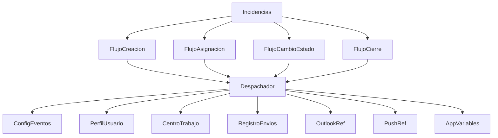
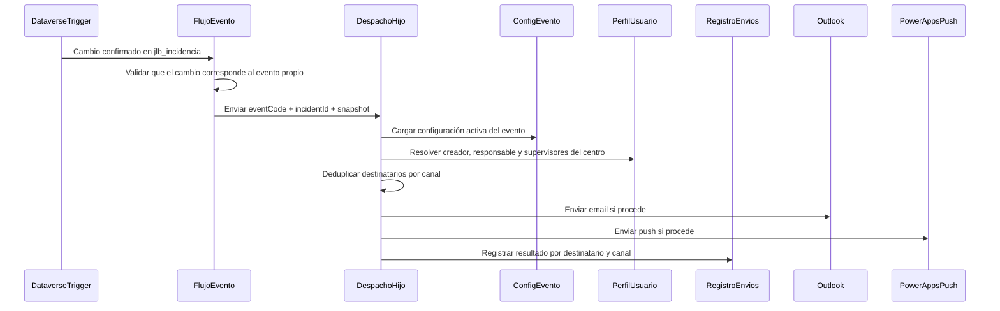
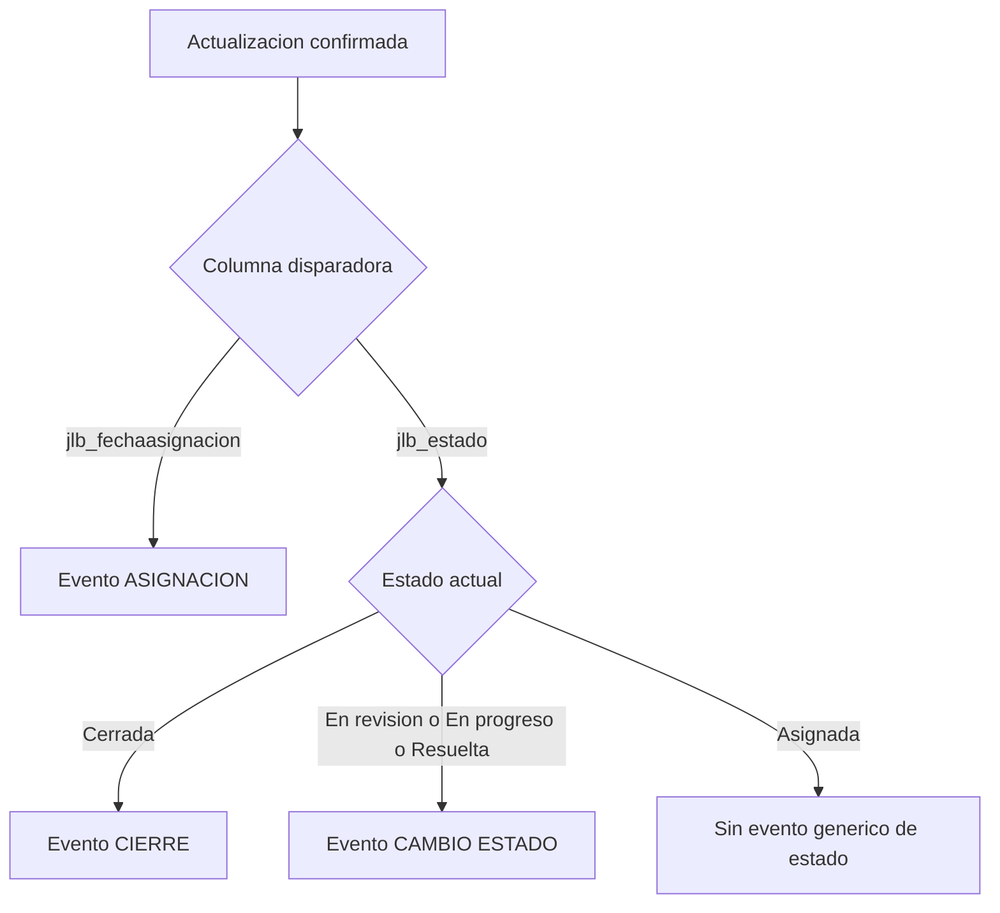
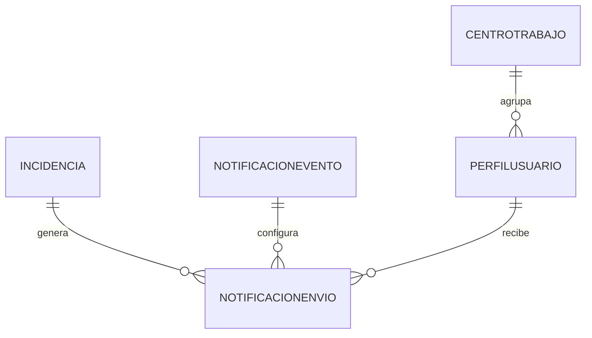

## Overview
Esta especificación define la capa de notificaciones automáticas para incidencias operativas de Logística Sur S.L. Su propósito es reaccionar a cambios ya confirmados en la tabla Dataverse `jlb_incidencia` y avisar a los interesados correctos sin alterar la lógica de negocio del ciclo de vida que ya pertenece a `incidencias-core`. La solución se apoya en flujos de Power Automate dentro de la misma solución, una configuración central simple por evento y un registro de intentos de envío para soporte operativo.

Los usuarios destinatarios son operarios, responsables asignados y supervisores de centro. Los administradores funcionales mantienen la configuración de destinatarios, canales y mensajes por evento. El impacto principal es sustituir avisos manuales e inconsistentes por una integración asíncrona y trazable, reutilizando el modelo de perfil, rol y centro de `autenticacion-roles` y el esquema exacto de `Incidencias` ya fijado por `incidencias-core`.

### Goals
- Cubrir exactamente los eventos de creación, asignación, cambio de estado y cierre sobre `jlb_incidencia`.
- Resolver destinatarios a partir de `creadorSystemUserId`, responsable asignado y supervisor del centro consumiendo el `AccessContext` canónico de `autenticacion-roles`.
- Enviar avisos por Outlook email y notificación push nativa dentro de la app con configuración central por evento.
- Aplicar reintentos básicos y trazabilidad por destinatario/canal sin bloquear otras entregas.
- Mantener contratos de ALM claros para conexiones, parámetros de entorno y artefactos de flujos.

### Non-Goals
- Redefinir la lógica del ciclo de vida, transiciones o ownership de `Incidencias`.
- Notificar comentarios, adjuntos, búsquedas, dashboards u otros cambios fuera de los cuatro eventos acordados.
- Implementar notificaciones push nativas fuera de la app de Power Apps.
- Introducir un motor de reglas configurable por usuario final o por estado arbitrario.
- Cambiar el modelo upstream de `jlb_perfilusuario`, `jlb_centrotrabajo` o `jlb_rolnegocio`.

## Boundary Commitments

### This Spec Owns
- Los flujos solution-aware que reaccionan a creación y actualizaciones relevantes de `jlb_incidencia`.
- La clasificación operativa de eventos de notificación: `CREACION`, `ASIGNACION`, `CAMBIO_ESTADO`, `CIERRE`.
- La configuración funcional central por evento (categorías de destinatario, canales habilitados y plantillas simples).
- La resolución y deduplicación de destinatarios para cada evento dentro del perímetro permitido.
- La entrega por correo Outlook y push nativa dentro de la app.
- El registro de intentos y fallos de envío necesario para soporte operativo.
- Los connection references y environment variables específicas de la automatización.

### Out of Boundary
- Las reglas que determinan cuándo una incidencia puede cambiar de estado o a quién puede asignarse.
- La definición de la tabla `jlb_incidencia`, su máquina de estados y sus columnas base.
- La UI de detalle de la incidencia, salvo la recepción pasiva de la notificación push en la app existente.
- Cualquier notificación sobre comentarios, adjuntos o capacidades ajenas a este spec.
- Un centro de notificaciones, bandeja, preferencias por usuario o analítica agregada de notificaciones.

### Allowed Dependencies
- `incidencias-core` como fuente autoritativa de `jlb_incidencia`, `jlb_estado`, `jlb_fechaasignacion`, `jlb_fecharesolucion`, `jlb_responsableid`, `jlb_centrotrabajoid`, `IdIncidencia` y `creadorSystemUserId` (proyección pública estable de `createdby`) dentro de su contrato de integración downstream.
- `autenticacion-roles` como fuente autoritativa del contrato canónico `AccessContext` (`entraObjectId`, `dataverseUserId`, `perfilUsuarioId`, `userPrincipalName`, `displayName`, `corporateEmail`, `role`, `centroTrabajoId`, `centroCodigo`, `centroTrabajoNombre`, `centroSecurityTeamId`, `dataScope`, `profileStatus`).
- Power Automate cloud flows dentro de soluciones Dataverse.
- Connection references para Office 365 Outlook y Power Apps Notification.
- Environment variables para App ID/URL y flags de comportamiento dependientes del entorno.

### Revalidation Triggers
- Renombrar, eliminar o cambiar la semántica de `jlb_estado`, `jlb_fechaasignacion`, `jlb_fecharesolucion`, `jlb_responsableid` o `IdIncidencia`.
- Cambios en la secuencia `Nueva → En revisión → Asignada → En progreso → Resuelta → Cerrada` o en qué transición representa cierre.
- Cambios en el contrato `AccessContext`, especialmente `dataverseUserId`, `perfilUsuarioId`, `role`, `centroTrabajoId`, `corporateEmail`, `userPrincipalName` o `profileStatus`.
- Sustitución o cambio de contrato de los conectores Outlook o Power Apps Notification.
- Migración del repositorio desde formato XML legado a YAML o cualquier cambio en el empaquetado de flujos solution-aware.

## Architecture

### Existing Architecture Analysis
El repositorio actual contiene la solución fuente en formato XML legado (`src\Other\Solution.xml` y `src\Other\Customizations.xml`) y una canvas app ya registrada como root component. `Customizations.xml` todavía tiene `<Workflows />` vacío, por lo que no existe automatización previa que condicione este diseño. Los specs upstream ya fijaron dos contratos imprescindibles: `incidencias-core` publica la tabla `jlb_incidencia` con las columnas `jlb_estado`, `jlb_fechaasignacion`, `jlb_fecharesolucion`, `jlb_responsableid`, `jlb_centrotrabajoid`, `IdIncidencia` y `creadorSystemUserId` (proyección pública estable de `createdby`) en su contrato de integración downstream; `autenticacion-roles` publica el `AccessContext` canónico con `entraObjectId`, `dataverseUserId`, `perfilUsuarioId`, `userPrincipalName`, `displayName`, `corporateEmail`, `role`, `centroTrabajoId`, `centroCodigo`, `centroTrabajoNombre`, `centroSecurityTeamId`, `dataScope` y `profileStatus`.

La principal restricción de integración es doble. Por un lado, el trigger de Dataverse no admite columnas lookup en `Select columns`, de modo que la asignación debe detectarse mediante `jlb_fechaasignacion`. Por otro, Microsoft recomienda YAML para modern flows, mientras que este repositorio continúa en XML legado; por ello el diseño conserva los flujos como componentes solution-aware y fija una convención explícita para versionar sus JSON exportados en `src\Workflows`.

### Architecture Pattern & Boundary Map


**Architecture Integration**:
- **Selected pattern**: cuatro flujos de borde orientados a evento + un flujo hijo compartido para resolución, entrega y logging.
- **Domain/feature boundaries**: los flujos de borde solo detectan el evento y construyen el snapshot de entrada; el flujo hijo resuelve configuración y destinatarios; las tablas Dataverse nuevas solo guardan configuración y trazabilidad, nunca mutan la incidencia.
- **Existing patterns preserved**: consumo exclusivo de cambios persistidos en Dataverse, reutilización de `jlb_perfilusuario`/`jlb_centrotrabajo` y despliegue mediante solución Power Platform.
- **New components rationale**: separar flujos de evento evita ambigüedad en el disparo; el flujo hijo evita duplicar plantillas, deduplicación y manejo de errores; las tablas nuevas soportan mantenibilidad y soporte.
- **Steering compliance**: respeta Power Apps + Dataverse + Power Automate como pila única y mantiene la push fuera de la app expresamente fuera de alcance.
- **Dependency direction**: `jlb_incidencia` persistida → flujo de evento → flujo hijo de despacho → conectores / tabla de logs. La dirección nunca vuelve a escribir lógica de negocio sobre `jlb_incidencia`.

### Technology Stack

| Layer | Choice / Version | Role in Feature | Notes |
|-------|------------------|-----------------|-------|
| Frontend / CLI | Power Apps Canvas App existente | Receptor pasivo de push y apertura contextual de la incidencia | Sin ownership funcional de UI en este spec |
| Backend / Services | Power Automate cloud flows solution-aware | Detección de eventos, resolución de destinatarios, envío y logging | Un flujo hijo compartido más cuatro flujos de borde |
| Data / Storage | Microsoft Dataverse | Fuente de eventos (`jlb_incidencia`), configuración (`jlb_notificacionevento`) y trazabilidad (`jlb_notificacionenvio`) | Reutiliza tablas upstream |
| Messaging / Events | Trigger Dataverse `When a row is added, modified or deleted` | Arranque de los cuatro eventos cubiertos | Asignación filtrada por `jlb_fechaasignacion` |
| Infrastructure / Runtime | Connection references + environment variables | Enlaces ALM a Outlook, Power Apps Notification y App ID/URL | Sin secretos hardcodeados en flujos |

## File Structure Plan

### Directory Structure
```text
src\
├── Workflows\
│   ├── jlb_notificaciones_creacion.json                # Flujo solution-aware disparado por creación de jlb_incidencia
│   ├── jlb_notificaciones_asignacion.json              # Flujo update filtrado por jlb_fechaasignacion
│   ├── jlb_notificaciones_cambio_estado.json           # Flujo update filtrado por jlb_estado y excluyendo cierre/asignación
│   ├── jlb_notificaciones_cierre.json                  # Flujo update filtrado por jlb_estado cuando la incidencia queda Cerrada
│   └── jlb_notificaciones_despacho_hijo.json           # Flujo hijo compartido para configuración, destinatarios, envío y logging
├── Entities\
│   ├── jlb_notificacionevento\
│   │   ├── Entity.xml                                  # Tabla autoritativa de configuración funcional por evento
│   │   ├── Attributes\jlb_codigoevento.xml            # CREACION, ASIGNACION, CAMBIO_ESTADO, CIERRE
│   │   ├── Attributes\jlb_activo.xml                  # Habilitación global del evento
│   │   ├── Attributes\jlb_enviarcorreo.xml            # Canal email habilitado
│   │   ├── Attributes\jlb_enviarpush.xml              # Canal push habilitado
│   │   ├── Attributes\jlb_incluircreador.xml          # Categoría creador habilitada
│   │   ├── Attributes\jlb_incluirresponsable.xml      # Categoría responsable habilitada
│   │   ├── Attributes\jlb_incluirsupervisor.xml       # Categoría supervisor de centro habilitada
│   │   ├── Attributes\jlb_asunto.xml                  # Asunto simple para email
│   │   ├── Attributes\jlb_mensaje.xml                 # Plantilla simple de mensaje
│   │   └── Views\ActiveNotificationEvents.xml         # Vista de administración y consumo
│   └── jlb_notificacionenvio\
│       ├── Entity.xml                                  # Tabla de trazabilidad de intentos y resultados
│       ├── Attributes\jlb_correlationid.xml           # Correlación entre flujo, evento y entregas
│       ├── Attributes\jlb_codigoevento.xml            # Evento notificado
│       ├── Attributes\jlb_canal.xml                   # email o push
│       ├── Attributes\jlb_destinatario.xml            # Email o UPN normalizado
│       ├── Attributes\jlb_estadoenvio.xml             # pendiente, enviado, omitido, fallido
│       ├── Attributes\jlb_intentos.xml                # Contador de intentos
│       ├── Attributes\jlb_ultimaejecucion.xml         # Fecha/hora del último intento
│       ├── Attributes\jlb_errorresumen.xml            # Resumen corto del último error
│       └── Relationships\jlb_notificacionenvio_jlb_incidencia.xml # Relación con incidencia
├── ConnectionReferences\
│   ├── cr_jlb_office365_outlook.xml                    # Connection reference para correo
│   └── cr_jlb_powerapps_notification.xml               # Connection reference para push in-app
├── EnvironmentVariables\
│   ├── ev_jlb_powerapps_appid.definition.xml           # App ID/URL objetivo para push
│   ├── ev_jlb_powerapps_appid.value.xml                # Valor por entorno del App ID/URL
│   ├── ev_jlb_push_openapp.definition.xml              # Bandera por defecto para abrir la app desde el push
│   └── ev_jlb_push_openapp.value.xml                   # Valor por entorno de apertura
└── Other\
    ├── Solution.xml                                    # Registro de nuevos componentes
    └── Customizations.xml                              # Metadatos exportados de workflows, tablas y relaciones
```

### Modified Files
- `src\Other\Solution.xml` — añadir los root components y dependencias de tablas, workflows, connection references y environment variables.
- `src\Other\Customizations.xml` — poblar `Workflows`, `Entities` y `EntityRelationships` con los artefactos nuevos.
- `src\CanvasApps\jlb_logsticasur_95873.meta.xml` — solo si la solución necesita registrar el parámetro de apertura contextual del push como dependencia visible de la app.

> Nota de ALM: el diseño asume que los JSON de `src\Workflows` proceden de exportaciones solution-aware y que se validará manualmente el round-trip porque el repositorio sigue en formato XML legado.

## System Flows





- El flujo de asignación se dispara por `jlb_fechaasignacion` para sortear la limitación de filtros sobre lookups.
- El estado `Asignada` no genera el evento genérico `CAMBIO_ESTADO`; queda cubierto por `ASIGNACION` para evitar duplicidad semántica.
- Los flujos se ejecutan después de la persistencia confirmada en Dataverse y nunca revierten ni corrigen la incidencia fuente.

## Requirements Traceability

| Requirement | Summary | Components | Interfaces | Flows |
|-------------|---------|------------|------------|-------|
| 1.1 | Notificación automática al crear | Flujo de Creación de Incidencia, Flujo Hijo de Despacho y Registro | `DispatchRequest` | Creación |
| 1.2 | Notificación automática al asignar o reasignar | Flujo de Asignación de Incidencia, Flujo Hijo de Despacho y Registro | `DispatchRequest` | Asignación |
| 1.3 | Notificación automática al cambiar estado sin solape | Flujo de Cambio de Estado de Incidencia, Flujo Hijo de Despacho y Registro | `DispatchRequest` | Cambio de estado |
| 1.4 | Notificación automática al cerrar | Flujo de Cierre de Incidencia, Flujo Hijo de Despacho y Registro | `DispatchRequest` | Cierre |
| 1.5 | No notificar cambios fuera de alcance | Todos los Flujos de Evento | `TriggerQualificationRule` | Todos |
| 2.1 | Solo creador, responsable y supervisor de centro | Flujo Hijo de Despacho y Registro, Configuración de Eventos de Notificación | `RecipientResolutionResult` | Todos |
| 2.2 | Combinar categorías configuradas | Configuración de Eventos de Notificación, Flujo Hijo de Despacho y Registro | `NotificationEventConfig`, `RecipientResolutionResult` | Todos |
| 2.3 | Omitir destinatario irresoluble y dejar constancia | Flujo Hijo de Despacho y Registro, Registro de Envíos de Notificación | `DeliveryAttemptRecord` | Todos |
| 2.4 | Deduplicación por persona y canal | Flujo Hijo de Despacho y Registro | `NormalizedRecipient` | Todos |
| 2.5 | Resolver supervisor desde centro de trabajo | Flujo Hijo de Despacho y Registro | `SupervisorResolutionRule` | Todos |
| 3.1 | Envío de correo cuando el canal esté habilitado | Configuración de Eventos de Notificación, Flujo Hijo de Despacho y Registro | `ChannelDispatchPlan` | Todos |
| 3.2 | Envío de push interna cuando el canal esté habilitado | Configuración de Eventos de Notificación, Flujo Hijo de Despacho y Registro | `ChannelDispatchPlan` | Todos |
| 3.3 | Contenido mínimo del aviso | Configuración de Eventos de Notificación, Flujo Hijo de Despacho y Registro | `NotificationMessageModel` | Todos |
| 3.4 | Responsable actual en asignación y cierre | Flujo de Asignación de Incidencia, Flujo de Cierre de Incidencia, Flujo Hijo de Despacho y Registro | `NotificationMessageModel` | Asignación, Cierre |
| 3.5 | Limitar canales a email y push in-app | Configuración de Eventos de Notificación, Flujo Hijo de Despacho y Registro | `NotificationEventConfig` | Todos |
| 4.1 | Configuración independiente para cuatro eventos | Configuración de Eventos de Notificación | `NotificationEventConfig` | N/A |
| 4.2 | Aplicar cambios de configuración a futuros envíos | Configuración de Eventos de Notificación, Flujo Hijo de Despacho y Registro | `NotificationEventConfig` | Todos |
| 4.3 | Deshabilitar un canal sin afectar al otro | Configuración de Eventos de Notificación, Flujo Hijo de Despacho y Registro | `ChannelDispatchPlan` | Todos |
| 4.4 | Bloquear categorías de destinatario fuera de alcance | Configuración de Eventos de Notificación | `NotificationEventConfig` | N/A |
| 4.5 | Plantillas consistentes por evento | Configuración de Eventos de Notificación, Flujo Hijo de Despacho y Registro | `NotificationMessageModel` | Todos |
| 5.1 | Reintentos básicos | Flujo Hijo de Despacho y Registro | `DeliveryRetryPolicy` | Todos |
| 5.2 | Registrar fallos tras reintentos | Registro de Envíos de Notificación, Flujo Hijo de Despacho y Registro | `DeliveryAttemptRecord` | Todos |
| 5.3 | Continuidad de otras entregas ante fallo parcial | Flujo Hijo de Despacho y Registro | `ChannelDispatchPlan` | Todos |
| 5.4 | No mutar incidencia por errores de envío | Todos los Flujos de Evento, Flujo Hijo de Despacho y Registro | `DispatchRequest` | Todos |
| 5.5 | Trazabilidad de intentos y resultado final | Registro de Envíos de Notificación, Flujo Hijo de Despacho y Registro | `DeliveryAttemptRecord` | Todos |
| 6.1 | Usar snapshot confirmado de la incidencia | Todos los Flujos de Evento, Flujo Hijo de Despacho y Registro | `IncidentNotificationSnapshot` | Todos |
| 6.2 | Respetar la secuencia autoritativa de estados | Flujo de Cambio de Estado de Incidencia, Flujo de Cierre de Incidencia | `TriggerQualificationRule` | Cambio de estado, Cierre |
| 6.3 | Ignorar comentarios, adjuntos y otros cambios | Todos los Flujos de Evento | `TriggerQualificationRule` | Todos |
| 6.4 | Comportamiento consistente por centro y rol | Flujo Hijo de Despacho y Registro, Configuración de Eventos de Notificación | `RecipientResolutionResult`, `NotificationEventConfig` | Todos |

## Components and Interfaces

| Component | Domain/Layer | Intent | Req Coverage | Key Dependencies (P0/P1) | Contracts |
|-----------|--------------|--------|--------------|--------------------------|-----------|
| Configuración de Eventos de Notificación | Data | Mantener la configuración funcional autoritativa por evento | 2.1, 2.2, 3.1, 3.2, 3.3, 3.5, 4.1, 4.2, 4.3, 4.4, 4.5, 6.4 | Dataverse (P0) | Service, State |
| Registro de Envíos de Notificación | Data | Persistir intentos, omisiones, éxitos y fallos por destinatario/canal | 2.3, 5.2, 5.5 | Dataverse (P0), `jlb_incidencia` (P0) | State |
| Flujo de Creación de Incidencia | Flow | Detectar creación confirmada y disparar el evento `CREACION` | 1.1, 1.5, 5.4, 6.1, 6.3 | `jlb_incidencia` (P0), Flujo Hijo (P0) | Event, Batch |
| Flujo de Asignación de Incidencia | Flow | Detectar asignaciones mediante `jlb_fechaasignacion` y disparar `ASIGNACION` | 1.2, 1.5, 3.4, 5.4, 6.1, 6.3 | `jlb_incidencia` (P0), Flujo Hijo (P0) | Event, Batch |
| Flujo de Cambio de Estado de Incidencia | Flow | Detectar cambios de estado no cubiertos por asignación ni cierre | 1.3, 1.5, 5.4, 6.1, 6.2, 6.3 | `jlb_incidencia` (P0), Flujo Hijo (P0) | Event, Batch |
| Flujo de Cierre de Incidencia | Flow | Detectar transición a `Cerrada` y disparar `CIERRE` | 1.4, 1.5, 3.4, 5.4, 6.1, 6.2, 6.3 | `jlb_incidencia` (P0), Flujo Hijo (P0) | Event, Batch |
| Flujo Hijo de Despacho y Registro | Integration | Resolver configuración, destinatarios, envíos y resultados | 2.1, 2.2, 2.3, 2.4, 2.5, 3.1, 3.2, 3.3, 3.4, 3.5, 4.2, 4.3, 4.5, 5.1, 5.2, 5.3, 5.5, 6.4 | Configuración (P0), PerfilUsuario (P0), CentroTrabajo (P0), Outlook (P1), PowerApps Notification (P1), RegistroEnvios (P0) | Service, Batch, State |

### Data

#### Configuración de Eventos de Notificación

| Field | Detail |
|-------|--------|
| Intent | Definir una configuración funcional simple y autoritativa para cada evento de notificación |
| Requirements | 2.1, 2.2, 3.1, 3.2, 3.3, 3.5, 4.1, 4.2, 4.3, 4.4, 4.5, 6.4 |

**Responsibilities & Constraints**
- Mantener exactamente cuatro códigos de evento: `CREACION`, `ASIGNACION`, `CAMBIO_ESTADO`, `CIERRE`.
- Guardar por evento las banderas de canal (`correo`, `push`) y categorías de destinatario (`creador`, `responsable`, `supervisor`).
- Guardar una plantilla simple con asunto y mensaje reutilizable por todas las incidencias del mismo evento.
- Impedir configuraciones que introduzcan categorías de destinatario fuera del conjunto permitido.
- Permitir desactivar temporalmente un evento o un canal sin tocar los flujos.

**Dependencies**
- Inbound: Flujo Hijo de Despacho y Registro — consulta la configuración vigente (P0)
- External: Dataverse table `jlb_notificacionevento` — persistencia funcional (P0)

**Contracts**: Service [x] / API [ ] / Event [ ] / Batch [ ] / State [x]

##### Service Interface
```typescript
type NotificationEventCode = "CREACION" | "ASIGNACION" | "CAMBIO_ESTADO" | "CIERRE";

interface NotificationEventConfig {
  eventCode: NotificationEventCode;
  isActive: boolean;
  channels: {
    email: boolean;
    push: boolean;
  };
  recipients: {
    creator: boolean;
    assignee: boolean;
    centerSupervisors: boolean;
  };
  emailSubjectTemplate: string;
  messageTemplate: string;
}

interface NotificationConfigService {
  getByEvent(eventCode: NotificationEventCode): Promise<NotificationEventConfig>;
  listAll(): Promise<NotificationEventConfig[]>;
}
```
- Preconditions: el código de evento pertenece al conjunto cerrado del spec.
- Postconditions: siempre devuelve una configuración consistente o un fallo explícito de configuración.
- Invariants: no existen eventos adicionales ni categorías de destinatario fuera del alcance del spec.

##### State Management
- State model: una fila activa por código de evento.
- Persistence & consistency: seed inicial con cuatro filas; los cambios afectan solo a envíos futuros.
- Concurrency strategy: cambios administrativos de bajo volumen, última escritura gana.

**Implementation Notes**
- Integration: el flujo hijo no debe hardcodear canales ni destinatarios fuera del seed mínimo.
- Validation: comprobar bloqueo de configuraciones fuera del conjunto permitido y lectura consistente de las cuatro filas.
- Risks: una desactivación accidental del evento puede silenciar todas sus notificaciones; por eso el estado debe quedar visible en administración.

#### Registro de Envíos de Notificación

| Field | Detail |
|-------|--------|
| Intent | Conservar trazabilidad operativa por destinatario, canal y resultado final |
| Requirements | 2.3, 5.2, 5.5 |

**Responsibilities & Constraints**
- Registrar cada entrega intentada con correlación al run y a la incidencia.
- Distinguir estados `pendiente`, `enviado`, `omitido` y `fallido`.
- Persistir el número de intentos, la fecha del último intento y un resumen corto de error cuando aplique.
- No almacenar secretos ni contenido excesivo del mensaje cuando baste la referencia al evento.

**Dependencies**
- Inbound: Flujo Hijo de Despacho y Registro — alta y actualización de logs (P0)
- Outbound: `jlb_incidencia` — lookup a la incidencia origen (P0)
- External: Dataverse table `jlb_notificacionenvio` — persistencia operativa (P0)

**Contracts**: Service [ ] / API [ ] / Event [ ] / Batch [ ] / State [x]

##### State Contract
```typescript
type DeliveryChannel = "email" | "push";
type DeliveryOutcome = "pendiente" | "enviado" | "omitido" | "fallido";

interface DeliveryAttemptRecord {
  correlationId: string;
  incidenciaId: string;
  idIncidencia: string;
  eventCode: NotificationEventCode;
  channel: DeliveryChannel;
  recipientKey: string;
  outcome: DeliveryOutcome;
  attempts: number;
  lastAttemptAt: string;
  errorSummary: string | null;
  flowRunId: string;
}
```
- Preconditions: existe una incidencia origen y un evento clasificado.
- Postconditions: cada envío u omisión deja una fila auditable.
- Invariants: el log no reescribe ni corrige datos de `jlb_incidencia`.

##### State Management
- State model: una fila por combinación `correlationId + recipientKey + channel`.
- Persistence & consistency: crear al iniciar el despacho y actualizar al completar o agotar reintentos.
- Concurrency strategy: un único flujo escribe una fila concreta por correlación; sin escrituras competitivas esperadas.

**Implementation Notes**
- Integration: soporte operativo y diagnóstico de fallos sin depender del historial efímero del run.
- Validation: comprobar que omisiones por destinatario irresoluble también quedan trazadas.
- Risks: crecerá con el volumen; deben definirse vistas operativas y limpieza fuera de este spec si el volumen lo exige.

### Flow

#### Flujo de Creación de Incidencia

| Field | Detail |
|-------|--------|
| Intent | Detectar la creación confirmada de una incidencia y emitir el evento `CREACION` |
| Requirements | 1.1, 1.5, 5.4, 6.1, 6.3 |

**Responsibilities & Constraints**
- Dispararse solo cuando se cree una fila en `jlb_incidencia`.
- Construir un snapshot mínimo del registro recién persistido.
- Invocar el flujo hijo con `eventCode = CREACION`.
- No evaluar comentarios, adjuntos ni cambios posteriores.

**Dependencies**
- External: trigger Dataverse sobre `jlb_incidencia` con `Change type = Added` (P0)
- Outbound: Flujo Hijo de Despacho y Registro (P0)

**Contracts**: Service [ ] / API [ ] / Event [x] / Batch [x] / State [ ]

##### Event Contract
- Published events:
  - `CREACION` cuando la fila `jlb_incidencia` se crea con éxito.
- Subscribed events:
  - Alta confirmada de `jlb_incidencia`.
- Ordering / delivery guarantees:
  - Usa siempre datos persistidos tras el `Create` de Dataverse.

##### Batch / Job Contract
- Trigger: Dataverse `When a row is added, modified or deleted` sobre `jlb_incidencia`, cambio `Added`, alcance `Organization`.
- Input / validation: `incidentGuid`, `IdIncidencia`, `jlb_estado`, `jlb_centrotrabajoid`, `jlb_responsableid` opcional.
- Output / destination: invocación del flujo hijo con `DispatchRequest`.
- Idempotency & recovery: la correlación del evento se basa en `workflow().run.id`; reejecuciones manuales deben crear una nueva correlación explícita.

**Implementation Notes**
- Integration: la creación no espera confirmación del canal para cerrar el alta de la incidencia.
- Validation: comprobar que actualizaciones posteriores no reactivan este flujo.
- Risks: si la incidencia se crea sin datos upstream esperados, el flujo debe registrar el fallo sin tocar la incidencia.

#### Flujo de Asignación de Incidencia

| Field | Detail |
|-------|--------|
| Intent | Detectar una asignación o reasignación mediante `jlb_fechaasignacion` y emitir `ASIGNACION` |
| Requirements | 1.2, 1.5, 3.4, 5.4, 6.1, 6.3 |

**Responsibilities & Constraints**
- Dispararse solo en actualizaciones donde se incluya `jlb_fechaasignacion`.
- Leer el responsable confirmado después del guardado para construir el snapshot.
- Ignorar actualizaciones donde el responsable siga vacío o la fecha de asignación no sea válida.
- Invocar el flujo hijo con `eventCode = ASIGNACION`.

**Dependencies**
- External: trigger Dataverse sobre `jlb_incidencia` con `Change type = Modified` y `Select columns = jlb_fechaasignacion` (P0)
- Outbound: Flujo Hijo de Despacho y Registro (P0)

**Contracts**: Service [ ] / API [ ] / Event [x] / Batch [x] / State [ ]

##### Trigger Qualification Rule
```typescript
interface TriggerQualificationRule {
  eventCode: NotificationEventCode;
  changedColumns: string[];
  qualifies(snapshot: IncidentNotificationSnapshot): boolean;
}
```
- Preconditions: la actualización incluye `jlb_fechaasignacion`.
- Postconditions: solo se emite `ASIGNACION` si existe responsable vigente confirmado.
- Invariants: nunca clasifica la asignación por el lookup `jlb_responsableid` como columna disparadora.

##### Batch / Job Contract
- Trigger: Dataverse `Modified` sobre `jlb_incidencia`, columna disparadora `jlb_fechaasignacion`.
- Input / validation: `incidentGuid`, `IdIncidencia`, `jlb_fechaasignacion`, `jlb_responsableid` resuelto tras guardar.
- Output / destination: `DispatchRequest` con `ASIGNACION`.
- Idempotency & recovery: la correlación distingue reasignaciones sucesivas aunque recaigan sobre la misma incidencia.

**Implementation Notes**
- Integration: depende del contrato upstream que actualiza `jlb_fechaasignacion` en toda asignación válida.
- Validation: probar asignación inicial y reasignación con el mismo y distinto responsable.
- Risks: un cambio manual de fecha sin intención de asignar generaría ruido; el flujo debe validar responsable presente.

#### Flujo de Cambio de Estado de Incidencia

| Field | Detail |
|-------|--------|
| Intent | Detectar cambios de estado cubiertos por `CAMBIO_ESTADO` sin duplicar asignación ni cierre |
| Requirements | 1.3, 1.5, 5.4, 6.1, 6.2, 6.3 |

**Responsibilities & Constraints**
- Dispararse solo cuando se incluya `jlb_estado` en una actualización.
- Emitir `CAMBIO_ESTADO` únicamente para estados `En revisión`, `En progreso` y `Resuelta`.
- Ignorar `Asignada` porque ese movimiento queda cubierto por `ASIGNACION`.
- Ignorar `Cerrada` porque ese movimiento queda cubierto por `CIERRE`.

**Dependencies**
- External: trigger Dataverse sobre `jlb_incidencia` con `Change type = Modified` y `Select columns = jlb_estado` (P0)
- Outbound: Flujo Hijo de Despacho y Registro (P0)

**Contracts**: Service [ ] / API [ ] / Event [x] / Batch [x] / State [ ]

##### Batch / Job Contract
- Trigger: Dataverse `Modified` sobre `jlb_incidencia`, columna disparadora `jlb_estado`.
- Input / validation: `incidentGuid`, `IdIncidencia`, `jlb_estado` actual confirmado.
- Output / destination: `DispatchRequest` con `CAMBIO_ESTADO`.
- Idempotency & recovery: reintentos del mismo run no deben cambiar la clasificación del evento.

**Implementation Notes**
- Integration: consume el option set exacto definido en `incidencias-core`; no crea un mapa alternativo.
- Validation: probar `En revisión`, `En progreso` y `Resuelta`, y confirmar que `Asignada` no dispara este flujo.
- Risks: si upstream añade nuevos estados, esta lista cerrada requiere revalidación.

#### Flujo de Cierre de Incidencia

| Field | Detail |
|-------|--------|
| Intent | Detectar la transición confirmada a `Cerrada` y emitir `CIERRE` |
| Requirements | 1.4, 1.5, 3.4, 5.4, 6.1, 6.2, 6.3 |

**Responsibilities & Constraints**
- Dispararse solo cuando `jlb_estado` cambie a `Cerrada`.
- Incluir en el snapshot el responsable vigente y la fecha de resolución ya confirmada.
- No generar otro evento adicional de cambio de estado para el mismo cierre.

**Dependencies**
- External: trigger Dataverse sobre `jlb_incidencia` con `Change type = Modified` y `Select columns = jlb_estado` (P0)
- Outbound: Flujo Hijo de Despacho y Registro (P0)

**Contracts**: Service [ ] / API [ ] / Event [x] / Batch [x] / State [ ]

##### Batch / Job Contract
- Trigger: Dataverse `Modified` sobre `jlb_incidencia`, columna disparadora `jlb_estado`, filtro final `estado actual = Cerrada`.
- Input / validation: `incidentGuid`, `IdIncidencia`, `jlb_estado`, `jlb_fecharesolucion`, `jlb_responsableid`.
- Output / destination: `DispatchRequest` con `CIERRE`.
- Idempotency & recovery: el cierre solo debe mapear a un evento `CIERRE` por actualización confirmada.

**Implementation Notes**
- Integration: depende del contrato upstream que conserva `FechaResolucion` al cerrar.
- Validation: verificar que el mensaje de cierre usa el estado final confirmado y el responsable vigente.
- Risks: un cierre importado masivamente puede aumentar el burst de notificaciones; revisar límites durante pruebas.

#### Flujo Hijo de Despacho y Registro

| Field | Detail |
|-------|--------|
| Intent | Convertir un evento clasificado en entregas configuradas, deduplicadas y trazables |
| Requirements | 2.1, 2.2, 2.3, 2.4, 2.5, 3.1, 3.2, 3.3, 3.4, 3.5, 4.2, 4.3, 4.5, 5.1, 5.2, 5.3, 5.5, 6.4 |

**Responsibilities & Constraints**
- Cargar la configuración vigente del evento y abortar con log controlado si está ausente o desactivada.
- Resolver creador, responsable y supervisores del centro a partir de `snapshot.creadorSystemUserId`, `snapshot.responsablePerfilId`, `snapshot.centroTrabajoId` y el `AccessContext` canónico de `autenticacion-roles`.
- Normalizar destinatarios por email/UPN en minúsculas y deduplicar por evento+canal.
- Construir el contenido final del mensaje con `IdIncidencia`, evento, estado actual y responsable cuando aplique.
- Ejecutar entregas por canal con scopes independientes para que un fallo parcial no bloquee el resto.
- Registrar todos los intentos, omisiones y resultados finales sin escribir en `jlb_incidencia`.

**Dependencies**
- Inbound: cuatro flujos de evento — entregan `DispatchRequest` (P0)
- Outbound: Configuración de Eventos de Notificación — lectura de configuración (P0)
- Outbound: Registro de Envíos de Notificación — persistencia de resultados (P0)
- External: `jlb_perfilusuario` y `jlb_centrotrabajo` — resolución de destinatarios (P0)
- External: Office 365 Outlook connection reference — envío de email (P1)
- External: Power Apps Notification connection reference — envío push in-app (P1)
- External: environment variables de App ID/URL y `openApp` (P1)

**Contracts**: Service [x] / API [ ] / Event [ ] / Batch [x] / State [x]

##### Service Interface
```typescript
interface IncidentNotificationSnapshot {
  incidentGuid: string;
  idIncidencia: string;
  estadoActual: "Nueva" | "En revisión" | "Asignada" | "En progreso" | "Resuelta" | "Cerrada";
  centroTrabajoId: string;
  responsablePerfilId: string | null;
  fechaAsignacion: string | null;
  fechaResolucion: string | null;
  creadorSystemUserId: string;
}

interface DispatchRequest {
  correlationId: string;
  eventCode: NotificationEventCode;
  snapshot: IncidentNotificationSnapshot;
}

interface NormalizedRecipient {
  recipientKey: string;
  displayName: string | null;
  channels: DeliveryChannel[];
  sourceRoles: Array<"creator" | "assignee" | "centerSupervisor">;
}

interface SupervisorResolutionRule {
  centroTrabajoId: string;
  role: "Supervisor";
  includeOnlyActiveProfiles: true;
}

interface RecipientResolutionResult {
  recipients: NormalizedRecipient[];
  unresolvedCategories: Array<"creator" | "assignee" | "centerSupervisor">;
}

interface NotificationMessageModel {
  subject: string;
  message: string;
  eventLabel: string;
  idIncidencia: string;
  estadoActual: string;
  responsableActual: string | null;
}

interface ChannelDispatchPlan {
  correlationId: string;
  eventCode: NotificationEventCode;
  recipients: NormalizedRecipient[];
  enableEmail: boolean;
  enablePush: boolean;
}

interface DeliveryRetryPolicy {
  maxAttempts: number;
  retryStrategy: "connector-default";
}

interface NotificationDispatchService {
  dispatch(request: DispatchRequest): Promise<void>;
}
```
- Preconditions: el evento ya fue clasificado por un flujo de borde y el snapshot proviene de datos persistidos.
- Postconditions: cada canal/destinatario queda en estado `enviado`, `omitido` o `fallido` con trazabilidad.
- Invariants: el servicio no modifica el negocio de la incidencia y no introduce canales o destinatarios fuera del conjunto permitido.
- Regla de integración upstream: la resolución del creador compara `snapshot.creadorSystemUserId` con `AccessContext.dataverseUserId`; la resolución del responsable compara `snapshot.responsablePerfilId` con `AccessContext.perfilUsuarioId`; la resolución de supervisores filtra `AccessContext.role == "Supervisor"`, `AccessContext.centroTrabajoId == snapshot.centroTrabajoId` y `AccessContext.profileStatus == "active"`, conservando `displayName`, `corporateEmail`, `userPrincipalName`, `centroCodigo`, `centroTrabajoNombre`, `centroSecurityTeamId` y `dataScope` con sus nombres canónicos.

##### Batch / Job Contract
- Trigger: invocación desde un flujo solution-aware padre.
- Input / validation: `DispatchRequest` con `correlationId`, `eventCode` y snapshot mínimo.
- Output / destination: acciones de correo/push y filas en `jlb_notificacionenvio`.
- Idempotency & recovery: la deduplicación se limita al mismo `DispatchRequest`; si se reejecuta manualmente un run, el nuevo `correlationId` lo tratará como nueva operación trazada.

##### State Management
- State model: configuración leída desde `jlb_notificacionevento`, destinatarios resueltos en memoria del run y resultados persistidos en `jlb_notificacionenvio`.
- Persistence & consistency: crear fila `pendiente` antes del envío y actualizarla después de éxito, omisión o agotamiento de reintentos.
- Concurrency strategy: entregas por destinatario/canal aisladas; los fallos se manejan con scopes `Try/Catch` y `Run after`.

**Implementation Notes**
- Integration: para el creador se usa `snapshot.creadorSystemUserId` y se resuelve contra `AccessContext.dataverseUserId`; para responsable y supervisores se consume `AccessContext` verbatim desde `autenticacion-roles`, usando `perfilUsuarioId`, `role`, `centroTrabajoId`, `profileStatus`, `corporateEmail`, `userPrincipalName`, `displayName`, `centroCodigo`, `centroTrabajoNombre`, `centroSecurityTeamId` y `dataScope` sin alias locales; si existen varios supervisores activos del centro, se notifica a todos y luego se deduplica por canal.
- Validation: cubrir ausencia de configuración, categorías irresolubles, fallo de Outlook, fallo de push y combinaciones de categorías superpuestas.
- Risks: la convención de placeholders de plantilla debe mantenerse mínima (`{{IdIncidencia}}`, `{{Evento}}`, `{{Estado}}`, `{{Responsable}}`) para no convertir el feature en un motor de plantillas complejo.

## Data Models

### Domain Model
- **EventoNotificacion**: configuración autoritativa que define qué categorías de destinatario y qué canales participan en cada evento del spec.
- **DespachoNotificacion**: operación efímera que combina snapshot de incidencia, configuración vigente y destinatarios resueltos.
- **IntentoEnvio**: registro persistido de una entrega por destinatario y canal.
- **Invariants**:
  - Solo existen cuatro eventos de negocio notificados por este spec.
  - `CAMBIO_ESTADO` no cubre `Asignada` ni `Cerrada`.
  - Un mismo destinatario no recibe duplicados del mismo evento por el mismo canal.
  - Un fallo de canal no puede mutar `jlb_incidencia`.



### Logical Data Model

**Structure Definition**:
- `jlb_notificacionevento`
  - `jlb_notificacioneventoid` (GUID, PK)
  - `jlb_codigoevento` (texto o choice, obligatorio, único; `CREACION`, `ASIGNACION`, `CAMBIO_ESTADO`, `CIERRE`)
  - `jlb_activo` (two options, obligatorio)
  - `jlb_enviarcorreo` (two options, obligatorio)
  - `jlb_enviarpush` (two options, obligatorio)
  - `jlb_incluircreador` (two options, obligatorio)
  - `jlb_incluirresponsable` (two options, obligatorio)
  - `jlb_incluirsupervisor` (two options, obligatorio)
  - `jlb_asunto` (texto, obligatorio para email)
  - `jlb_mensaje` (texto largo, obligatorio)
- `jlb_notificacionenvio`
  - `jlb_notificacionenvioid` (GUID, PK)
  - `jlb_correlationid` (texto, obligatorio)
  - `jlb_incidenciaid` (lookup a `jlb_incidencia`, obligatorio)
  - `jlb_codigoevento` (texto o choice, obligatorio)
  - `jlb_canal` (choice, obligatorio; `email`, `push`)
  - `jlb_destinatario` (texto, obligatorio; email o UPN normalizado)
  - `jlb_estadoenvio` (choice, obligatorio; `pendiente`, `enviado`, `omitido`, `fallido`)
  - `jlb_intentos` (entero, obligatorio)
  - `jlb_ultimaejecucion` (datetime, obligatorio)
  - `jlb_errorresumen` (texto, nulo)
  - `jlb_flowrunid` (texto, obligatorio)

**Consistency & Integrity**:
- `jlb_codigoevento` queda restringido al conjunto cerrado del spec.
- `jlb_notificacionevento` arranca con exactamente cuatro filas semilla.
- `jlb_notificacionenvio` conserva histórico de intentos; no se reciclan filas entre correlaciones distintas.
- La relación con `jlb_incidencia` es solo de trazabilidad; no hay cascada destructiva hacia logs históricos.

### Physical Data Model

**For Relational Databases**:
- Índices / claves:
  - Clave alternativa en `jlb_notificacionevento.jlb_codigoevento`
  - Índices recomendados en `jlb_notificacionenvio.jlb_correlationid`, `jlb_notificacionenvio.jlb_codigoevento`, `jlb_notificacionenvio.jlb_estadoenvio`, `jlb_notificacionenvio.jlb_incidenciaid`
- Seeds mínimos:
  - `CREACION`
  - `ASIGNACION`
  - `CAMBIO_ESTADO`
  - `CIERRE`
- Estrategia de escala:
  - Consultas operativas por incidencia, correlación o estado de envío
  - Plantillas y toggles leídos una vez por ejecución de despacho

### Data Contracts & Integration

**API Data Transfer**
- No hay API custom. Los contratos cruzan flujos mediante `DispatchRequest` y usan tablas Dataverse como configuración y trazabilidad.

**Event Schemas**
- `DispatchRequest` actúa como contrato estable entre flujos de borde y flujo hijo.
- Compatibilidad:
  - `eventCode` pertenece al conjunto cerrado del spec.
  - `snapshot.estadoActual` usa exactamente la nomenclatura de `incidencias-core`.
  - `snapshot.creadorSystemUserId` usa exactamente el nombre publicado por `incidencias-core`.

**Cross-Service Data Management**
- `incidencias-core` es el único productor del estado de la incidencia.
- `autenticacion-roles` es el único productor del `AccessContext` canónico y, por tanto, del rol/centro/supervisores válidos.
- `notificaciones` consume ambos contratos y produce solo configuración y logs propios.

## Error Handling

### Error Strategy
El diseño aplica un patrón `Try/Catch` por canal y por destinatario. Cada flujo de evento solo clasifica e invoca el despacho; toda la resiliencia vive en el flujo hijo. Antes de intentar un envío, el flujo crea o actualiza un registro `pendiente`; después marca `enviado`, `omitido` o `fallido`. Los errores de resolución y de canal se registran, pero no revierten la incidencia ni interrumpen otras entregas válidas.

### Error Categories and Responses
- **Errores de configuración**: evento sin fila activa, sin canal habilitado o con plantilla inválida → registrar `omitido` o `fallido` de configuración y terminar sin tocar la incidencia.
- **Errores de resolución**: creador, responsable o supervisor no resoluble → omitir solo esa categoría y seguir con el resto.
- **Errores de canal**: fallo de Outlook o Power Apps Notification → aplicar reintentos del conector; si se agotan, registrar `fallido`.
- **Errores de contrato upstream**: snapshot sin `IdIncidencia`, estado desconocido o centro ausente → registrar fallo técnico y detener ese despacho.

### Monitoring
- La tabla `jlb_notificacionenvio` es la fuente de soporte para estado final e intentos.
- El `flowRunId` permite correlacionar la fila con el historial de ejecución de Power Automate.
- Los fallos recurrentes por canal o por evento deberán revisarse operativamente fuera de este spec.

## Testing Strategy

### Unit / Flow Logic Tests
- Validar que cada flujo de borde clasifica solo su evento: creación, asignación por `jlb_fechaasignacion`, cambio de estado válido y cierre.
- Validar que `CAMBIO_ESTADO` ignora `Asignada` y `Cerrada`.
- Validar que el renderizado del mensaje inserta `IdIncidencia`, evento, estado y responsable cuando aplica.

### Integration Tests
- Crear una incidencia y confirmar generación de `CREACION` con destinatarios configurados.
- Asignar y reasignar responsable verificando `ASIGNACION`, deduplicación por persona/canal y lectura del responsable vigente.
- Mover una incidencia a `En revisión`, `En progreso`, `Resuelta` y `Cerrada` validando que el evento correcto se envía y que cierre no duplica cambio de estado.
- Cambiar configuraciones por evento y comprobar que solo afectan a ejecuciones futuras.
- Forzar fallo de un canal y verificar continuidad del otro más registro `fallido` con intentos agotados.

### E2E / Operational Tests
- Desde la app y el entorno de solución, comprobar que el push abre la app y entrega el parámetro de incidencia esperado.
- Importar la solución en un entorno de prueba, asociar connection references y environment variables, y verificar que los flujos quedan activables.
- Validar que el correo recibido muestra información mínima coherente con el snapshot persistido.

### Performance / Load
- Simular ráfagas de creación o cierre para revisar que los logs se escriben sin bloquear la persistencia de incidencias.
- Revisar el volumen de ejecuciones paralelas cuando varios supervisores del mismo centro son destinatarios.
- Confirmar que el flujo hijo se mantiene por debajo de límites razonables de acciones y anidamiento.

### Security Considerations
- Las entregas solo usan correo corporativo o UPN resueltos desde fuentes internas autorizadas.
- Los logs no deben almacenar datos sensibles innecesarios ni secretos de conexión.
- Los connection references deben quedar separados de los valores específicos de entorno.

### Performance & Scalability
- El procesamiento es asíncrono tras la persistencia de la incidencia y no añade latencia interactiva al cambio de negocio.
- La deduplicación en memoria del run reduce ruido cuando un destinatario coincide en varias categorías.
- La tabla de logs debe indexarse por correlación, incidencia y estado para soporte eficiente.
